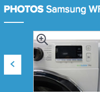
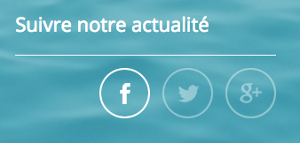
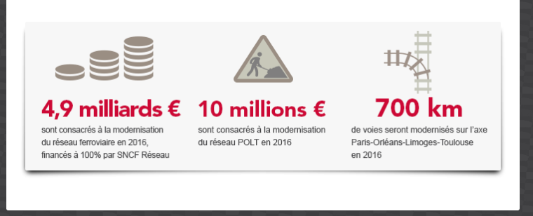
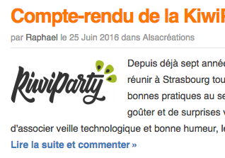

# Guidelines : Accessibilité

_Bonnes pratiques accessibilité en production_

## Généralités

* Ne pas fixer de hauteur sur les éléments afin que le contenu reste lisible lorsque le texte est zoomé.
* Respecter la hiérarchie des titres `<hX>`
* Ne pas supprimer l’*outline* autour des éléments cliquables (pas de `outline: none`)
* Utiliser les éléments HTML pour leur fonction/sémantique et non pas pour leur forme

## Structure générale

### Structure HTML

#### Menu de navigation

Utiliser des `<ul><li>` (liste non ordonnée) pour structurer les menus de navigation dans un élément `<nav role="navigation”>`.

### Éléments sémantiques HTML5

#### Zone d’en-tête principale :

```
<header role="banner">
  […]
</header>
```

La balise `<header>` peut être utilisée plusieurs fois dans la page mais l’attribut `role="banner"` ne doit être utilisé qu’une seule fois.

#### Pied de page :

```
<footer role="contentinfo">
  […]
</footer>
```

La balise `<footer>` peut être utilisée plusieurs fois dans la page mais l’attribut `role="contentinfo"` ne doit être utilisé qu’une seule fois.

#### Zone de contenu principal :

```
<main role="main">
  […]
</main>
```

La balise `<main>` ne peut être utilisée qu’une seule fois dans la page ainsi que l’attribut `role="main"`.

#### Système de navigation principale :

```
<nav role="navigation">
  […]
</nav>
```

La balise `<nav>` et son attribut `role="navigation"` peuvent être utilisés pour un système de navigation principal ou secondaire, englobant des menus contenant des liens internes au site.

Exemple :

* Le menu principal du site (souvent affiché dans l’en-tête)
* Un menu secondaire affiché dans certaines pages internes (parfois dans une barre latérale)
* Un menu secondaire affiché dans le pied de page

Ne sont pas concernés :

* Le fil d’ariane
* Les systèmes de pagination
* table des matières

Plus d’informations : [http://www.accede-web.com/notices/html-css-javascript/1-structure/1-5-role-navigation/](http://www.accede-web.com/notices/html-css-javascript/1-structure/1-5-role-navigation/)

## Un peu de CSS

### CSS generated content

On peut générer du contenu en CSS à l’aide de `::before` et `::after` et la propriété `content`, pour afficher une icône par exemple (gérée via une font-icon).

Mais la plupart des lecteurs d’écrans actuels peuvent retranscrire ce contenu, ce qui peut provoquer une gêne (voir [http://tink.uk/accessibility-support-for-css-generated-content/](http://tink.uk/accessibility-support-for-css-generated-content/)).

Pour éviter cela, il est préférable d’insérer l’attribut `aria-hidden=true` sur l’élément.

Exemple :

```
<a href="URL" class="btn">
  <i class="icon-kiwi" aria-hidden="true"></i> KiwiParty
</a>
```

### Contenu lu mais masqué à l’écran

Ne **jamais** utiliser `display: none` ou `visibility: hidden` pour masquer visuellement du texte qui devrait être retranscrit par un lecteur d’écran.

Utiliser plutôt la classe `.visually-hidden`, présente dans [KNACSS](http://knacss.com/). Cette astuce CSS permet de cacher visuellement du contenu texte mais tout en restant accessible aux lecteurs d’écrans.

```
.visually-hidden {
  position: absolute !important;
  border: 0 !important;
  height: 1px !important;
  width: 1px !important;
  padding: 0 !important;
  overflow: hidden !important;
  clip: rect(0, 0, 0, 0) !important;
}
```

**Exemple :**


*Bouton "précédent" d’un slider*

 Ne pas faire :

```
<button class="btn-icon swiper-button-prev">
  <i class="icon-arrow" aria-hidden="true"></i>
  <span>Éléments précédents</span>
</button>
```

```
.swiper-button-prev span {
  display: none;
}
```

 À faire :

```
<button class="btn-icon swiper-button-prev">
  <i class="icon-arrow" aria-hidden="true"></i>
  <span class="visually-hidden">Éléments précédents</span>
</button>
```

## Liens d’évitement

**TODO**

## Titres de page

Dans `<title>`, éviter le caractère `|` (pipe) comme séparateur. Préférer `:` (deux-points).

## Liens

### Les intitulés des liens

Tous les liens doivent avoir un **intitulé**, un lien "vide" n’est pas accessible.

**Exemple :**


*Liens vers les réseaux sociaux*

Ne pas faire :

```
<a href="URL" class="link-facebook"></a>
```

```
.link-facebook {
  display: block;
  height: 2rem;
  width: 2rem;
  background-image: url("facebook.png");
}
```

→ dans ce cas là, le lecteur d’écran retranscrit l’intégralité de l’URL.

Même en ajoutant un attribut `title="Retrouvez-nous sur Facebook"` sur le lien, celui-ci reste considéré comme vide.
De plus, il n’est pas sûr à 100% que l’attribut `title` soit correctement restitué par le lecteur d’écran (tout dépend de la configuration de l’utilisateur).

À faire :

```
<a href="URL" class="link-facebook">
  <span class="visually-hidden">Retrouvez-nous sur Facebook</span>
</a>
```

```
.link-facebook {
  display: block;
  height: 2rem;
  width: 2rem;
  background-image: url("facebook.png");
}
```

→ dans ce cas là, le lecteur d’écran retranscrit bien _"Retrouvez-nous sur Facebook"_.

### Ouverture dans une nouvelle fenêtre

Signaler lorsqu’un lien s’ouvre dans une nouvelle fenêtre :

#### 1re méthode :

```
<a href="URL" target="_blank" aria-label="Lire l’article (nouvelle fenêtre)">Lire l’article</a>
```

#### 2e méthode :

```
<a href="URL" target="_blank" title="Lire l’article (nouvelle fenêtre)">Lire l’article</a>
```

## Images

Chaque image doit avoir un attribut `alt`.

Documentation : [https://www.w3.org/WAI/tutorials/images/](https://www.w3.org/WAI/tutorials/images/)

### Image porteuse d’information ou cliquable

Une image **porteuse d’information ou cliquable** doit avoir une alternative textuelle, l’attribut `alt` doit reprendre l’information figurant sur l’image.

Exemple d’une image **cliquable** :


```
<a href="www.knacss.com">
   
</a>
```

Exemple d’une image **porteuse d’information** :



```

```

**Attention** : inutile de commencer l’attribut `alt=""` par `"Image : …"`, cette information sera retranscrite par les lecteurs d’écrans lors de la lecture de l’élément ``.

### Image décorative

Une image de **décoration** doit avoir un `alt` vide afin que l’image ne soit pas retranscrite par les lecteurs d’écrans.

Exemple d’une image de **décoration** :



```

```

## SVG

### SVG dans lien

Utiliser de préférence un `<span>` invisible pour l’alternative textuelle, le texte sera alors retranscrit par les lecteurs d’écrans (cf "[Astuces CSS](#heading=h.wsw7a5jk60yz)" plus haut).

Meilleure technique relevée par Atalan : [http://blog.atalan.fr/svg-liens-et-lecteurs-decran/](http://blog.atalan.fr/svg-liens-et-lecteurs-decran/)

```
<a href="…">
  <span class="visually-hidden">Le titre du lien</span>
  <svg role="img" aria-hidden="true">…</svg>
</a>
```

## Formulaires

**TODO**

Fieldset

Label/input

## Navigation

### Navigation cohérente

**TODO**

### Tabindex

**TODO**

## Tableaux

**TODO**

## Médias

**TODO**

Player accessibles

Sous-titres avec webVTT

## Design

**TODO**

* Contrastes
    * Techniques et principes généraux (lisibilité du texte sur fond, par exemple)
    * Outils pour évaluer/mesurer ça
* Couleurs
    * Daltonisme
* Tailles de polices
    * Minimums ?

## Javascript

**TODO**

Ajax et ARIA live

### Composants JS

De type swiper, slider, slideshow, accordéon, pagination, onglets

Navigation au clavier

ARIA

**TODO**

## Ressources

* Notices Accedeweb [http://www.accede-web.com/notices/](http://www.accede-web.com/notices/)
* Patterns accessibles [http://a11yproject.com/patterns/](http://a11yproject.com/patterns/)
* Exemples ARIA [http://heydonworks.com/practical_aria_examples/](http://heydonworks.com/practical_aria_examples/)
* RGAA 3 [https://references.modernisation.gouv.fr/rgaa-accessibilite](https://references.modernisation.gouv.fr/rgaa-accessibilite)
* Plugins jQuery accessibles [https://a11y.nicolas-hoffmann.net/](https://a11y.nicolas-hoffmann.net/)
* Plugins vanilla JS accessibles [https://van11y.net/](https://van11y.net/)

## Outils

### NVDA

TODO

### VoiceOver

Sous Mac OS X. Fonctionne bien avec Safari.

Lancement : cmd + fn + F5

Navigation avec les flèches et d’autres raccourcis
