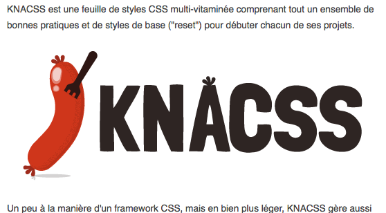

# Guidelines : Accessibilité

_Statut : Working Draft (WD)_

## Généralités

- Ne pas fixer de hauteur sur les éléments afin que le contenu reste lisible lorsque le texte est zoomé.
- Respecter la hiérarchie des titres `<hX>`.
- Utiliser les éléments HTML pour leur fonction/sémantique et non pas pour leur forme.
  - Utiliser les éléments pouvant recevoir le focus (`<a>`, `<input type="button">`) lorsqu'ils sont cliquables/interactifs.
- Exploiter WAI ARIA <https://www.w3.org/WAI/intro/aria> lorsque c'est pertinent pour aider le navigateur.

## Structure générale

### Structure HTML

#### Menu de navigation

Utiliser des combinaisons `<ul><li>` (liste non ordonnée) pour structurer les menus de navigation dans un élément `<nav role="navigation”>`.

### Éléments sémantiques HTML5

#### Zone d’en-tête principale

```html
<header role="banner">[…]</header>
```

La balise `<header>` peut être utilisée plusieurs fois dans la page mais l’attribut `role="banner"` ne doit être utilisé qu’une seule fois.

#### Pied de page

```html
<footer role="contentinfo">[…]</footer>
```

La balise `<footer>` peut être utilisée plusieurs fois dans la page mais l’attribut `role="contentinfo"` ne doit être utilisé qu’une seule fois.

#### Zone de contenu principal

```html
<main role="main">[…]</main>
```

La balise `<main>` ne peut être utilisée qu’une seule fois dans la page ainsi que l’attribut `role="main"`.

#### Système de navigation principale

```html
<nav role="navigation">[…]</nav>
```

La balise `<nav>` et son attribut `role="navigation"` peuvent être utilisés pour un système de navigation principal ou secondaire, englobant des menus contenant des liens internes au site.

Exemple :

- Le menu principal du site (souvent affiché dans l’en-tête)
- Un menu secondaire affiché dans certaines pages internes (parfois dans une barre latérale)
- Un menu secondaire affiché dans le pied de page

Ne sont pas concernés :

- Le fil d’ariane
- Les systèmes de pagination
- table des matières

Plus d’informations : [http://www.accede-web.com/notices/html-css-javascript/1-structure/1-5-role-navigation/](http://www.accede-web.com/notices/html-css-javascript/1-structure/1-5-role-navigation/)

## Un peu de CSS

### outline et focus

Les éléments interactifs (liens, champs, boutons) affichent un contour lorsqu'ils réagissent au `:focus`, c'est à dire au clic, au touch ou à la navigation clavier.

Ce contour correspond à la propriété CSS `outline` (ce n'est pas une `border` ni un `box-shadow`) et il est important de ne pas le supprimer autour des éléments cliquables (pas de `outline: none`) car il a été conçu pour rendre ces éléments accessibles à tous (= se repérer lors d'une navigation au clavier).

Exemple tiré de&nbsp;: <https://developer.mozilla.org/fr/docs/Web/CSS/:focus-visible>

```css
.custom-button:focus {
  /* alternative pour anciens navigateurs */
  outline: none;
  background: lightgrey;
}

.custom-button:focus:not(:focus-visible) {
  /* suppression du focus lors du clic/tap */
  background: transparent;
}

.custom-button:focus-visible {
  /* affichage du focus lors de la navigation au clavier */
  outline: 4px dashed darkorange;
  background: transparent;
}
```

### CSS generated content

On peut générer du contenu en CSS à l’aide de `::before` et `::after` et la propriété `content`, pour afficher une icône par exemple (gérée via une font-icon).

Mais la plupart des lecteurs d’écrans actuels peuvent retranscrire ce contenu, ce qui peut provoquer une gêne (voir [http://tink.uk/accessibility-support-for-css-generated-content/](http://tink.uk/accessibility-support-for-css-generated-content/)).

Pour éviter cela, il est préférable d’insérer l’attribut `aria-hidden=true` sur l’élément.

Exemple :

```html
<a href="URL" class="btn"> <i class="icon-kiwi" aria-hidden="true"></i> KiwiParty </a>
```

### Contenu lu mais masqué à l’écran

Ne **jamais** utiliser `display: none` ou `visibility: hidden` pour masquer visuellement du texte qui devrait être retranscrit par un lecteur d’écran.

Utiliser plutôt la classe `.visually-hidden`, présente dans [KNACSS](http://knacss.com/). Cette astuce CSS permet de cacher visuellement du contenu texte mais tout en restant accessible aux lecteurs d’écrans.

```css
.visually-hidden {
  position: absolute !important;
  border: 0 !important;
  height: 1px !important;
  width: 1px !important;
  padding: 0 !important;
  overflow: hidden !important;
  clip: rect(0, 0, 0, 0) !important;
}
```

**Exemple :**


_Bouton "précédent" d’un slider_

Ne pas faire :

```html
<button class="btn-icon swiper-button-prev">
  <i class="icon-arrow" aria-hidden="true"></i>
  <span>Éléments précédents</span>
</button>
```

```css
.swiper-button-prev span {
  display: none;
}
```

À faire :

```html
<button class="btn-icon swiper-button-prev">
  <i class="icon-arrow" aria-hidden="true"></i>
  <span class="visually-hidden">Éléments précédents</span>
</button>
```

## ARIA

WAI-ARIA est une technologie permettant de donner des indications d'accessibilité supplémentaires par rapport aux comportements natifs déjà prévus par les navigateurs pour les éléments HTML de base. Elle passe par les attributs `role` (landmarks, regions, widgets divers) et `aria-*` (propriétés). ARIA est particulièrement recommandé pour les composants complexes pilotés par JavaScript (ex : menus déroulants, sliders, onglets, modales...).

- [Matrice des rôles ARIA](http://whatsock.com/training/matrices/)

La bibliothèque de plugins jQuery Pepin utilise ARIA pour la plupart des composants <https://github.com/alsacreations/pepin>

## Liens d’évitement

- Prévoir des liens d'évitement en haut de document pour accéder rapidement au contenu, à la navigation à la recherche, etc.

Voir [Guidelines HTML](Guidelines-HTML.md)

## Titres de page

Dans `<title>`, éviter le caractère `|` (pipe) comme séparateur. Préférer `:` (deux-points).

## Liens

### Les intitulés des liens

Tous les liens doivent avoir un **intitulé**, un lien "vide" n’est pas accessible.

**Exemple :**


_Liens vers les réseaux sociaux_

Ne pas faire :

```html
<a href="URL" class="link-facebook"></a>
```

```css
.link-facebook {
  display: block;
  height: 2rem;
  width: 2rem;
  background-image: url('facebook.png');
}
```

→ dans ce cas là, le lecteur d’écran retranscrit l’intégralité de l’URL.

Même en ajoutant un attribut `title="Retrouvez-nous sur Facebook"` sur le lien, celui-ci reste considéré comme vide.
De plus, il n’est pas sûr à 100% que l’attribut `title` soit correctement restitué par le lecteur d’écran (tout dépend de la configuration de l’utilisateur).

À faire :

```html
<a href="URL" class="link-facebook">
  <span class="visually-hidden">Retrouvez-nous sur Facebook</span>
</a>
```

```css
.link-facebook {
  display: block;
  height: 2rem;
  width: 2rem;
  background-image: url('facebook.png');
}
```

→ dans ce cas là, le lecteur d’écran retranscrit bien _"Retrouvez-nous sur Facebook"_.

### Ouverture dans une nouvelle fenêtre

Signaler lorsqu’un lien s’ouvre dans une nouvelle fenêtre :

#### Première méthode

```html
<a href="URL" target="_blank" aria-label="Lire l’article (nouvelle fenêtre)">Lire l’article</a>
```

#### Deuxième méthode

```html
<a href="URL" target="_blank" title="Lire l’article (nouvelle fenêtre)">Lire l’article</a>
```

## Images

Chaque image doit avoir un attribut `alt`. Les images décoratives (qui n'apportent rien au contenu) doivent avoir un attribut alt vide ``.

Documentation : [https://www.w3.org/WAI/tutorials/images/](https://www.w3.org/WAI/tutorials/images/)

### Image porteuse d’information ou cliquable

Une image **porteuse d’information ou cliquable** doit avoir une alternative textuelle, l’attribut `alt` doit reprendre l’information figurant sur l’image.

Exemple d’une image **cliquable** :



```html
<a href="www.knacss.com">
  
</a>
```

Exemple d’une image **porteuse d’information** :


```html

```

**Attention** : inutile de commencer l’attribut `alt=""` par `"Image : …"`, cette information sera retranscrite par les lecteurs d’écrans lors de la lecture de l’élément ``.

### Image décorative

Une image de **décoration** doit avoir un `alt` vide afin que l’image ne soit pas retranscrite par les lecteurs d’écrans.

Exemple d’une image de **décoration** :


```html

```

## SVG

### SVG dans lien

Utiliser de préférence un `<span>` invisible pour l’alternative textuelle, le texte sera alors retranscrit par les lecteurs d’écrans (cf "[Astuces CSS](#heading=h.wsw7a5jk60yz)" plus haut).

Meilleure technique relevée par Atalan : [http://blog.atalan.fr/svg-liens-et-lecteurs-decran/](http://blog.atalan.fr/svg-liens-et-lecteurs-decran/)

```html
<a href="…">
  <span class="visually-hidden">Le titre du lien</span>
  <svg aria-hidden="true">…</svg>
</a>
```

## Formulaires

Utiliser l'élément `<fieldset>` associé à `<legend>` pour regrouper les champs ayant trait à la même thématique (ex : coordonnées du visiteur lors d'une commande en ligne.

Toujours associer un `<label>` à un élément de formulaire `<input>` ou `<textarea>` pour définir son intitulé. Ne pas utiliser l'attribut `placeholder` comme seule indication.

Ne pas enlever les styles au focus pour toujours savoir quel est le champ actif.

Indiquer de manière claire les champs obligatoires.

Compléter si besoin par `aria-required="true"` et `aria-labelledby` par exemple

```html
<label for="numero-m">Numéro de membre *</label>
<input type="text" id="numero-m" aria-describedby="hint" />
<p id="hint">Numéro composé de 4 chiffres.</p>
```

## Navigation

### Navigation cohérente

Faciliter la navigation avec un menu, une recherche ou un plan du site, exploitables au clavier.

### Tabindex

Les éléments pouvant recevoir le focus autres que nativement `<a>`, `<input>` ou `<button>` pourront être équipés de `tabindex="0"`.

Les éléments ne devant pas recevoir de focus doivent comporter l'attribut `tabindex="-1"`.

S'il y a lieu, changer l'ordre de tabulation avec des attributs `tabindex` positifs pour réfléter l'ordre logique et/ou l'ordre visuel des éléments.

## Tableaux

N'utiliser les tableaux que pour la présentation de données, et non pour la structure du document ou du design.

## Médias

Utiliser un lecteur audio/vidéo accessible, par exemple les éléments HTML5 natifs.

Fournir une piste de sous-titres avec le format webVTT et l'élément `<track>`.

## Design

Respecter les taux de contrastes minimum entre le texte et le fond.

- https://app.contrast-finder.org/ propose des couleurs suffisament contrastées quand c'est pas déjà le cas
- https://developer.paciellogroup.com/resources/contrastanalyser/ à installer, permet de pipetter dans tout programme, pas juste le navigateur

Ne pas indiquer une information uniquement par la couleur.

Respecter une taille minimum de police pour la lisibilité.

## Javascript

### ARIA live

Utiliser l'attribut `aria-live` sur les informations provenant de chargements AJAX ou dévoilées par JavaScript dynamiquement (ex : non présentes naturellement dans le flux de la page comme des alertes).

```html
<div role="alert" aria-live="assertive" aria-atomic="true">
  <p>Message envoyé avec succès / Article ajouté au panier</p>
</div>
```

On pourra moduler avec `aria-relevant` (`additions`, `removals`, `text`, `all`) selon qu'on ajoute le contenu au conteneur ou que c'est lui-même qui se voit inséré dans le corps de la page.

### Autres composants

Pour tous les composants de page agissant sur le contenu, de type swiper, slider, slideshow, accordéon, pagination, onglets, menu déroulant, on privilégiera les scripts "accessibles", y compris ceux utilisant ARIA. Le but étant, entre autres, de ne pas gêner la navigation au clavier et de permettre la lecture de la page avec une synthèse vocale.

La bibliothèque de plugins jQuery Pepin est un départ pour cela <https://github.com/alsacreations/pepin>

Pour les menus déroulants et mega menus, Accessible Mega Menu a fait ses preuves <https://adobe-accessibility.github.io/Accessible-Mega-Menu/>

## Ressources

- Notices Accedeweb [http://www.accede-web.com/notices/](http://www.accede-web.com/notices/)
- Patterns accessibles [http://a11yproject.com/patterns/](http://a11yproject.com/patterns/)
- Exemples ARIA [http://heydonworks.com/practical_aria_examples/](http://heydonworks.com/practical_aria_examples/)
- RGAA 3 [https://references.modernisation.gouv.fr/rgaa-accessibilite](https://references.modernisation.gouv.fr/rgaa-accessibilite)
- Plugins jQuery accessibles [https://a11y.nicolas-hoffmann.net/](https://a11y.nicolas-hoffmann.net/)
- Plugins vanilla JS accessibles [https://van11y.net/](https://van11y.net/)

## Outils

### Devtools

- Accessibilité dans les devtools de Chrome [https://www.smashingmagazine.com/2020/08/accessibility-chrome-devtools/](https://www.smashingmagazine.com/2020/08/accessibility-chrome-devtools/)

### Synthèses vocales

- NVDA
- VoiceOver (natif sur macOS, iOS) (activation : cmd + fn + F5), voir [https://www.apple.com/voiceover/info/guide/_1131.html](raccourcis clavier)
- Jaws
