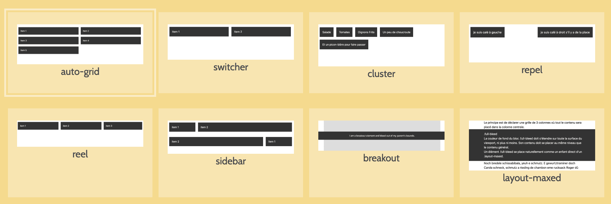

# Guidelines : CSS

Statut : Working Draft (WD)

Bonnes pratiques CSS appliquées par l'agence web [Alsacreations.fr](https://www.alsacreations.fr/), évoluant dans le temps et adaptées à chaque nouveau projet.

## Résumé

De manière générale et sauf projets d'intégration spécifiques, nous privilégions les méthodologies, langages et outils suivants&nbsp;:

- Méthodologie CSS : **Cube CSS**
- Préprocesseur **Sass** (syntaxe `.scss`) *ou* Post-processeur (postCSS)
- Constructeur de classes utilitaires : **Tailwind CSS**

Tous les détails et bonnes pratiques internes concernant ces technologies sont détaillés au sein de ce présent document.

## Bonnes pratiques CSS globales

### Points généraux

- Accessibilité
  - Opter pour des tailles de polices fluides (de préférence en `rem`), éviter les tailles de police de taille fixe (`px` ou `pt`) car inaccessibles aux personnes nécessitant d’agrandir les contenus textuels.
- Maintenabilité
  - Privilégier systématiquement l'usage de sélecteurs de **class** plutôt que les sélecteurs d'éléments (`li`, `span`, `p`) et ne jamais cibler via un sélecteur `#id`.
  - Éviter les *sélecteurs composés* tels que `.modal span` ou `.modal .date` mais plutôt `.modal-date` pour conserver une spécificité minimale.
  - Prévoir dès le départ un nom de classe pour chaque élément HTML (même anodin tels que `<span>`, `<p>` ou `<a>`) afin qu'il puisse être ciblés sans avoir à faire à sa hiérarchie.
  - Éviter d’écraser une règle CSS par une autre.
  - La règle `!important` doit être éradiquée si possible du fait de son poids extrêmement important (certaines parties des styles peuvent toutefois exceptionnellement employer à juste titre `!important`).
- Performances
  - Durant la phase de développement l'intégration se fait sur plusieurs fichiers CSS (composants, layout, etc.) que l'on rassemble (`@import`) dans un fichier unique.
  - Les fichiers CSS doivent être minifiés pour économiser du poids de chargement.
  - Toujours préciser quelle(s) propriété(s) doit être animée dans une transition ou animation.
  - Éviter d’animer des propriétés autres que `transform` (`translate`, `rotate`, `scale`) ou `opacity` ou `filter` (ou alors ajouter la propriété `will-change` au cas par cas).

### Ordre des déclarations

Les déclarations au sein d'une règle CSS sont ordonnées de façon à faire apparaître les propriétés importantes en tête de liste.

Voici dans quel ordre nous déclarons nos propriétés :

1. Propriété **`display`** : tout ce qui affecte le rendu par défaut de l’élément
2. **Positionnement** : tout ce qui détermine la position de l’élément
3. **Modèle de boîte** : tout ce qui influe sur les dimensions de l’élément
4. **Transformations** et **transitions**
5. **Typographie** : tout ce qui détermine les caractéristiques de la police de caractères
6. **Décoration** : les propriétés purement ornementales

Exemple :

```css
selecteur {
  display: inline-block;
  position: relative;
  top: -1em;
  z-index: 1337;
  max-width: 50%;
  margin: 1em;
  padding: 0;
  overflow: hidden;
  text-align: right;
  font: bold 1.5em/1.3 arial, verdana, sans-serif;
  background: rgba(0, 0, 0, 0.5);
}
```

**_Note : La démarche de réordonnement est manuelle, en se servant de cette liste comme référence.**

## Méthodologie : Cube CSS

Cube CSS est une Méthodologie d'intégration CSS conçue par Andy Bell en 2019 ([Documentation officielle](https://cube.fyi/)).

**CUBE est un acronyme qui signifie Compositions, Utilities, Blocks, Exceptions** (détails ci-après).

Le grand principe de la méthodologie Cube CSS est - contrairement à beaucoup d'autres - "d'embrasser la Cascade CSS plutôt que d'essayer de la contrer".

Les styles sont progressivement hérités de la page gobale, vers des compositions, puis vers les différents composants.

**Cube CSS est une méthodologie et non un framework, donc s'adapte à Sass, BEM, Bootstrap, WordPress, VueJS, etc.**

### Pré-requis de Cube

Tout projet Cube CSS nécessite en amont au minimum :

- Un fichier **["Reset CSS"](https://github.com/alsacreations/bretzel/blob/main/public/bretzel-reset.css)** : ce fichier est maintenu en interne chez nous et mis à jour régulièrement.
- Une **feuille de styles basique** pour définir les styles des éléments de générique : html, body (taille de base, couleur, police), liens (+ survol et focus), titres, listes, etc.

### Compositions (Layouts)

Le "C" de "CUBE" signifie "Compositions". *Note : nous les appelons **"Layouts"** chez nous pour éviter de faire la confusion avec "Composants".*



*(exemples de Layouts rassemblés sur [Bretzel](http://bretzel.alsacreations.com/#layouts))*

**Les Layouts constituent l'un des principaux apports de la méthodologie CubeCSS&nbsp;: il s'agit de zones d'affichages neutres et flexibles concues en Flexbox ou Grid Layout réutilisables un peu partout et destinées à recueillir les composants.**

Toutes les pages web comportent l'un ou plusieurs de ces Layouts, souvent répétés. Il s'agit donc dans un premier temps de faire la liste des Layout nécessaires pour les maquettes.

### Utilities (classes utilitaires)

Le "U" de "CUBE" signifie "Utilities" et désigne les classes utilitaires (également appelées atomiques) dont le principe est qu'à chaque classe correspond une action et une seule.

Les classes utilitaires sont à rédiger dans le HTML directement (ex. `<p class="mt-20 text-pink"></p>`) et on devrait se limiter aux informations de **Couleurs**, **Espacements** et **Typographie**, tant que possible.

#### Générateur de classes utilitaires&nbsp;: Tailwind

Nous utilisons [Tailwind CSS](https://tailwindcss.com) comme générateur de classes utilitaires (uniquement la partie `@utilities`).

Le fichier de config de Tailwind, qu'il est indispensable d'adapter à chaque projet, permet :

- d'utiliser directement les classes utilitaires dans le HTML (ex. `<p class="mt-20 text-pink"></p>`)
- d'utiliser les variables au sein de CSS (ex. `p {margin-top: theme("clé.clé")`)

### Blocks (Composants)

Le "B" de "CUBE" signifie "Blocks". *Note : nous les appelons **"Components"** chez nous... parce que ce sont des "Composants" card, button, carrousel, progressbar, ...*

Exemple :

```css
.card {
  /* ici des styles qui ne seraient ni apportés par le Layout ni par les Utilities */
}
```

### Exceptions (Variantes)

Le "E" de "CUBE" signifie "Exceptions", ce sont les variantes d'un composant ou d'un layout.

Cube CSS se sert des attributs `aria-` ou `data-` en HTML et le sélecteur d'attributs en CSS pour cibler les Exceptions ([pourquoi ?](https://www.aleksandrhovhannisyan.com/blog/represent-state-with-html-attributes-not-class-names/))&nbsp;:

```html
<!-- exemple de variante de card -->
<div class="[ card ]" data-variant="reversed"></div>
```

```css
.card[data-variant="reversed"] {
  flex-direction: row-reverse;
}
```

Lorsqu'ils sont présents, utiliser autant que possible les **attributs ARIA** pour cibler les variantes d'un élément&nbsp;:

```css
a[aria-current="page"] {...}
.toggle-btn[aria-expanded="true"] {...}
.label[aria-hidden="true"] {...}
```

### Groupement des classes dans Cube CSS

Les noms de classes sont regroupés par fonctions :

- Soit entre crochets (symboles `[` et `]`, ne pas oublier l'espace)
- Soit séparés par un "pipe" (symbole `|`, ne pas oublier l'espace)

 et dans cet ordre&nbsp;:

1. Le **nom primaire** ("sémantique") du Block
2. Les **noms des Layouts** si nécessaires
3. Les **classes utilitaires** (core + design tokens)

```html
<!-- exemple de nommage groupé -->
<article class="[ card card--primary ] [ l-media ] [ bg-base color-primary ]" data-variant="reversed">
</article>
```

```html
<!-- autre exemple de nommage -->
<section class="[ card-group ] [ l-autogrid ]" role="group">
  <div class="[ card ] [ l-media ] [ mx-8 text-hotpink ]"></div>
</section>
```

```html
<!-- autre exemple de nommage (avec pipe) -->
<section class="card-group | l-autogrid" role="group">
  <div class="card | l-media | mx-8 text-hotpink"></div>
</section>
```

## Guidelines Sass / postCSS

Certaines fonctionnalités CSS indispensables ne sont actuellement pas réalisables en CSS natif&nbsp;:

- Concaténation des fichiers lors d'un `@import`
- Variables et constantes
- Mixins
- Custom Media (Media Queries contenant une variable)
- (Imbrications de sélecteurs)
- etc.

Selon les projets, deux options sont envisagées pour bénéficier de ces fonctionnalités&nbsp;:

- Le pré-processeur [Sass](https://sass-lang.com/) (syntaxe `.scss`) dans nos projets d'intégration.
- Le post-processeur [PostCSS](https://postcss.org/)

Quelle que soit la solution choisie, la méthode de compilation vers CSS dépend du type de projet (statique, Vue, Vite, Webpack, etc.).

### Variables

Les variables Sass sont généralement à éviter au profit des variables présentes dans la configuration du contructeur de classes utilitaires (ex. `font-size: theme('fontSize.18');` pour Tailwind).

Le Constructeur de classes utilitaires propose un fichier de configuration contenant les "variables" de l'ensemble du projet (couleurs, tailles, breakpoints, etc.). Ces variables sont à utiliser en priorité (ex. `font-size: theme('fontSize.18');` pour Tailwind), et nous n'utilisons pas de variables Sass dans nos projets.

**Aucune valeur numérique ne devrait apparaître dans les styles de développement sans être associée à une variable.**

### Breakpoints et Media Queries

La liste de points de rupture (breakpoints) figure dans la configuration du contructeur de classes utilitaires (ex. `@screen valeur {}` pour Tailwind).

Sauf contre-indication selon projet, les valeurs des breakpoints sont :

- `sm: 576px`
- `md: 992px`
- `lg: 1400px`

```scss
// composant card sur écran "lg" ou plus
@screen lg {
  .card {
    display: flex;
  }
}
```

### Notation imbriquée (nesting)

La [Notation imbriquée](https://sass-lang.com/guide#topic-3) (nesting) de Sass ou de CSS natif facilite la lecture et la maintenabilité du code en évitant de répéter les occurences de chaque sélecteur.

Le nesting est particulièrement préconisé :

- Pour les événements tels que `&:hover`, `&:focus`, `&:active`.
- Pour les pseudo-classes telles que `&:first-child`, `&:empty`, etc.
- Pour les pseudo-éléments tels que `&::before`, `&::after`.
- Pour les media queries `@media ()`.

**À éviter** *(duplication du sélecteur .wrapper, rend difficile de trouver, renommer, déplacer, supprimer ces sélecteurs) :*

```scss
.wrapper {}

.wrapper:hover,
.wrapper:focus {}

.wrapper::before, 
.wrapper::after {}

@media (width > 640px) {
  .wrapper {}
  .wrapper::before {}
}
```

**À privilégier** *(le nesting permet de réduire les duplications de sélecteurs) :*

```scss
.wrapper {
  
  &:hover,
  &:focus {}
  
  &::before,
  &::after {}
  
  @media (width > 640px) {

    &::before {}
  }
}
```

Les inconvénients majeurs de cette notation imbriquée (nesting) sont qu'elle génère des sélecteurs CSS composés (donc avec une spécificité qui augmente).

**Il est conseillé d'éviter les sélecteurs imbriqués, ou au pire de limiter la syntaxe à un seul niveau d'imbrication.**

**À conseiller si vraiment nécessaire** (un seul niveau d'imbrication génère des sélecteurs composés de 2 niveaux au maximum `.home .home-first { … }`) :

```scss
.home {
  & .home-first {
  }
  & .home-spotlights {
  }
}
```

## Méthodes de positionnement

De nombreuses méthodes de positionnement existent en CSS. Les méthodes modernes offrent de meilleures performances, une meilleure flexibilité et une maintenabilité améliorée.

Nous privilégions **Flexbox et Grid Layout** de manière générale en tenant compte de certains points d'attention.

### Grid Layout

[Grid Layout](https://developer.mozilla.org/fr/docs/Web/CSS/CSS_grid_layout/Basic_concepts_of_grid_layout) sera choisi en priorité pour les avantages suivants :

- Gère parfaitement les deux axes à la fois
- Place très précisément les éléments
- Permet de cibler uniquement le parent
- A peu de comportements contre-intuitifs
- Les areas offrent une représentation visuelle idéale
- Gère très bien le Responsive via Media Queries

Par contre les inconvénients majeurs de Grid Layout sont :

- Gère moins bien le Responsive via taille du contenu ou [Container Queries](https://www.alsacreations.com/article/lire/1915-Les-Container-Queries-en-CSS.html)

### Flexbox

[Flexbox](https://developer.mozilla.org/fr/docs/Web/CSS/CSS_flexible_box_layout/Basic_concepts_of_flexbox) sera choisi en priorité pour les avantages suivants :

- Passage à la ligne (wrap) d'enfants de tailles différentes
- Centrage simple de rangées multiples
- Grande liberté donnée aux enfants (grow, shrink)
- Prévoit un affichage inversé (*-reverse)
- Permet de se passer de Media / Container Queries

Par contre les inconvénients majeurs de Flexbox sont :

- Ne gère pas bien les deux axes en même temps
- De nombreux comportements contre-intuitifs (alignements, shrink, min-width)

**Lorsqu'aucune des deux méthodes ne sort clairement du lot, alors Grid Layout sera notre choix par défaut.**

## Mode d'apparence (Light Mode, Dark Mode)

Le mode d'apparence est un paramètre que l'utilisateur peut définir via ses réglages systèmes ainsi que via son navigateur.

Les techniques CSS modernes permettent de gérer finement ces modes :

- Couleurs système (ex. Canvas, CanvasText)
- `@prefers-color-scheme` : Teste le Mode d'apparence utilisateur (OS ou navigateur) et permet de s'y adapter
- `color-scheme` : Force le navigateur à adapter l'UI à un Mode d'apparence (couleurs système, scrollbars, boutons,...)
- `light-dark()` : Fonction permettant d'alterner deux couleurs selon le Mode d'apparence. Expérimental

Dans nos projets, **les classes utilitaires de Tailwind sont idéales pour gèrer les modes d'apparence** à partir du moment où le dark mode est indiqué dans le fichier de config : `darkMode: 'class', // 'false' or 'media' or 'class'` (`class` = une classe est ajoutée sur `html`, `media` = c'est `@prefers-color-scheme` qui s'en charge).

Ainsi, un exemple de bouton qui s'adapte automatiquement aux modes light ou dark pourrait s'écrire ainsi :

```html
<button class="
  btn btn-icon | text-gray-90 dark:text-gray-10  bg-fairytale dark:bg-gray-90"
>Hey !</button>
```

## Fonts, polices de caractère

On privilégie l'auto-hébergement des fichiers de police, sans passer par Google Fonts <https://gwfh.mranftl.com/fonts>

## Bonus : Media print (impression)

Nous proposons une feuille de styles "Print" dans nos projets d'intégration web.

La feuille de styles dédiée à l'impression aide aussi à l'export PDF dans le navigateur. La plupart du temps il s'agira en priorité de masquer les éléments inutiles dans un document statique ou papier (ex : navigation) et de retirer les décorations superflues.

- [Une feuille de styles de base pour le media print](https://www.alsacreations.com/astuce/lire/1160-Une-feuille-de-styles-de-base-pour-le-media-print.html)
- [Faire une feuille de style CSS print pour l'impression](https://www.alsacreations.com/tuto/lire/586-feuille-style-css-print-impression.html)
