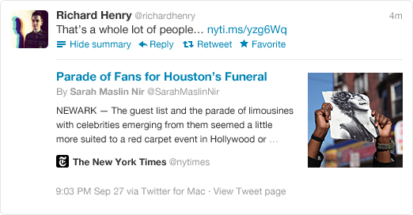
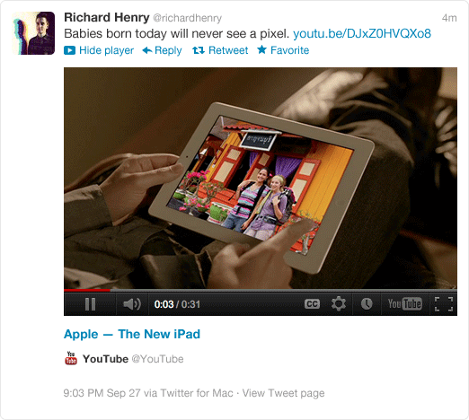
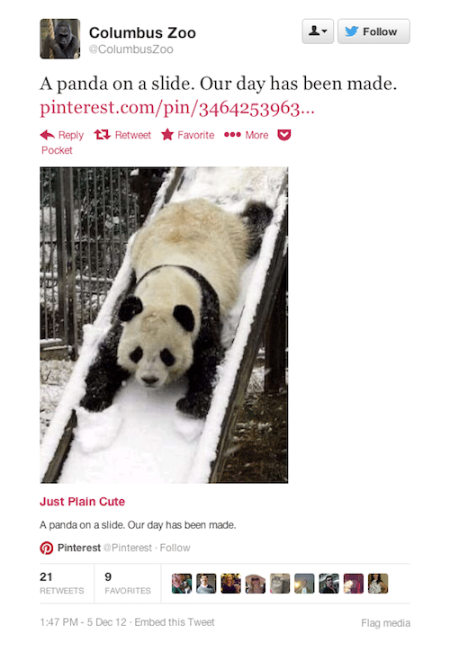

# Guidelines : HTML

_Statut : Working Draft (WD)_

## Généralités

- L’encodage des fichiers et des bases de données doit se faire en UTF-8 (sans BOM).
- Les indentations se font à l’aide de deux espaces et non à l'aide de tabulations. Pour assurer une cohérence inter-projets, utiliser la convention [EditorConfig](http://editorconfig.org/).
- Les liens absolus ne doivent pas faire apparaître le protocole (par exemple href="//www.alsacreations.fr/" et non href="http://www.alsacreations.fr").
- Choisir des noms en anglais prioritairement (classes, fichiers, images, etc.).
- Séparer les noms des fichiers, des images des classes et id CSS par des tirets (`.slide-info`, `styles-ie.css`, `jquery-2.0.min.css`, etc), sauf convention contraire apportée par le client.
- Les noms d'éléments et des attributs sont rédigés en minuscules,
- Les éléments sont imbriqués correctement,
- Les valeurs identiques aux attributs ne sont pas renseignées sauf nécessité (ex. en HTML5 pas de `checked="checked"`),
- L'usage des double quotes est préconisé autour des valeurs d’attributs (ex. `class="fruit"`) ainsi que les simples quotes dans les autres langages JavaScript, PHP (ex. `alert('blup');`) de manière à faciliter les imbrications (ex. `alert('<p class="fruit">plop</p>');`)

## Doctype

Le doctype HTML5 est fortement recommandé.

```html
<!DOCTYPE html>
```

## Langue

La langue de la page est systématiquement renseignée via un attribut dans l’élément `<html>` :

```html
<html lang="fr"></html>
```

## Encodage

L’encodage du document (en UTF-8) est systématiquement renseigné via un élément meta dans le `<head>` :

```html
<meta charset="UTF-8" />
```

## Titre de la page

Le titre de page, différent à chaque page, est systématiquement renseigné via un élément `<title>` dans le `<head>` :

```html
<title>J'aime la choucroute</title>
```

## Meta "Viewport"

Pour une adaptation du site web vers les terminaux mobiles, l’élément `<meta name="viewport">` est ajouté dans la partie `<head>`.

```html
<meta name="viewport" content="width=device-width, initial-scale=1.0" />
```

**_Note : Les syntaxes empêchant l’agrandissement des contenus par le visiteur seront proscrites (maximum-scale=1, user-scalable=no, etc.)._**

Documentation : [https://www.alsacreations.com/article/lire/1490-comprendre-le-viewport-dans-le-web-mobile.html](http://www.alsacreations.com/article/lire/1490-comprendre-le-viewport-dans-le-web-mobile.html)

## Favicon

L’icône de favori est utilisée de différentes manières par les navigateurs et systèmes. Le format ICO est ancien, le format PNG permet une meilleure définition avec un poids plus léger. Mais :

- Tous les navigateurs récents reconnaissent le format PNG
- IE ne reconnaît que la relation "shortcut icon" (standard : “icon”), ne reconnaît pas le format PNG, et la version 10 ne supporte plus les commentaires conditionnels (pour isoler sa déclaration non standard et le format ICO). IE (y compris 10) va tout de même chercher par défaut dans la racine `/favicon.ico`

Source : [http://realfavicongenerator.net/](http://realfavicongenerator.net/)

Source (variante) : [https://github.com/audreyr/favicon-cheat-sheet](https://github.com/audreyr/favicon-cheat-sheet)

## Sémantique globale

Les éléments HTML5 `<header>`, `<article>`, `<main>`, `<footer>`, `<aside>`, `<section>` et `<nav>` sont privilégiés aux éléments neutres `<div>` si leur fonction s’y prête.

La structure globale préconisée est celle-ci :

- `<body>` : corps de page et du site web
- `<div id="layout-page">` : sous-conteneur optionnel. Par exemple si body ne suffit pas
- `<div class="layout-inner">` : sous-conteneur optionnel. Par exemple pour centrer plusieurs blocs de la même manière
- `<main id="main" role="main">` : conteneur général du contenu principal, typiquement ce qui n'est pas dans header et footer
- `<header id="header" role="banner">` : entête global, comportant souvent la navigation et des éléments qui se retrouvent en commun sur (quasiment) toutes les pages
- `<footer id="footer" role="contentinfo">` : pied de page global comportant des éléments qui se retrouvent en commun sur (quasiment) toutes les pages
- `<aside class="aside" role="complementary">` : barre latérale globale. Note : `<aside>` doit pouvoir être extrait de la page sans poser de problème, en clair ne pas y placer la navigation par exemple.
- `<nav id="navigation" role="navigation">` : navigation principale
- `<form id="search" role="search">` : recherche principale

## Liens d’évitement

Afin de proposer une navigation alternative au clavier pour certaines déficiences visuelles, des liens d’évitements sont systématiquement intégrés dans la structure HTML :

```html
<div class="skip-links">
  <a href="#navigation">Aller au menu</a>
  <a href="#main">Aller au contenu</a>
  <a href="#search">Aller à la recherche</a>
</div>
```

Afin de rendre automatiquement visibles / audibles les liens d’évitement lors de la navigation au clavier via la touche Tab, nous employons par défaut ces règles de styles CSS :

```html
.skip-links { position: absolute; } .skip-links a { position: absolute; left: -9999px; padding: 0.5em; background: #000;
color:#fff; text-decoration: none; } .skip-links a:focus { position: static; }
```

## Accessibilité

Une attention toute particulière sera apportée à l’accessibilité des documents afin que chaque utilisateur, quelle que soit sa défaillance, puisse avoir plein accès aux contenus proposés.

Documentation : [https://github.com/DISIC/guide-integrateur](https://github.com/DISIC/guide-integrateur)

## Microdata

Dans la mesure du possible, et selon le type de site, les microformats les plus courants seront ajoutés.

Vocabulaire privilégié : [http://schema.org](https://schema.org) (promu et utilisé par Google, Yahoo, Bing, Yandex).

Types : Events, Person, Product, Movie, Book, Recipe, et toute la [hiérarchie](https://schema.org/docs/full.html), avec les attributs HTML5.

Documentation : [http://www.alsacreations.com/article/lire/1509-microdata-microformats-schema-semantique.html](http://www.alsacreations.com/article/lire/1509-microdata-microformats-schema-semantique.html)

## États des éléments

Les éléments ayant une condition ou un état particulier seront préfixés :

- Le lien, l’onglet ou la page active est désigné par la classe `.is-current`
- tout état sera préfixé par "is-". Ex. `.is-paused`, `.is-opened`, `.is-hidden`, `.has-*`
- tout événement ou comportement JavaScript sera préfixé par "js-". Ex. `.js-nav-button`, `.js-menu`, `.js-is-hidden`

## Liens target \_blank

Dans la mesure du possible, éviter les liens ouvrant une nouvelle fenêtre/onglet, sans les signaler explicitement. Ils perturbent la navigation classique du visiteur et peuvent créer des failles de sécurité.

Voir aussi [https://medium.com/@jitbit/target-blank-the-most-underestimated-vulnerability-ever-96e328301f4c](https://medium.com/@jitbit/target-blank-the-most-underestimated-vulnerability-ever-96e328301f4c)

**_Toujours utiliser `rel="noopener noreferrer"` sur des liens `target="_blank"`_**

## Meta spécifiques - SEO et réseaux sociaux

Les liens entre site web et les différents réseaux sociaux sont de plus en plus forts. Certaines meta spécifiques permettent de faciliter ou d’améliorer ces liens, sans que l’on connaisse directement leur impact sur le référencement direct.

### Twitter card

Elle permet une présentation améliorée d’un site web sur le réseau Twitter et lien ce site web à un compte Twitter via son URL mentionnée dans un Tweet. Exemple :



Exemple d’une carte de type _summary_

Le code correspondant pourrait ressembler à cela :

```html
<meta name="twitter:card" content="summary" />
<meta name="twitter:url" content="http://alsacreations.com/{content_url}" />
<meta name="twitter:image" content="/default_square_icon.png" />
<meta name="twitter:title" content="{page_title} – Alsacréations" />
<meta
  name="twitter:description"
  content="Alsacréations, blog d'actualité dans le monde des technologies web (HTML5, CSS 3, JavaScript, etc.)"
/>
<meta name="twitter:site" content="@alsacreations" />
<meta name="twitter:creator" content="@diou" />
```

- **Twitter:card** : "summary", “player” ou “photo” sont des valeurs possibles
- **Twitter:url** : l’URL canonique de la référence
- **Twitter:title** : Le titre de la carte (devrait correspondre au titre de la page de l’URL canonique)
- **Twitter:image** : l’URL de l’image illustrant la page
- **Twitter:site** : le compte Twitter associé au site web éditeur (publisher)
- **Twitter:creator** : le compte Twitter associé à l’auteur

Plus d’infos : [https://dev.twitter.com/cards/types/summary](https://dev.twitter.com/cards/types/summary)

Exemple d’une carte de type "photo" (la première) et “player” (la seconde) :



**_Note : l’utilisation de ces meta invalide le document s’il est de doctype HTML5. La valeur twitter:\* n’est en effet pas reconnue pour la balise meta._**

Une fois en place, il faut demander la validation par Twitter : [https://dev.twitter.com/docs/cards/validation/validator](https://dev.twitter.com/docs/cards/validation/validator)

### Facebook et OpenGraph

L’[OpenGraph](http://ogp.me/) permet, à l’instar de Twitter Cards, de maîtriser d’avantage les contenus partagés sur le réseaux social Facebook (entre autres). Le titre, l’image d’illustration, la description, l’URL, etc. peuvent être personnalisés pour ce réseaux spécifique.

Parmi les valeurs de og: les plus utilisées on retrouve :

```html
<meta property="og:title" content="Alsacréations, agence Web exotique" />
<meta property="og:url" content="http://alsacreations.fr" />
<meta property="og:locale" content="fr_FR" />
<meta property="og:site_name" content="Alsacréations.fr" />
<meta
  property="og:description"
  content="Alsacréations est une agence Web exotique proposant à ses clients des solutions originales et professionnelles."
/>
<meta property="og:image" content="/default_square_icon.png" />
<meta property="og:type" content="website" />
```

Une balise meta spécifique à Facebook permet d’associer le site web à une application précise de Facebook.

```html
<meta property="fb:app_id" content="250737731706431" />
Afin de pouvoir utiliser ces meta spécifiques, un namespace xmlns doit être créé, ce qui rend invalide la page en HTML5
pur. La balise HTML devient alors :
<html lang="fr" xmlns:fb="http://www.facebook.com/2008/fbml" xmlns:og="http://opengraphprotocol.org/schema/"></html>
```

### OpenSearch

Si le projet comporte un moteur de recherche efficace et pertinent, il peut être doté d’[OpenSearch](http://www.opensearch.org/).

## Performance

On veillera à respecter des critères communs de performance :

- Limiter le nombre de ressources différentes exploitées (images, feuilles de styles, scripts, fonts)
- Limiter le nombre de requêtes HTTP
- Minifier les ressources texte (CSS, JavaScript, JSON...)
- Différer les requêtes moins importantes (lazy loading) (en JavaScript ou avec l'attribut natif `loading`)
- Établir [https://bitsofco.de/your-first-performance-budget-with-lighthouse/](un budget de performance pour Lighthouse)

Voir aussi : <https://github.com/thedaviddias/Front-End-Performance-Checklist>
