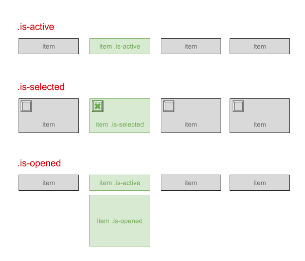

# Guidelines JavaScript

_Statut : Working Draft (WD)_

## Généralités

- L’encodage des fichiers et des bases de données doit se faire en UTF-8 (sans BOM).
- JavaScript apporte une amélioration progressive, c’est-à-dire qu’il se produit une dégradation gracieuse lorsqu’il est désactivé.
- Les scripts doivent être placés de préférence en fin de document, avant la balise `</body>` (ceci n’est plus extrêmement significatif suite aux optimisations des navigateurs mais permet d’éviter les écueils majeurs et de visualiser l’ordre de chargement au même endroit).
- L’appel à une librairie ou à un framework (jQuery) fait toujours apparaître le numéro de version et le suffixe `-min` si le fichier a été minifié.
- Les attributs `defer` et `async` seront utilisés à bon escient pour réduire la latence (voir [Article](http://www.alsacreations.com/astuce/lire/1562-script-attribut-async-defer.html)).

### Syntaxe

- Valider le code avec JSHint (disponible en plugins d’éditeur de code ou gulp).
- Les indentations se font à l’aide de deux espaces et non avec la tabulation.
  Pour assurer une cohérence inter-projets, utiliser la convention [EditorConfig](http://editorconfig.org/).
- Utiliser la syntaxe _lowerCamelCase_ (voir https://fr.wikipedia.org/wiki/CamelCase) pour l'écriture des noms de variables, fonctions, objets, etc.
- Utiliser "use strict"; en début de script pour activer le mode strict d’ECMAScript.
- Toujours utiliser le mot clé `var` pour déclarer une variable et maîtriser sa portée.
- Toujours terminer les instructions par un `;`.
- Toujours commenter (même brièvement) le code à l’aide de `//` ou `/* */`.
- Ne jamais laisser un appel à `console.log()` ou `eval()` dans le code en production.
- Ne pas déclarer de fonctions/variables dans le scope global qui pourraient amener à des conflits avec d’autres scripts. Si besoin, utiliser une [IIFE](https://en.wikipedia.org/wiki/Immediately-invoked_function_expression).

En bonus, suivre les recommandations de

- [Airbnb JavaScript Style Guide](https://github.com/airbnb/javascript)
- [JavaScript The Right Way](http://jstherightway.org/)
- [Principe d'écriture d'un code Javascript cohérent et idiomatique](https://github.com/rwaldron/idiomatic.js/tree/master/translations/fr_FR)
- [Programming JavaScript Applications](http://chimera.labs.oreilly.com/books/1234000000262/apa.html)
- [clean-code-javascript](https://github.com/ryanmcdermott/clean-code-javascript/blob/master/README.md)

## Déclaration et variables

Utiliser les structures littérales simple pour déclarer tableaux et objets.

```
var monTableau = [1,2,3];
var monObjet = { };
```

De préférence, encapsuler les ensembles de variables utilisés par un même script dans un objet, par exemple :

```
var maConfig = {
  slider_width: 800,
  slider_height: 600
}
```

Ou :

```
var maConfig = {
  slider : {
    width: 800,
    height: 600
  }
}
```

L’accès est facile ensuite par `maConfig.slider.width` (dans cet exemple).

# Fonctions et blocs

Toujours déclarer les fonctions dans le scope, et pas dans un bloc (if ou autre car cela ne fait pas partie d’ECMAScript), à moins d’utiliser la notation suivante :

```
if (x) {
  var mafonction = function() {}
}
```

Sinon, en suivant le principe précédent

```
var maConfig = {
  slider: {
    width: 800,
    height: 600
  }
}
maConfig.fonctionSpecifique = function() {
  return true;
}
```

De préférence :

- Nommer les fonctions/plugins d’après les classes HTML avec lesquelles elles vont interagir.
- Les préfixer par un code relatif au nom du projet.
- Placer les accolades sur la première ligne de bloc et non sur la suivante pour éviter (entre autres) les erreurs de minification dues à l’insertion implicite de `;` pour terminer les lignes.

```
if (quelquechose) {
  // …
} else {
  // …
}
```

## Chaînes de texte

Utiliser les simples quotes `'` pour conserver une consistance et faciliter l’écriture du HTML.

```
var msg = 'Ceci est un message';
```

Ne pas utiliser l’antislash `\` pour continuer une chaîne multiligne sur la ligne suivante (ne fait pas partie d’ECMAScript), utiliser plutôt la concaténation, en attendant mieux (ES6).

```
var str = 'Ceci est une phrase plutôt ' +
    'longue constituée de plusieurs mots ' +
    'sans être pour autant démesurée. ';
```

Dans la mesure du possible, ne pas stocker les textes "traduisibles" dans les fichiers JavaScript mais passer par le code HTML, éventuellement caché ou dans des attributs `data-*`.

## Commentaires

Pour les brefs commentaires, le double slash `//` sur une seule ligne est privilégié. Il permet à plus grande échelle de désactiver un bloc de code par `/* */` qui englobe ces courts commentaires sans être gêné.

```
// Une ligne de commentaire
```

Les commentaires plus conséquents, en introduction de fichier ou de description de fonctions doivent se faire avec des blocs `/** */`. Si le commentaire ne doit pas être supprimé à la minification, la syntaxe `/*! */` le permet.

## Closures

Pour isoler le code JavaScript des autres scripts externes (frameworks, plug-ins...) et ne pas engendrer de conflit de variable, il est nécessaire d’encapsuler les instructions dans un bloc de fonction.

```
(function() {
  "use strict";
  // Le code…
})();
```

Avec jQuery :

```
<script src="jquery.js">
<script>
(function($) {
  // Le code avec $...
})(jQuery);
</script>
```

## JSHint

Configuration par défaut du fichier `.jshintrc` placé à la racine de chaque projet pour configurer la validation JavaScript

```
{
  "browser": true,
  "devel": true,
  "jquery" : true,
}
```

## Editorconfig

à placer à la racine du projet sous le nom `.editorconfig`

```
# EditorConfig is awesome: http://EditorConfig.org

root = true

[*]
end_of_line = lf
indent_style = space
indent_size = 2
charset = utf-8
```

## Bonnes pratiques jQuery/JavaScript pour l'intégration

### Généralités

- Préfixer une variable représentant un objet jQuery (résultat d’un sélecteur) par `$`

```
var $el = $('#el');
```

- Démarrer avec cette syntaxe pour document ready :

```
jQuery(document).ready(function($) {
  // à l’intérieur, usage de $ comme d’habitude...
});
```

### Convention de nommage

- Exploiter au maximum le document "statique" HTML, dont les attributs `data-*`, les classes, ou l’ordre des éléments pour construire un script autour, plutôt que de se reposer uniquement sur JavaScript ou des variables indépendantes de la structure HTML.
- Placer les attributs `data-*` sur les éléments pour lesquels ils seront utiles, notamment le conteneur du plugin/composant.
- Différencier classes qui vont permettre de styler l’élément (dans les fichiers CSS) et classes qui vont permettre d’activer un comportement spécifique JS sur l’élément (fichiers JS) en les préfixant par `js-`.

```
<div class="slideshow js-slideshow" data-timing="2000" ...>
   <figure class="slideshow-item">
```

#### Classes suggérées



- `.is-active` pour un élément qui est tout le temps visible mais qui peut avoir un état actif/inactif (ex : élément de menu ou de sous-menu au focus/survol).
- `.is-selected` pour un élément qui est tout le temps visible mais qui peut avoir un état sélectionné/désélectionné (ex : bouton/bloc radio/checkbox).
- `.is-opened` pour un élément qui peut avoir deux états affiché ou masqué (ex : menu déroulant, panel d'accordéon). Inverse possible : `.is-closed`.

- Utiliser les classes CSS du projet pour cacher/masquer des éléments, lancer des transitions, ou changer leur état

```
$('element').addClass('visually-hidden');
```

plutôt que

```
$('element').hide();
```

- De même pour les animations/transitions, il est souvent préférable de passer par l’ajout/suppression de classes CSS.

#### Interactions et événements

- Se reposer sur les éléments pouvant recevoir le focus (`<a>`, `<button>`, `<input>`) pour l’ajout d’événements `onclick`, etc.
- Toujours écrire les gestionnaires d'événement avec `.on()` pour les retrouver plus facilement dans le code plutôt qu'avec les alias.
- Penser à prévoir les cas de figure où le code peut être appelé plusieurs fois dans une même page, ou plusieurs fois par erreur sur un même élément (par exemple avec la gestion `.off()` et `.on()` des événements, les attributs `data-*` pour savoir s’il a déjà été appliqué, etc).
- Suivre le principe des _Optimistic Updates_ : les opérations du visiteur prennent effet immédiatment pour ne pas attendre, et son corrigées une fois le résultat réel de l'opération retournée par le serveur.

### ARIA et accessibilité

Exploiter les [propriétés/états](https://www.w3.org/TR/wai-aria/states_and_properties) ARIA pour les composants dynamiques :

- Ajouter/supprimer l'attribut `aria-hidden="true"` pour les éléments qui ne doivent pas être visibles ni rendus vocalement. Celui-ci peut être décorélé de `.visually-hidden`.
- Utiliser les attributs `aria-selected`, `aria-checked`, `aria-expanded`, `aria-controls` le cas échéant.
- Utiliser `aria-live` pour les zones de contenu se mettant à jour en JavaScript et devant être signalées.

Exploiter les [rôles](https://www.w3.org/TR/wai-aria/roles) pour les composants complexes (ex : onglets avec `tab`, `tabpanel`, `tablist`... accordéons et sliders divers).

Vérifier que la navigation au clavier par tabulations suit un cheminement logique et n'est pas capturée par un élément sans possibilité d'en sortir. Ajouter en JavaScript `tabindex="-1"` sur les éléments ne devant plus recevoir le focus (ex : items de formulaire dans un parent masqué par `.visually-hidden`). Utiliser `tabindex` si c'est nécessaire pour changer l'ordre de tabulation (voir [Using the tabindex attribute](https://www.paciellogroup.com/blog/2014/08/using-the-tabindex-attribute/)).

## Plugin boilerplate

Encapsuler les développements jQuery tant que possible dans des plugins, idéalement avec le _boilerplate_ : un modèle relativement simple de plugin-type, avec options par défaut, remplacées/complétées par les paramètres `data-*` en HTML, méthodes privées et publiques.

Voir aussi sur le dépôt Github [https://github.com/alsacreations/pepin](https://github.com/alsacreations/pepin)

À l'intérieur du plugin :

- Se servir des paramètres par défaut et de la possibilité de les remplacer lors de l'appel par des options passées en objet au plugin et/ou par la valeur des attributs `data-*`.
- Simplifier au maximum le code en découpant par actions simples.

Ne pas hésiter à utiliser des plugins éprouvés mais toujours tester s’ils peuvent être multiples sur une même page.
