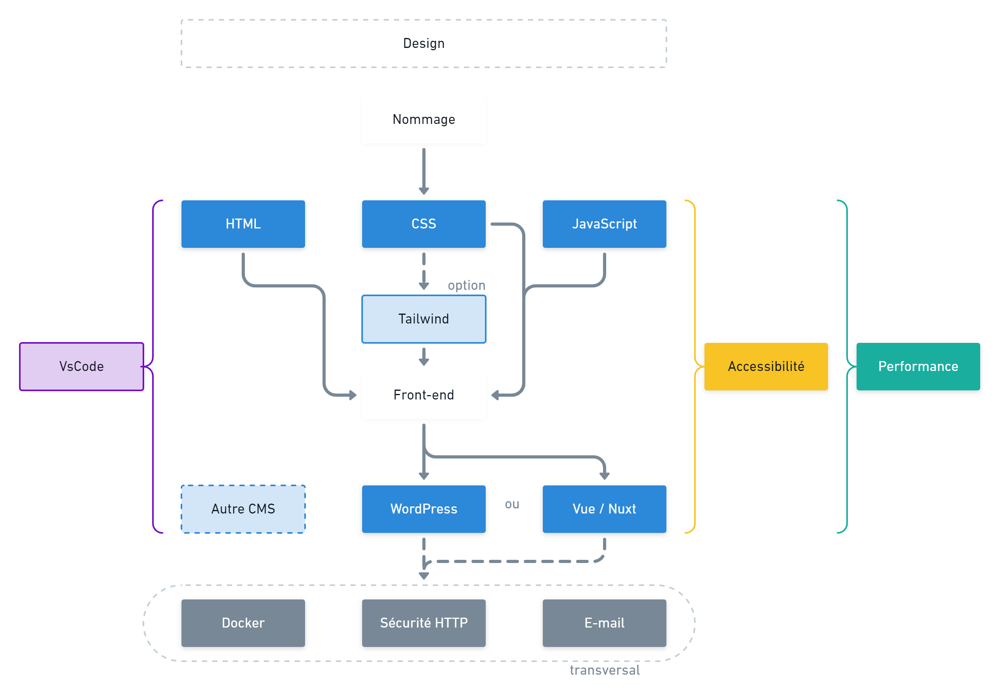

# Kiwipedia, made by Alsacréations 🥝

Kiwipedia est une base de connaissance technique librement partagée et dont les objectifs sont&#8239;:

- D'uniformiser et d’harmoniser les processus de conception de l’agence web [Alsacreations.fr](https://www.alsacreations.fr/).
- De favoriser l’intervention de profils de compétences variés au sein d'une équipe.
- De faciliter la maintenance des projets.

💬 Le Web est un métier de plus en plus tentaculaire, comportant un vaste ensemble de thématiques qui vont avoir au final un impact sur le succès auprès de l'internaute&#8239;: **l'accessibilité, la qualité, l'ergonomie, la performance, le référencement (SEO), la maintenabilité**. Tous les critères ne seront pas toujours applicables et le seront bien souvent en fonction du temps alloué.

Cette présente base de connaissances techniques est le fruit de notre veille technologique quotidienne et se compose de&#8239;:

- **Guidelines** (bonnes pratiques internes concernant divers langages et technologies web)
- **Ressources** (documentations diverses, checklists, cheatsheets)
- **Starters** (tutoriels rapides pour initier des projets)
- **Configs** (fichiers de configuration tels que `.editorconfig`, `stylelintrc.json`, `tsconfig.json`, `settings.json` pour VScode)

## Socle de connaissances minimal

Les thématiques suivantes sont **au c&oelig;ur de notre activité** d'agence web spécialisée dans l'accessibilité, il est absolument indispensable de respecter les bonnes pratiques qui y sont préconisées et de s'y référer aussi souvent que possible&#8239;:

- [**Conventions Générales de Nommage**](guidelines/naming-conventions.md)
- [**Ressource Visual Studio Code**](resources/vscode.md)
- [**Guidelines HTML**](guidelines/html.md)
- [**Guidelines CSS**](guidelines/css.md)
- [**Guidelines JavaScript**](guidelines/javascript.md)
- [**Guidelines Accessibilité**](guidelines/accessibility.md)
  
## Guidelines transversales

Ces thématiques couvrent l'ensemble des domaines auxquels une agence web est confrontée. Les connaître doit faire partie de notre périmètre de compétences&#8239;:

- [**Guidelines Interopérabilité**](guidelines/interoperabilite.md)
- [**Guidelines RGPD**](guidelines/rgpd.md)
- [**Guidelines Écoconception**](guidelines/ecoconception.md)
- [**Guidelines SEO**](guidelines/seo.md)
- [**Guidelines Tailwind CSS**](guidelines/tailwind.md)
- [**Guidelines Cube CSS**](guidelines/cubecss.md)
- [**Guidelines TypeScript**](guidelines/typescript.md)
- [**Guidelines Sécurité HTTP**](guidelines/http-security.md)
- [**Guidelines Webdesign**](guidelines/webdesign.md)
- [**Guidelines E-mailing**](guidelines/e-mailing.md)
- [**Guidelines Icones**](guidelines/icons.md)

## Selon typologie de projet

Ces thématiques traitent de technologies précises, qui varient selon les projets que nous prenons en charge&#8239;:

- [**Guidelines VueJS**](guidelines/vue.md)
- [**Guidelines WordPress**](guidelines/wordpress.md)
- [**Guidelines Développement PHP / MySql**](guidelines/php-mysql.md)

**NOTE : Aucun de ces documents n'est figé, ils sont en constante amélioration et évolution.**

## Architecture globale

Nous percevons ces guidelines comme faisant partie d'un ensemble organisé.

## Ressources et pense-bêtes

- [**Pense-Bête Flexbox**](resources/flexbox-cheatsheet.png)
- [**Pense-Bête Grid Layout**](resources/grid-cheatsheet.png)
- [**Cheatsheet Linux**](resources/linux.md)
- [**Cheatsheet Docker**](resources/docker.md)
- [**Cheatsheet htaccess**](resources/htaccess.md)
- [**Cheatsheet git**](resources/git.md)
- [**Cheatsheet NPM**](resources/npm.md)
- [**Ressources et liens utiles**](resources/links.md)
- [**Checklist**](resources/checklist.md)

## Licence

Auteur : Alsacréations

Les contenus de ce dépôt sont disponibles sous une licence Creative Commons « Attribution - Pas d'Utilisation Commerciale - Partage à l'Identique 2.0 France (CC BY-NC-SA 2.0) ».
