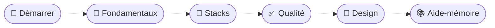

# Kiwipedia 🥝

> **Le compagnon de route des projets web Alsacréations.**
> Une base de connaissances vivante, organisée selon le cycle de vie d’un projet web : de l’initialisation à la mise en production.

## Pourquoi Kiwipedia ?

Kiwipedia est le fruit de notre veille technologique, librement partagée. Elle vise à :

- **Uniformiser** les processus de conception de l’agence [Alsacreations.fr](https://www.alsacreations.fr/).
- **Faciliter** l’intervention de profils variés au sein d’une équipe.
- **Pérenniser** la maintenance de nos projets.
- **Renforcer** notre impact auprès des internautes via l’**accessibilité**, la **qualité**, l’**ergonomie**, la **performance** et le **référencement**.

## Le cycle de vie d’un projet web

```mermaid
flowchart LR
    A([🚀 Démarrer]) --> B([🧱 Fondamentaux])
    B --> C([🧩 Stacks])
    C --> D([✅ Qualité])
    D --> E([🎨 Design])
    E --> F([📚 Aide-mémoire])
    click A "#-démarrer-un-projet"
    click B "#-fondamentaux--conventions"
    click C "#-stacks--frameworks"
    click D "#-qualité--exigences-non-fonctionnelles"
    click E "#-design--production-visuelle"
    click F "#-aide-mémoire"
```

Chaque section ci-dessous correspond à une étape de ce cycle. Les fiches sont annotées d’un **statut** (stable, draft, expérimental), d’un **niveau** (débutant, intermédiaire, avancé) et d’une **date de mise à jour**.

---

## 🚀 Démarrer un projet

> Tout ce qu’il faut pour bien initialiser un projet : outillage, configuration, workflow.

- [**Initialisation de projet**](starters/project-init.md) — Squelette, conventions et configuration de base.
- [**Projet avec Vite**](starters/vite.md) — Bootstrap rapide d’un projet front moderne.
- [**Hébergement AWS S3**](starters/aws-s3.md) — Déploiement statique sur S3.
- [**Visual Studio Code**](guidelines/vscode.md) — Extensions, configuration et bonnes pratiques.
- [**Workflow Git**](guidelines/git.md) — Conventions de commits et de branches.

## 🧱 Fondamentaux & conventions

> Le socle commun à **tous** les projets, à respecter scrupuleusement et à consulter aussi souvent que nécessaire.

- [**Conventions de nommage**](guidelines/naming-conventions.md) — Composants, fichiers, classes, variables.
- [**HTML**](guidelines/html.md) — Sémantique, structure, microdonnées.
- [**CSS**](guidelines/css.md) — Architecture, variables, dark mode, responsive.
- [**JavaScript**](guidelines/javascript.md) — Style, idiomes et bonnes pratiques.
- [**TypeScript**](guidelines/typescript.md) — Typage et configuration.
- [**Accessibilité**](guidelines/accessibility.md) — RGAA, ARIA, checklist et patterns.

## 🧩 Stacks & frameworks

> Les guidelines spécifiques aux technologies que nous mettons en œuvre selon les projets.

- [**Vue.js**](guidelines/vue.md) — Architecture, composants, conventions.
- [**WordPress**](guidelines/wordpress/README.md) — Thème, sécurité, performance, recette.
- [**PHP / MySQL**](guidelines/php-mysql.md) — Développement back-end.
- [**E-mailing**](guidelines/e-mailing.md) — Templates HTML compatibles.
- [**CSS utilitaires** *(archivé)*](archives/css-utilities.md) — Approche Tailwind / utilitaires.

## ✅ Qualité & exigences non-fonctionnelles

> Les bonnes pratiques transverses à valider en recette comme en production.

- [**Performances**](guidelines/performances.md) — Web Vitals, optimisation, audits.
- [**SEO**](guidelines/seo.md) — Référencement naturel.
- [**RGPD**](guidelines/rgpd.md) — Conformité, cookies, consentement.
- [**Écoconception**](guidelines/ecoconception.md) — Sobriété numérique.
- [**Sécurité HTTP**](guidelines/http-security.md) — En-têtes, CSP, bonnes pratiques.
- [**Interopérabilité**](guidelines/interoperabilite.md) — Compatibilité multi-navigateurs et appareils.

## 🎨 Design & production visuelle

> Les fiches dédiées au design, à la production graphique et aux assets.

- [**Webdesign**](guidelines/webdesign.md) — Maquettes, design system, livrables.
- [**Icônes**](guidelines/icons.md) — Choix, intégration et accessibilité des pictogrammes.

## 📚 Aide-mémoire

> Pense-bêtes à garder sous la main pendant le développement.

- [**Cheatsheet Flexbox**](cheatsheets/flexbox-cheatsheet.png)
- [**Cheatsheet Grid Layout**](cheatsheets/grid-cheatsheet.png)
- [**Cheatsheet Git**](cheatsheets/git.md)
- [**Cheatsheet Linux**](cheatsheets/linux.md)
- [**Cheatsheet Docker**](cheatsheets/docker.md)
- [**Cheatsheet htaccess**](cheatsheets/htaccess.md)
- [**Cheatsheet NPM**](cheatsheets/npm.md)

## 🔗 Ressources & veille

- [**Liens utiles**](resources/links.md) — Veille, outils, articles de référence.
- [**Archives**](archives/) — Anciennes guidelines conservées pour mémoire.

---

## Contribuer

Kiwipedia évolue : chaque fiche peut être amendée, enrichie ou repensée.

- 📐 [**Guide de style éditorial**](STYLE.md) — Conventions typographiques, emojis sémantiques, blockquotes typés.
- 📄 [**Modèle de fiche**](.template.md) — Squelette à dupliquer pour toute nouvelle guideline.

## Licence

Auteur : **Alsacréations**.

Les contenus de ce dépôt sont disponibles sous licence Creative Commons « **Attribution – Pas d’Utilisation Commerciale – Partage à l’Identique 2.0 France** » ([CC BY-NC-SA 2.0](https://creativecommons.org/licenses/by-nc-sa/2.0/fr/)).
