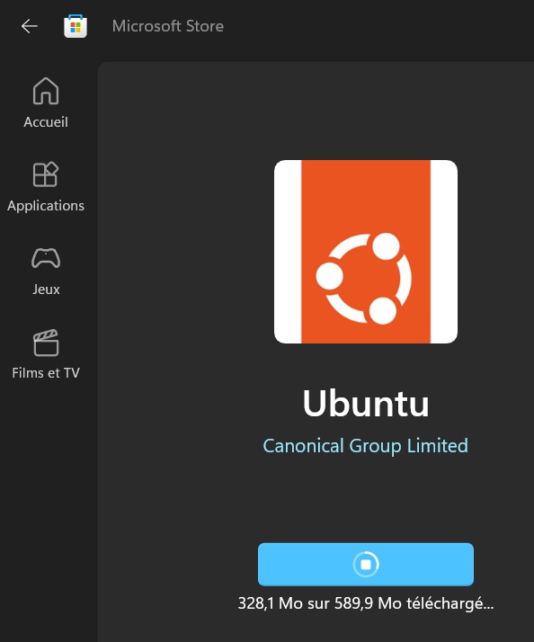
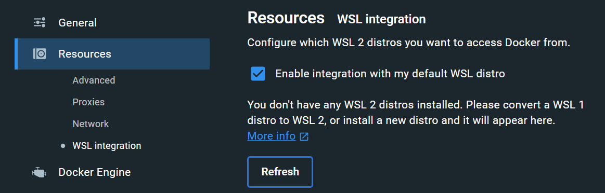

# Cheatsheet : Docker

Voir aussi <https://www.alsacreations.com/tuto/lire/1836-Docker--decouverte-et-environnement-LAMP-pour-WordPress.html> et <https://www.alsacreations.com/tuto/lire/1838-Docker-compose.html>

## Commandes Docker utiles

* Compiler un Dockerfile dans le dossier courant pour créer une image : `docker build -t <image:tag> .`
* Compiler une image en conteneur et l'exécuter : `docker run --name <nomducontainer> <image:tag>` (+ voir autres options)
* Démarrer ou arrêter un conteneur s'il est déjà existant : `docker start <nomducontainer>` (ou `stop`)
* Arrêter tous les conteneurs actifs : `docker stop $(docker ps -aq)`
* Exécuter une commande dans le conteneur : `docker container exec -it <nomducontainer> <lacommande>` (par exemple `bash` pour ouvrir un shell)
* Lister tous les conteneurs : `docker container ls` ou `docker ps -a`
* Lister toutes les images : `docker image ls`
* Supprimer un conteneur : `docker container rm <nomducontainer>` (`-f` force)
* Supprimer une image : `docker image rm <image>`
* Utiliser le chemin courant dans une commande docker : `$PWD`
* Créer un network : `docker network create my-custom-net` et l'utiliser au run : `--network=my-custom-net`
* Copier un fichier dans un conteneur actif : `docker cp .\fichier.sql.gz 133713371337:/root` où 133713371337 est l'ID du conteneur obtenu par `docker container list` et `/root` le chemin de destination.
* Redémarrer tous les conteneurs arrêtés : `docker restart $(docker ps -a -q)`
* Renommer une image : `docker tag <old> <new>`
* Mettre à jour une politique de redémarrage : `docker update --restart=unless-stopped <nomducontainer>`
* Annuler le redémarrage auto sur tous les coneneurs : `docker update --restart=no $(docker ps -a -q)`

## Commandes Docker-compose utiles

* Compiler et démarrer tous les conteneurs `docker compose -p <projet> up -d` (`-d` : "détache" en background pour rendre la main, `-p` : nom du projet sinon il utilise le nom du dossier courant)
  * 🏗️ Ajouter `--build` pour forcer la recompilation de l'image d'après le fichier Dockerfile
* Compiler sans démarrer les conteneurs `docker compose build` (en option ajouter le nom du service concerné, `--no-cache` pour éviter le cache)
* Tout arrêter, supprimer les conteneurs, volumes et réseaux `docker compose -p <projet> down`
* Stopper un service, le supprimer ainsi que ses volumes anonymes `docker compose rm -s -v <nom_du_service>`
* Journaux `docker compose logs`
* Statut des conteneurs `docker compose -p <projet> ps`
* Liste des images utilisées `docker compose images`
* Exécute une commande dans un conteneur `docker compose exec <service> <command>`
* Arrêter et supprimer `docker compose rm --stop`
* Arrêter `docker compose stop <service>`
* Démarrer `docker compose start <service>`
* Mettre en pause `docker compose pause <service>`
* Reprendre `docker compose unpause <service>`
* Visualiser la conf intégrant les variables d'env `docker compose convert`
* Lister tous les projets démarrés à partir de compose `docker compose ls`

## Ressources / espace disque / statistiques

* Statistiques cpu/ram temps réel `docker stats`
* Visualiser l'espace occupé `docker system df`
* Ressources pour les processus/conteneurs `docker ps --size`
* Nettoyer les images/volumes inutilisés `docker image prune` / `docker volume prune`
* Nettoyer le _build cache_ `docker builder prune` / `docker buildx prune`
* Nettoyer toutes les ressources système inutilisées `docker system prune`

## Lancer un shell minimaliste

Télécharge et exécute immédiatement un shell dans un container "alpine" super-léger : `docker run -it alpine /bin/sh`

### Inspection

* Informations système : `docker info`
* Savoir quel dossier a initialisé un container : `docker inspect <nomducontainer> | grep "com.docker.compose.project.working_dir"`
* Logs : `docker logs <nomducontainer>` (ajouter `-f` pour suivre en continu)
* Ports ouverts : `docker port <nomducontainer>`
* Processus : `docker top <nomducontainer>`
* Informations techniques : `docker inspect <nomducontainer>`
* Différences appliquées : `docker diff <nomducontainer>`

### Ignorer des fichiers

Utiliser un fichier [.dockerignore](https://shisho.dev/blog/posts/how-to-use-dockerignore/) pour exclure fichiers et dossiers lors d'une étape de _build_ (notamment commandes ADD, COPY).

### Sauvetage d'un volume égaré

`docker volume ls -f 'dangling=true'` pour lister les volumes détachés et leur hash, `docker volume inspect <volume_hash>` pour localiser l'emplacement sur le disque (par exemple `/var/lib/docker/volumes/...`), examiner pour chacun le dossier `/_data`

## Options Docker run

* `-d` : permet de détacher l'exécution du conteneur du terminal courant
* `-p` : permet de lier un port (local:container `-p 8080:80`)
* `-u` : permet de spécifier l'utilisateur+groupe d'exécution
* `-v` : permet de déclarer un volume (local:container `-v /var/path/to/mydata/mysql:/var/lib/mysql`)
* `-e` : permet de passer/spécifier une variable d'environnement
* `-i` : permet d'avoir un terminal interactif (_stdin_), par exemple pour entrer un mot de passe au prompt (souvent combiné avec `t`)
* `-t` : alloue un _pseudo-tty_
* `--link` : permet de "lier" un hostname d'un conteneur à un autre (par exemple un serveur mysql dans un 1er conteneur `mysqlserver` devient `--link mysqlserver:db` dans le 2e, on utilise alors `db`)
* `--restart always` : indique au service Docker de redémarrer le conteneur au boot et de le maintenir actif si Docker est lui-même relancé

Astuces :

* ajouter `-v /etc/localtime:/etc/localtime:ro` pour faire correspondre avec le fuseau horaire hôte
* ajouter `-m 256m` pour limiter la mémoire à 256 Mo
* ajouter`--read-only` pour que le filesystem soit en lecture seule
* suffixer un volume par`:ro` pour qu'il soit en lecture seule
* afficher les _restart policies_ de tous les conteneurs existants `docker inspect --format "{{.HostConfig.RestartPolicy.Name}}, {{.Name}}, {{.Id}}" $(docker ps -qf status=running) | sort -t, -k1 |column -s, -t`
* après compilation de l'image,si le conteneur ne se lance pas, on peut tout de même l'utiliser/analyser avec `docker run -it <nomdelimage> <commande>` par exemple `docker run -it alpine ls` ou `docker run -it alpine /bin/bash -c "echo $HOME"`

## Dockerfile

Le fichier `Dockerfile` est compilé en image à l'aide de `docker build -t test/myapp .`

<https://hadolint.github.io/hadolint/> est un Dockerfile Linter.

* `FROM` Définit l'image source (`FROM php:8.1-cli-alpine`).
* `ENV` Définit une variable d'environnement à la compilation et à l'exécution (`ENV MY_VAR=kiwi`).
* `LABEL` Ajoute une métadonnée à l'image.
* `WORKDIR` Définit le dossier de travail pour les commandes suivantes (`WORKDIR /var/www/html`).
* `RUN` Exécute une commande à la compilation (`RUN echo Hello`).
* `CMD` Exécute une commande au démarrage du conteneur (`CMD [ "php", "./your-script.php" ]` ou `CMD [ "node", "server.js" ]`).
* `EXPOSE` Informe Docker que le conteneur écoute sur un port (`EXPOSE 80` ou `EXPOSE 80/tcp`).
* `COPY` Copie des fichiers/répertoires depuis une source hôte vers le _filesystem_ de l'image. `--chown` modifie les droits à la volée.
* `ADD` Ajoute des fichiers/répertoires (y compris depuis une URL ou une extraction tar) dans le _filesystem_ de l'image (`ADD test.txt dir/`). `--chown` modifie les droits à la volée.
* `VOLUME` Crée un point de montage (`VOLUME /myvol`).
* `ENTRYPOINT` Configure un conteneur comme un exécutable.
* `USER` Définit l'id utilisateur (UID) et groupe (GID) à utiliser lorsque l'image s'exécute et pour toute instruction suivante (RUN, CMD, ENTRYPOINT).
* `ARG` Définit une variable que l'on peut passer au moment de la compilation avec `--build-arg <varname>=<value>`.

Liste non exhaustive, voir <https://docs.docker.com/engine/reference/builder/>.

---

## Ressources et bonnes pratiques

* [Recommandations de sécurité relatives au déploiement de conteneurs Docker | Agence nationale de la sécurité des systèmes d'information](https://cyber.gouv.fr/publications/recommandations-de-securite-relatives-au-deploiement-de-conteneurs-docker)
* [Assurer des temps d'arrêt minimes avec Docker Compose](https://youtu.be/IOR18FgxhTU) (courte vidéo YouTube)
* [Awesome Self-Host Docker](https://github.com/hotheadhacker/awesome-selfhost-docker) : liste de projets à déployer soi-même avec docker-compose.
* OWASP cheatsheet <https://cheatsheetseries.owasp.org/cheatsheets/Docker_Security_Cheat_Sheet.html>
* Cheatsheet Quickref <https://quickref.me/docker>
* <https://blog.gitguardian.com/how-to-improve-your-docker-containers-security-cheat-sheet/>
* <https://www.viget.com/articles/local-docker-best-practices/>
* <https://medium.com/better-programming/docker-best-practices-and-anti-patterns-e7cbccba4f19>
* <https://github.com/FuriKuri/docker-best-practices>
* <https://snyk.io/fr/blog/10-docker-image-security-best-practices/>
* <https://www.panoptica.app/research/7-ways-to-escape-a-container>
* <https://enix.io/fr/blog/cherie-j-ai-retreci-docker-part1/>
* <https://medium.com/@remyc/comprendre-docker-dockerfile-et-docker-compose-f21fe4ba22cb>
* <https://code.visualstudio.com/remote/advancedcontainers/develop-remote-host#_connect-using-docker-contexts> Développer en remote avec vscode dans un container (⚠️ vérifier que cela ne persiste pas pour les autres projets car sinon cela pourrait écraser des conteneurs sur le serveur)

---

## Podman

Interface graphique : <https://iongion.github.io/podman-desktop-companion/>

La grande majorité des commandes Docker ont un équivalent Podman (start, stop, logs, port...).

* Tous les conteneurs `podman ps -a`
* Processus actifs dans un conteneur `podman top <container>`
* Poids des fichiers `podman ps --size --sort size`
* Exécuter une commande, par ex un backup MySQL vers l'hôte : `podman exec <container-mysql> mysqldump -uroot -p<password> <nom_base> >dump.sql`

### Podman compose

* Démarrer à partir d'un fichier docker-compose.yml local `podman-compose up -d`
* Démarrer à partir d'un fichier compose spécifique `podman-compose -f path/to/compose.yml up -d`
* Démarrer UN conteneur/service en particulier à partir d'un fichier compose `podman-compose up -d <service>`
* Retirer un service `podman-compose down <service>` (tel que nommé dans le fichier yml, par exemple `db`)
* Si les ports ne sont pas ouverts pour le service `podman-compose run --service-ports <service>`

---

## Docker et performance sous Windows

Les volumes limitent les performances, notamment lors de développements WordPress/PHP. Technique :

* [Installer WSL2](https://learn.microsoft.com/fr-fr/windows/wsl/install)
* Installer Ubuntu ou autre distribution via le Microsoft Store intégré
* Activer l'option dans Docker _Use the WSL 2 based engine_
* Désormais `git clone` les projets "dans" la vm WSL et y accéder avec Visual Studio Code pour développer

### Télécharger/installer

`wsl --install`

* <https://apps.microsoft.com/detail/9NBLGGH4MSV6?hl=fr-fr&gl=FR>

### Commandes WSL

* `wsl --list --online` to see all available distros
* `wsl -l -v` to see all your currently installed distros

### Configurer

* <https://ubuntu.com/tutorials/install-ubuntu-on-wsl2-on-windows-11-with-gui-support>

### Sur Windows

Installer une distribution telle qu'Ubuntu via le Store

Activer l'intégration WSL dans Docker.

