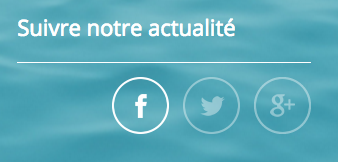
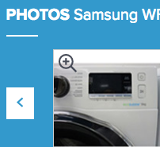
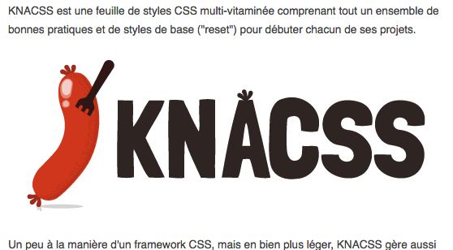
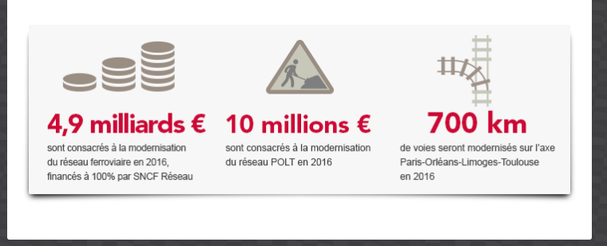
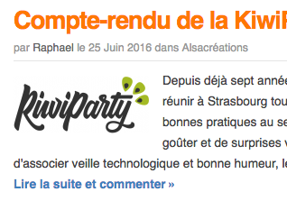

# Accessibilité

> Statut : stable · Niveau : avancé

**TL;DR** — Référence complète d’accessibilité numérique chez Alsacréations : checklist progressive (niveaux 1, 2, 3), explications techniques, patterns ARIA et ressources. Aligné RGAA et WCAG.

Bonnes pratiques d'accessibilité numérique appliquées par l'agence [Alsacreations.fr](https://www.alsacreations.fr/), évoluant dans le temps et adaptées à chaque nouveau projet.

Ce document est divisé en trois parties :

1. La [Checklist](#checklist-niveau-1-base-) (ensemble des points à respecter)
2. Les [Explications techniques détaillées](#explications-techniques-détaillées) (s'y référer lorsqu'un point de la Checklist n'est pas clair)
3. Les [Ressources d'accessibilité](#ressources-générales) (liens et outils)

---

## Checklist Niveau 1 (base) 🥈

Ces règles visent à obtenir une conformité au moins partielle au RGAA (supérieure à 50%).

### HTML

- Le code produit est valide et respecte les [standards W3C](https://www.w3.org/standards/).
- [Utiliser les éléments HTML pour leur fonction/sémantique](#s%C3%A9mantique-html) et non pas pour leur forme.
- Renseigner la [langue par défaut](#langue) de chaque page avec l'attribut `lang` sur `<html>` et indiquer les changements de langue locaux dans les blocs.
- Utiliser un [titre `<title>` pertinent/différent](#titres-de-page) pour chaque page.
- Respecter la hiérarchie des titres `<hX>`, dont au moins un `<h1>`.
- Utiliser les [landmarks ARIA](https://developer.mozilla.org/en-US/docs/Web/Accessibility/ARIA/Roles/landmark_role) avec leurs rôles explicites (ex: `<main role="main">`, encore demandé par RGAA 4.1)
- Ignorer correctement les contenus qui ne devraient *pas* être retranscrits par un lecteur d’écran (ex. `aria-hidden="true"`).
- Prévoir au moins [un lien d'accès rapide](#liens-dévitement-skip-link) ("lien d'évitement") permettant d'accéder directement au contenu principal.
- Donner [un intitulé explicite à tous les liens](#liens).
- Signaler lorsqu’un lien [s’ouvre dans une nouvelle fenêtre](#ouverture-dans-une-nouvelle-fenêtre-lien-externe).
- Hors composant spécifique, s'assurer de la cohérence de la tabulation au clavier.

### CSS

- Travailler avec des tailles de polices fluides `rem` ou `em` pour permettre l'agrandissement.
- Ne pas fixer de hauteur sur les éléments afin que le contenu reste lisible lorsque le texte est zoomé. Les éléments décoratifs et l'attribut height `` ne sont pas concernés.
- Ne pas empêcher le zoom avec `user-scalable=0` pour le viewport, utiliser `<meta name="viewport" content="width=device-width, initial-scale=1">`.
- Permettre l'affichage des pages avec un niveau de zoom jusqu'à 200%.
- Ne pas supprimer l'outline autour des éléments cliquables/focusables (pas de `outline: none`) [ou utiliser `:focus-visible`](#outline-et-focus), ne pas dégrader l'outline par défaut des navigateurs.
- Ne pas employer de contenu généré (`::before`, `::after`) pour [véhiculer des informations ou pour afficher des icônes](#css-generated-content).
- Masquer correctement [les contenus qui doivent être lus par un lecteur d’écran](#contenu-lu-mais-masqué-à-lécran) (ex. `.visually-hidden` au lieu de `display: none`).

### Formulaires

- S'assurer de l'usage des formulaires au clavier.
- Indiquer clairement les champs obligatoires (attribut `aria-required="true"`) avec dans l'étiquette la mention `" (obligatoire)"` sinon une étoile (dans ce cas avec une légende située en début de formulaire).
- Toujours associer une étiquette `<label>` à son champ respectif (avec `for` et `id` sinon ARIA).
- Utiliser [l'élément `<fieldset>` associé à `<legend>`](#formulaires-et-champs) pour regrouper les champs par thématique (ex : boutons radio, cases à cocher).
- Indiquer les formats attendus lorsqu'il y en a ; ne pas utiliser l'attribut `placeholder` comme indication (privilégier `label`), il ne doit fournir qu'un exemple d'usage.
- Associer correctement une erreur à son champ (via `aria-describedby` en général).
- Associer un [`autocomplete`](#formulaires-et-champs) pour les champs demandant une donnée personnelle (nom, prénom, e-mail, adresse, etc.).

### Design

- Respect des recommandations [webdesign](webdesign.md#checklist-accessibilité).

### Médias

- Les images [doivent comporter un attribut `alt`](#image-porteuse-dinformation-ou-cliquable) pertinent ; pour les images décoratives il doit être vide (`alt=""` ou `alt`).
- Lorsqu'un lien renvoie vers un téléchargement de fichier, il faut indiquer : son intitulé, son poids, son format, éventuellement sa langue (si différente) et l'ouverture dans une nouvelle fenêtre.
- [Rendre les fichiers SVG accessibles](#svg-et-accessibilité) : décoratifs ou non, inline ou non, dans un bouton / lien ou non.
- Utiliser un lecteur audio/vidéo accessible prêt-à-l'emploi (par exemple les éléments HTML5 natifs ou YouTube).
- Pas d'animation de plus de 5 secondes.

## Checklist Niveau 2 (demandes spécifiques) 🥇

À la carte selon les besoins exprimés, permet une conformité RGAA partielle ou totale.

- Tester avec un lecteur d'écran.
- Fournir une piste de sous-titres avec le format webVTT et l'élément `<track>` pour les vidéos.
- Fournir une alternative textuelle (une retranscription) aux formats audio.
- Rendre les fichiers PDF accessibles ou fournir une alternative `HTML`, `.doc`, `.odt` structurée.
- Utiliser l'attribut `aria-live` judicieusement sur les informations provenant de chargements AJAX ou dévoilées dynamiquement par JavaScript.
- Ajouter un *plugin* de personnalisation d'affichage : outils [AccessConfig](https://accessconfig.a11y.fr/) et [Orange Confort+](https://confort-plus.orange.com/).
- Rendre chaque script compatible avec les technologies d'assistance.
- Concevoir ou personnaliser des lecteurs audio/vidéo accessibles.
- Permettre une tabulation cohérente entre les éléments qui doivent recevoir le focus (adapter si nécessaire avec `tabindex="0"` et `tabindex="-1"` y compris les modales et la navigation).

---

# Explications techniques détaillées

## Structure générale

Chaque page doit être correctement structurée afin de définir des zones aussi appelées [regions](https://www.w3.org/WAI/tutorials/page-structure/regions/) (en-tête, pied de page, contenu principal, navigation et moteur de recherche) notamment grâce aux éléments HTML sémantiques tels que `main`, `header`, `footer`, `nav`, etc. ou aux attributs `role`.

## Sémantique HTML

### Langue

Chaque page doit avoir déclaré le type de document ainsi que la langue principale du contenu.

```html
<!DOCTYPE html>
<html lang="fr">
    ...
</html>
```

### Titres de page

Le titre de la page doit être pertinent et de préférence unique pour chaque page. Dans `<title>`, éviter le caractère `|` (pipe) comme séparateur. Préférer `:` (deux-points).

Pour une page de résultats de recherche, il faut indiquer dans le titre le mot recherché ainsi que la page actuelle si une pagination est présente :
"Vous avez recherché le mot : xxx - page 2"

### Titres

Chaque page doit être organisée selon une structure de titres et de sous-titres hiérarchisés. Chaque titre doit être balisé avec un élément HTML `<hx>` allant du niveau 1 (`<h1>`) au niveau 6 (`<h6>`), `<h1>` étant le niveau le plus important. Nous conseillons :

- d'avoir toujours un titre de niveau 1 `<h1>` et que celui-ci ne structure pas le titre du site commun à toutes les pages mais plutôt le titre du contenu courant
- d'éviter les sauts dans les niveaux de titres : pas de titre `<h4>` après un titre `<h2>`

Voir aussi <https://access42.net/en-tetes-non-conformite-wcag-clarification-titre/>

La hiérarchie peut être testée avec l'extension [Headings Map pour Chrome](https://chrome.google.com/webstore/detail/headingsmap/flbjommegcjonpdmenkdiocclhjacmbi) ou [Headings Map pour Firefox](https://addons.mozilla.org/fr/firefox/addon/headingsmap/).

### Listes

Les listes doivent être correctement structurées dans le code. Il existe 3 types de listes :

- ordonnée (numérotée)
- non ordonnée (à puces)
- de définitions

Liste ordonnée :

```html
<ol>
    <li>Étape 1</li> 
    <li>Étape 2</li>
    <li>Étape 3</li>
</ol>
```

Liste non ordonnée :

```html
<ul>
    <li>100g de farine</li>
    <li>30cl d'eau</li>
</ul>
```

Liste de définitions (ex : glossaire) :

```html
<dl>
    <dt>Terme</dt>
    <dd>Définition</dd>
</dl>
```

### Zone d’en-tête principale

```html
<header role="banner">[…]</header>
```

La balise `<header>` peut être utilisée plusieurs fois dans la page mais l’attribut `role="banner"` ne doit être utilisé qu’une seule fois.

### Pied de page

```html
<footer role="contentinfo">[…]</footer>
```

La balise `<footer>` peut être utilisée plusieurs fois dans la page mais l’attribut `role="contentinfo"` ne doit être utilisé qu’une seule fois.

### Zone de contenu principal

```html
<main role="main">[…]</main>
```

La balise `<main>` ne peut être utilisée qu’une seule fois dans la page ainsi que l’attribut `role="main"`.

### Zone de recherche

```html
<search>[…]</search>
```

Regroupe des capacités de recherche et de filtrage grâce à l'aide de contrôles de formulaire, il peut y en exister un ou plusieurs sur un même document, dans le corps ou dans une section `<header>` s'il s'agit d'un module de recherche transversal présent durant toute la navigation. Le landmark implicite est `role="search"`, il n'y a donc plus besoin de l'ajouter à `<form>`.

### Moteur de recherche

Le rôle `role="search"` doit être ajouté à l'élément HTML englobant le formulaire de recherche. Dans le cas où plusieurs recherches se trouvent au sein d'une page, elles doivent être différenciées en précisant un nom à chacune des zones via l'attribut `aria-label`.

```html
<div role="search" aria-label="Moteur de recherche principal">
  <form>[…]</form>
</div>
```

Plus d’informations : <https://developer.mozilla.org/en-US/docs/Web/Accessibility/ARIA/Roles/Search_role/>

### Navigation

#### Moyens de navigation

Chaque ensemble de pages doit proposer au moins deux moyens de navigation différents parmi la liste suivante :

- Un menu de navigation
- Un plan du site
- Un moteur de recherche interne

Le menu de navigation, les barres de navigation (fil d'ariane par exemple) et le moteur de recherche (si existant) doivent toujours être affichés et atteignables de la même manière y compris au clavier.

Utiliser des combinaisons `<ul><li>` (liste non ordonnée) pour structurer les menus de navigation (principale ou secondaire) dans un élément `<nav role="navigation”>` :

- Le menu principal du site (souvent affiché dans l’en-tête)
- Un menu secondaire affiché dans certaines pages internes (parfois dans une barre latérale)
- Un menu secondaire affiché dans le pied de page
- Un fil d’ariane
- Une pagination
- Une table des matières

La balise `<nav>` peut-être utilisée plusieurs fois, avec l'attribut `role="navigation"`. Dans le cas où plusieurs navigations sont utilisées au sein d'une page, elles doivent être différenciées en précisant un nom à chacune des zones avec l'attribut `aria-label`.

**Exemple :**

```html
<nav role="navigation" aria-label="Menu principal">[…]</nav>
```

#### Navigation au clavier, tabulation et tabindex

La navigation au clavier se fait via la tabulation (touche *Tab* du clavier ; *Shift+Tab* en arrière) sur tous les éléments interactifs *focusables* : boutons, liens, champs de formulaire, sélecteur, etc. Ce *focus* est indiqué par un contour visuel (propriété `outline` en CSS qu'il est impératif de conserver, ou proposer une alternative avec `focus-visible`).

- Le site doit être intégralement utilisable au clavier.
- L'ordre de tabulation doit être cohérent.
- Il ne doit pas y avoir de piège au clavier (si l'internaute ne peut atteindre ni l'élément *focusable* suivant, ni l'élément *focusable* précédent).

L'attribut `tabindex` permet de capturer l’ordre du focus selon le nombre qu’on lui attribue (permettant de passer d'un élément *focusable* à l'autre avec la touche `tab`). Un ordre logique est "naturellement" créé en suivant les éléments interactifs du DOM (liens, boutons, champs...). Il comprend tous les nombres positifs à partir de 0.

Il faut éviter de toucher aux valeurs positives de `tabindex` cela pourrait aller à l'encontre de l'ordre "naturel" dans le document.

On peut utiliser :

- `-1` : rend un élément *focusable* sans le rendre navigable au clavier ; s'il est ajouté sur un élément interactif, celui-ci perdra le focus.
- `0` : l'élément peut capturer le focus et être atteint via la navigation au clavier.

Les éléments pouvant recevoir le focus autres que nativement `<a>`, `<input>`, `<button>`, `<select>`, `<textarea>` (entre autres) pourront être équipés de `tabindex="0"`.

Pour en savoir plus : [MDN : tabindex](https://developer.mozilla.org/fr/docs/Web/HTML/Global_attributes/tabindex)

#### Liens d’évitement ("skip link")

Un lien d'évitement vers le contenu principal est nécessaire. D'autres liens d'évitement peuvent être ajoutés pour accéder rapidement à la navigation, à la recherche, au pied de page, etc.

- Il doit être le premier lien de la page.
- Il peut être masqué par défaut (classe `visually-hidden`) mais doit devenir visible lors du focus.
- Si le contenu principal est un élément non interactif il faut ajouter `tabindex="-1"` pour rendre cet élément *focusable* (ex. sur une balise `<main>`).

Voici un exemple de liens d'évitement&#8239;:

```html
<body>
  <ul class="skip-links">
    <li><a href="#nav">Aller à la navigation</a></li>
    <li><a href="#main">Aller au contenu</a></li>
    <li><a href="#contact">Aller au formulaire de contact</a></li>
  </ul>
  […]
  <main role="main" id="main" tabindex="-1">
```

```css
@scope (.skip-links) {
  :scope {
    position: absolute;
    top: 8px;
    left: 8px;
    margin: 0;
    padding: 0;
    list-style: none;
  }

  a {
    padding: 0.6rem 1rem;
    border: 3px solid currentcolor;
    background-color: mark;
    color: marktext;
    text-decoration: none;

    &:not(:focus, :active) {
      position: absolute;
      width: 1px;
      height: 1px;
      margin: -1px;
      overflow: hidden;
      white-space: nowrap;
      clip-path: inset(50%);
    }

    &:focus-visible {
      position: absolute;
      z-index: calc(infinity);
      width: max-content;
    }
  }
}
```

### Liens

Un lien `<a>` mène vers une nouvelle page, un nouveau contexte de navigation. À ne pas confondre avec un bouton `<button>` ou `<input type="button">` qui déclenche une action sans nécessairement changer de page (ex : déployer un menu, révéler un bloc).

#### Intitulés des liens

Tous les liens doivent avoir un **intitulé explicite**, un lien "vide" n’est pas accessible.

**Exemple :**


*Liens vers les réseaux sociaux*

Ne pas faire 👎

```html
<a href="#" class="link-facebook"></a>
```

```css
.link-facebook {
  display: block;
  height: 2rem;
  width: 2rem;
  background-image: url('facebook.png');
}
```

⚠️ Dans ce cas, le lecteur d’écran retranscrit l’intégralité de l’URL. Même en ajoutant un attribut `title="Retrouvez-nous sur Facebook"` sur le lien, celui-ci reste considéré comme vide. De plus, il n’est pas sûr à 100% que l’attribut `title` soit correctement restitué par le lecteur d’écran (tout dépend de la configuration de l’utilisateur).

À faire 👍

```html
<a href="#" class="link-facebook">
  <span class="visually-hidden">Retrouvez-nous sur Facebook</span>
</a>
```

```css
.link-facebook {
  display: block;
  height: 2rem;
  width: 2rem;
  background-image: url('facebook.png');
}
```

✅ Dans ce cas, le lecteur d’écran retranscrit bien *"Retrouvez-nous sur Facebook"*.

#### Ouverture dans une nouvelle fenêtre (lien externe)

Signaler lorsqu’un lien s’ouvre dans une nouvelle fenêtre :

```html
<a href="#" target="_blank" aria-label="Lire l’article (nouvelle fenêtre)">Lire l’article</a>
<!-- ou -->
<a href="#" target="_blank" title="Lire l’article (nouvelle fenêtre)">Lire l’article</a>
<!-- ou -->
<a href="#" target="_blank" title="Lire l’article (nouvelle fenêtre)">Lire l’article 
    
    <!-- ou -->
    <span class="visually-hidden">nouvelle fenêtre</span>
</a>
```

#### Lien explicite

Un lien explicite permet de comprendre facilement sa fonction. L'intitulé doit être réfléchi en amont dans les phases de design / conception, ou de contribution.

Exemple : "GO", ou "OK" ne correspondent pas à des intitulés explicites.

Un lien peut devenir explicite grâce à son contexte. Par exemple :

- Le contenu de la phrase dans laquelle le lien texte est présent ;
- Le contenu du paragraphe (balise `<p>`) dans lequel le lien texte est présent ;
- Le contenu de l'item de liste (balise `<li>`) ou le contenu d'un item de liste parent (balise `<li>`) dans lequel le lien texte est présent ;
- Le contenu du titre (balise `<hx>`) précédent le lien texte ;
- Le contenu de la ou les cellule(s) d'en-tête de tableau (balise(s) `<th>`) associée(s) à la cellule de donnée (balise `<td>`) dans laquelle le lien texte est présent ;
- Le contenu de la cellule de donnée (balise `<td>`) dans laquelle le lien texte est présent.

```html
<!-- Contexte du contenu de la phrase / paragraphe  -->
<p>Le document RGAA 4.1 a été mis à jour. <a href="#">En savoir plus</a></p>

<!-- Contexte du titre -->
<article>
    <h2>Document RGAA 4.1</h2>
    <p>Le document RGAA 4.1 a été mis à jour</p>
    <a href="#">Lire l'article</a>
</article>
```

#### Attribut `title`

L'attribut `title` permet d'ajouter une infobulle native qui apparaît au survol. Cet attribut doit être utilisé uniquement pour apporter une information complémentaire.

Pour utiliser correctement `title`, il faut reprendre l'intitulé du lien :

```html
<a href="#" target="_blank" title="En savoir plus (ouvre une nouvelle fenêtre)">En savoir plus</a>
```

Nous recommandons d'utiliser cette méthode lorsque les liens ouvrent une nouvelle fenêtre (`target="_blank"`). Il ne fonctionne cependant pas sur écrans tactiles pour lesquels il n'existe pas de survol avec un curseur.

#### Lien image

Lorsqu'un lien n'est composé que d'une image, c'est le texte alternatif de l'image qui devient l'intitulé du lien.

```html
<a href="#"></a>
```

#### Lien icône

Lorsqu'un lien n'est composé que d'une icône générée en CSS (les font-icon par exemple), il est important de :

- Rendre explicite le lien avec un texte masqué (classe CSS `.visually-hidden`)
- Masquer l'icône aux lecteurs d'écran
- (optionnel si l'icône n'est pas parlante) Ajouter un attribut `title` sur le lien.

```html
<a href="#">
    <span class="icone" aria-hidden="true"></span>
    <span class="visually-hidden">Retour à l'accueil</span>
</a>
```

#### Lien composite

Un lien composite est un lien composé d'un texte et d'une image. Dans ce cas, si le texte est explicite : l'image est décorative.

Dans le cas où l'image apporte une information, le texte alternatif peut être renseigné.

```html
<!-- Texte explicite -->
<a href="#">Retour à l'accueil </a>

<!-- Lien avec une image porteuse d'informations -->
<a href="#">Statut : </a>

<!-- Lien icône générée en CSS -->
<a href="#">Statut :
    <span class="icone" aria-hidden="true"></span>
    <span class="visually-hidden">En cours</span>
</a>
```

### Formulaires et champs

👉 Ne pas enlever les styles au focus pour toujours savoir quel est le champ actif. Vérifier l'usage au clavier, la cohérence de la tabulation et adapter si nécessaire avec `tabindex`.

👉 L'intitulé de chaque bouton (et notamment de celui de validation du formulaire) doit être pertinent "Envoyer le message" est bien mieux que "OK" ou "Valider".

#### Regroupement de champs (avec fieldset)

Utiliser l'élément `<fieldset>` associé à `<legend>` pour regrouper les champs ayant trait à la même thématique. Exemple : coordonnées du visiteur lors d'une commande en ligne :

```html
<form>
  <fieldset>
    <legend>Vos coordonnées</legend>

    <input type="text" id="name" name="name" autocomplete="family-name">
    <label for="name">Nom</label>

    <input type="email" id="email" name="email" autocomplete="email">
    <label for="email">Email</label>
  </fieldset>
</form>
```

#### Lier correctement un champ à son étiquette (label)

Chaque champ d'entrée (`input`, `textarea`, etc) doit être correctement visuellement accolé à son étiquette.

Tous les champs doivent être correctement liés à leur étiquette associée (`<label>`). Pour cela, chaque étiquette doit avoir un attribut `for` qui a pour valeur l'identifiant (`id`) du champ correspondant.

```html
<form>

    <label for="city">Ville</label>
    <input type="text" id="city" name="ville_personne">

</form>
```

🔖 <https://access42.net/formulaires-etiquettes-label-accessibles/>

#### Mention obligatoire

Lorsqu'un champ est obligatoire, il doit être :

- indiqué de manière visuelle : en ajoutant la mention obligatoire dans chaque étiquette, soit avec une indication qui est explicitée en début de formulaire (avant le premier champ).
- indiqué dans le code : par un attribut `required` ou `aria-required="true"`.

```html
<form>
    <!-- mention obligatoire dans chaque étiquette -->
    <label for="name">Nom (obligatoire)</label>
    <input type="text" id="name" name="name" required>
</form>

<form>
    <!-- indication qui est explicitée en début de formulaire -->
    <p>Les champs signalés par l'indication (*) sont obligatoires</p>
    <label for="name">Nom (*)</label>
    <input type="text" id="name" name="name" required>
</form>
```

#### Aide à la saisie

Lorsqu'un champ attend un format particulier ou possède une limite de caractères entrés, il est nécessaire de l'indiquer pour aider l'internaute à renseigner le formulaire.

L'indication doit être correctement lié à son champ, et peut être placée soit :

- dans l'étiquette (`<label>`),
- dans le passage de texte (les attributs suivants ont pour valeur l'identifiant (`id`) de l'indication) :
  - Soit dans l'intitulé (lié avec un attribut `aria-labelledby`)
  - Soit en tant que description du champ (lié avec un attribut `aria-describedby` qui a pour valeur l'identifiant (`id`) de l'indication).

```html
<form>
    <!-- Indication dans l'étiquette -->
    <label for="name">E-mail (format attendu : john@example.org)</label>
    <input type="text" id="name" name="name">

    <!-- Indication dans la description du champ -->
    <label for="name">E-mail</label>
    <input type="text" id="name" name="name" aria-describedby="format-email">
    <p id="format-email">format attendu : john@example.org</p>
</form>
```

Les *placeholders* (attribut `placeholder`) ne constituent pas une technique correcte pour nommer ou donner des précisions à un champ. Premièrement à cause d'un contraste souvent insuffisant et d'autre part car cette indication disparaît pendant la saisie puis une fois que le champ est renseigné.

💡 Associer un `autocomplete` pour les champs demandant une donnée personnelle (nom, prénom, e-mail, adresse, etc.). Voir [la liste complète des valeurs de `autocomplete`.](https://www.w3.org/TR/WCAG21/#input-purposes).

```html
<label for="name">Nom</p>
<input type="text" id="name" name="name" autocomplete="family-name">
```

Utiliser l'attribut `type` sur `<input>` pour définir le format attendu (email, number, tel, url, date, month, week, color, etc.) Compléter si besoin par les attributs `pattern`, `min`, `max`, etc.

```html
<form>
    <label for="email">E-mail</label>
    <input type="email" id="email" name="email">
</form>
```

#### Erreur de saisie

Lorsqu'un formulaire retourne des erreurs, les champs erronés doivent être indiqués dans le code, et de manière visuelle. Les messages d'erreurs doivent être explicites et placés de manière à identifier nommément le champ concerné.

Le message d'erreur d'un champ doit être lié soit :

- dans l'étiquette (`<label>`),
- dans le passage de texte (les attributs suivants ont pour valeur l'identifiant (`id`) de l'indication) :
  - Soit dans l'intitulé (lié avec un attribut `aria-labelledby`).
  - Soit en tant que description du champ (lié avec un attribut `aria-describedby`).

```html
    <label for="name">E-mail (format attendu : john@example.org)</label>
    <input type="text" id="name" name="name" aria-invalid="true" aria-labelledby="erreur-email">
    <p id="erreur-email">Le format attendu n'est pas correct.</p>
```

Voir [WebAIM : Usable and Accessible Form Validation and Error Recovery](https://webaim.org/techniques/formvalidation/).

### Contenu sémantique

- Pour les citations, utiliser `<blockquote>` (bloc de citation, longue) ou `<q>` (citation courte).
- Pour les abréviations et acronymes utiliser `<abbr title="...">`.
- Pour les valeurs de temps, dates, utiliser `<time datetime="...">`.
- Pour surligner, utiliser `<mark>`
- Ne pas oublier `<datalist>`, `<progress>`, `<meter>`, `<output>`...

### Modales (avec dialog)

Pour créer des boîtes de dialogue modales utiliser `<dialog>`, correctement étiqueté avec un titre et un contenu, accessible au clavier.

```html
<dialog>
  <form method="dialog">
    <p>Êtes-vous sûr de vouloir supprimer cet élément ?</p>
    <button>Annuler</button>
    <button>Confirmer</button>
  </form>
</dialog>
```

### Details et summary

Les éléments `details` et `summary` sont accessibles dans la pupart des cas en respectant des bonnes pratiques, voir [The details and summary elements, again](https://www.scottohara.me/blog/2022/09/12/details-summary.html).

### Tableaux

N'utiliser les tableaux que pour la présentation de données, et non pour la structure du document ou de la mise en page (design).

- Définir un titre pertinent avec `<caption>` placée juste après la balise d’ouverture `<table>`.
- Les cellules d’en-têtes doivent être déclarées avec la balise `<th>`. Et les cellules de données avec `<td>`.
- Sur les cellules d’en-tête il est nécessaire d’ajouter l’attribut `scope` afin de les lier aux cellules de données. Il prend pour valeur :
  - `col` : s’applique à toutes les cellules de la colonne.
  - `row` : s’applique à toutes les cellules de la ligne.

```html
<table>
 <caption>Quantité de fruits mangés par jour</caption>
  <thead>
   <tr>
      <th scope="col">Kiwi</th>
      <th scope="col">Orange</th>
      <th scope="col">Myrtille</th>
   </tr>
  </thead>
  <tbody>
    <tr>
      <td>10</td>
      <td>30</td>
      <td>42</td>
     </tr>
  </tbody>
</table>
```

#### Tableaux complexes

Dans le cas des tableaux complexes, `scope` ne suffit pas pour lier l’en-tête à ses cellules de données.

Il faut ajouter l’attribut `id` sur la cellule d'en-tête, et `headers` avec la valeur de l’id sur la cellule de donnée :

```html
<table>
  <caption>Nombre de fruits avec pépins, et avec noyau. Et nombre de légumes avec ou sans peau</caption>
  <thead>
    <tr>
      <th id="fruits" colspan="2">Fruits</th>
      <th id="legumes" colspan="2">Légumes</th>
    </tr>
    <tr>
      <th id="data1" headers="fruits">avec pépins</th>
      <th id="data2" headers="fruits">avec noyau</th>
      <th id="data3" headers="legumes">avec peau</th>
      <th id="data4" headers="legumes">sans peau</th>
    </tr>
  </thead>
  <tbody>
    <tr>
      <td headers="fruits data1">14</td>
      <td headers="fruits data2">25</td>
      <td headers="legumes data3">33</td>
      <td headers="legumes data4">30</td>
    </tr>
  </tbody>
</table>
```

### Changement de langue

Pour tout changement de langue dans le contenu, il est nécessaire de les indiquer avec un attribut `lang`. Ce changement ne s'applique pas pour les noms propres ni les noms communs de langue étrangère présent dans le dictionnaire officiel de la langue (ex: *week-end* pour le dictionnaire Français).

L'attribut `lang` prend pour valeur le code langue selon la norme [ISO 693-1](https://fr.wikipedia.org/wiki/Liste_des_codes_ISO_639-1).

```html
<a href="#">Voir le document en anglais (<span lang="en">english</span>)</a>
<a href="#">Voir le document en allemand (<span lang="de">deutsch</span>)</a>
```

💡 S'il y a un terme qui ne doit pas être traduit automatiquement par un outil tiers, on ajoute l'attribut `translate="no"`, ex : `<p>© Tous droits réservés <span translate="no">Banana Republic</span></p>`.

### Changement de sens de lecture

Dans le cas où le sens de lecture change, il faut l'indiquer avec un attribut `dir` qui peut avoir 2 valeurs :

- `ltr` (*left to right*) indique un sens de lecture de gauche à droite
- `rtl` (*right to left*) indique un sens de lecture de droite à gauche

```html
<p lang="ar" dir="rtl">شكرا جزيلا</p>
```

Sans indication, le sens de lecture est par défaut de gauche à droite (`ltr`).

### Préserver l'ordre de lecture

👉 Conserver un ordre "logique" dans le DOM parce que c'est ce qui est restitué avec un lecteur d'écran. Par exemple sur une carte d'actualité, le titre doit figurer en premier parce que c'est ce qui sera restitué en premier. L'ordre d'affichage peut ensuite être modifié en CSS (flex/grid/autre). ⚠️ La propriété CSS order modifie l'ordre visuel mais pas l'ordre de restitution qui reste celui du DOM. On ne peut donc pas se reposer uniquement sur cette technique.

---

## Bonnes pratiques ARIA

[WAI-ARIA](https://developer.mozilla.org/fr/docs/Web/Accessibility/ARIA) est une technologie permettant de donner des indications d'accessibilité supplémentaires par rapport aux comportements natifs déjà prévus par les navigateurs pour les éléments HTML de base.

Trois caractéristiques principales sont définies dans la spécification :

- les **attributs** `role` (landmarks), voir la [Matrice des rôles ARIA](https://whatsock.com/training/matrices/)
- les **propriétés**, par exemple `aria-label` ou `aria-required`.
- les **états**, par exemple `aria-disabled`

ARIA est aussi recommandé pour les composants complexes pilotés par JavaScript (ex : menus déroulants, sliders, onglets, modales, etc.).

Voir <https://www.w3.org/WAI/ARIA/apg/patterns/>

Voici un exemple d'usage de l'attribut `aria-label` :

```html
<button aria-label="accéder au code Hypertext markup language">html</button>
```

Cet exemple est issu de l'article [Les attributs ARIA qui peuvent vous sauver !](https://a11y-guidelines.orange.com/fr/articles/attributs-aria-qui-peuvent-vous-sauver/) décrivant en détail les différences d'usage de `aria-label`, `aria-labelledby` et  `aria-describedby`.

---

## Bonnes pratiques CSS

Exploiter les [préférences en CSS](https://www.smashingmagazine.com/2023/08/css-accessibility-inclusion-user-choice/) avec [CSS Media Features](https://developer.mozilla.org/en-US/docs/Web/CSS/@media#media_features) : `prefers-color-scheme`, `forced-colors`, `inverted-colors`, `prefers-contrast`, `prefers-reduced-transparency`, `prefers-reduced-motion`, `prefers-reduced-data`.

### outline et focus

Les éléments interactifs (liens, champs, boutons) affichent un contour lorsqu'ils réagissent au `:focus`, c'est à dire au clic, au touch ou à la navigation clavier (les 3).

Ce contour correspond à la propriété CSS `outline` (ce n'est pas une `border` ni un `box-shadow`).

L'ensemble des navigateurs appliquent par défaut un `outline` visible lors de l'événement `:focus` et, même si nous pourrions trouver cela disgracieux, il est important de ne pas le supprimer autour des éléments cliquables (pas de `outline: none`) car il a été conçu pour rendre ces éléments accessibles à tous (= se repérer lors d'une navigation au clavier).

Grâce à la pseudo-classe `:focus-visible` il est possible de masquer le contour (focus) lors du clic ou d'un touch, tout en le préservant lors d'un focus au clavier.:

```css
@supports selector(div:focus-visible) {
  /* uniquement au clic/tap focus */
  .custom-button:focus:not(:focus-visible) {
    outline-color: transparent;
  }
  /* uniquement au focus clavier */
  .custom-button:focus-visible {
    outline: 6px dashed hotpink;
  }
}
```

Voir [le support](https://caniuse.com/css-focus-visible) et tester [sur CodePen](https://codepen.io/alsacreations/pen/MWbzYJQ?editors=1100)

### CSS generated content

On peut générer du contenu en CSS à l’aide de `::before` et `::after` et la propriété `content`, pour afficher une icône par exemple (gérée via une font-icon).

Mais la plupart des lecteurs d’écrans actuels peuvent retranscrire ce contenu, ce qui peut provoquer une gêne (voir <https://tink.uk/accessibility-support-for-css-generated-content>).

Pour éviter cela, il est préférable d’insérer l’attribut `aria-hidden="true"` sur l’élément.

Exemple :

```html
<a href="#" class="btn"> <i class="icon-kiwi" aria-hidden="true"></i> KiwiParty </a>
```

### Contenu lu mais masqué à l’écran

Ne **jamais** utiliser `display: none` pour masquer visuellement du texte qui devrait être retranscrit par un lecteur d’écran. Utiliser plutôt la classe `.visually-hidden`, présente dans [Tailwind](https://tailwindcss.com/docs/screen-readers) ou `.visually-hidden`, présente dans [Bootstrap](https://getbootstrap.com/docs/5.0/helpers/visually-hidden/). Cette astuce CSS permet de cacher visuellement du contenu texte mais tout en restant accessible aux lecteurs d’écrans. Lire aussi [Accessibilité Numérique Orange : Exemple masquage accessible et aria-hidden](https://a11y-guidelines.orange.com/fr/articles/masquage-accessible/).

```css
.visually-hidden {
  position: absolute;
  width: 1px;
  height: 1px;
  padding: 0;
  margin: -1px;
  overflow: hidden;
  clip: rect(0, 0, 0, 0);
  white-space: nowrap;
  border-width: 0;
}
```

**Exemple :**


*Bouton "précédent" d’un slider*

Ne pas faire :

```html
<button class="btn-icon swiper-button-prev">
  <i class="icon-arrow" aria-hidden="true"></i>
  <span>Éléments précédents</span>
</button>
```

```css
.swiper-button-prev span {
  display: none;
}
```

À faire :

```html
<button class="btn-icon swiper-button-prev">
  <i class="icon-arrow" aria-hidden="true"></i>
  <span class="visually-hidden">Éléments précédents</span>
</button>
```

---

## Bonnes pratiques Images

Dans tous les cas, les images (``) doivent obligatoirement posséder un attribut `alt` ; sa valeur dépendra des cas suivants.

### Image porteuse d’information ou cliquable

Une image **porteuse d’information ou cliquable** doit avoir une alternative textuelle, l’attribut `alt` doit reprendre l’information figurant sur l’image.

Exemple d’une image **cliquable** :



```html
<a href="www.knacss.com">
  
</a>
```

Exemple d’une image **porteuse d’information** :



```html

```

**Attention** : inutile de débuter l’attribut `alt="Image : …"`, cette information sera retranscrite par les lecteurs d’écrans lors de la lecture de l’élément ``.

### Image décorative

Une image décorative doit avoir un attribut `alt` vide afin que l’image ne soit pas retranscrite par les lecteurs d’écrans.

Exemple d’une image de **décoration** :



```html

```

### SVG et accessibilité

Les exemples à suivre proviennent du [Design System du W3C](https://design-system.w3.org/styles/svg-icons.html) ainsi que de l'article [Contextually Marking up accessible images and SVGs](https://www.scottohara.me/blog/2019/05/22/contextual-images-svgs-and-a11y.html) et [Les images SVG sont de plus en plus utilisées sur le web mais qu’en est-il de leur accessibilité ?](https://a11y-guidelines.orange.com/fr/articles/svg-accessibles/).

**Important :** Toujours commencer par nettoyer proprement les fichiers SVG (avec [SVGOMG](https://jakearchibald.github.io/svgomg/)) car les éditeurs graphiques ajoutent de nombreux éléments inutiles tels que des `<title>` de type "créé par Sketch".

#### Image SVG inline et porteuse d'information

- Ajouter l'attribut `role="img"` pour indiquer aux lecteurs d'écrans de la considérer comme une image et lui éviter de lire tous les nœuds HTML du SVG.
- Ajouter un `<title>` (ou un `aria-label`) pour expliciter la fonction de l'image.
- `focusable="false"` était nécessaire pour éviter un bug Internet Explorer. Il est inutile aujourd'hui.

```xml
<svg role="img" aria-labelledby="title">
  <title id="title">Le nom accessible</title>
  <use href="#id-du-svg" aria-hidden="true" />
  <!-- contenu du SVG -->
</svg>
```

ou bien (avec `aria-label` si l'infobulle au survol n'est pas souhaitée) :

```xml
<svg role="img" aria-label="Nom accessible">
  <use href="#id-du-svg" aria-hidden="true"></use>
</svg>
```

#### Image SVG externe et porteuse d'information

- Attribut `alt` contenant le nom accessible

```html

```

#### Image SVG inline et décorative

- doit avoir l'attribut `aria-hidden="true"`
- ne doit pas contenir d'éléments `<title>` ni `<desc>`
- ne doit pas contenir d'attribut `title`, `aria-label`, `aria-labelledby`, `role="img"`
- `focusable="false"` était nécessaire pour éviter un bug Internet Explorer. Il est inutile aujourd'hui.

```xml
<svg aria-hidden="true">
  <!-- contenu du SVG -->
</svg>
```

#### Image SVG externe et décorative

- doit avoir un attribut `alt` vide

```html

```

#### Icône SVG

**Important :** Une icône est toujours considérée comme décorative. C'est l'environnement ou l'élément interactif (lien, bouton) dans lequel elle se trouve qui portera l'information.

Si l'information ne doit pas être visible à l'écran, la transmettre via un texte dans un élément `<span>` invisible (`<span class="visually-hidden">`), le texte sera alors retranscrit par les lecteurs d’écrans.

Exemple :

```xml
<button>
  <svg aria-hidden="true">
    <!-- contenu du SVG -->
  </svg>
  <span class="visually-hidden">Nom accessible masqué à l'écran</span>
</button>
```

### Image complexe

Une image complexe est une image contenant beaucoup d'informations, comme un graphique par exemple.
Dans ce cas, il est nécessaire de décrire toute l'image dans une description détaillée qui peut se trouver soit :

- sur la page en elle-même : en dessous ou à côté de l'image
- ou sur une autre page

Le texte alternatif de l'image (`alt`) doit être renseigné.

#### Description détaillée sur la page

```html

<p>Description détaillée
    …
</p>
```

Si la description est trop longue, elle peut être masquée de manière accessible avec un [accordéon](https://developer.mozilla.org/fr/docs/Web/HTML/Element/details). Sinon, il est possible d'utiliser une description détaillée n'importe où sur la page via l'attribut `longdesc` sur l'image avec pour valeur l'identifiant (`id`) de cette description détaillée.

```html

<div>
    …
</div>
<div id="description">
    <p>Description détaillée
        …
    </p>
</div>
```

#### Description détaillée sur une autre page

Pour cela, il faut utiliser un attribut `longdesc` sur l'image (``) ayant pour valeur l'adresse (URL) de la page contenant la description détaillée.

```html
<!-- La page page-de-la-description-detaillee.html regroupera la description détaillée de l'image.-->

```

### Figure et figcaption

Une image accompagnée de sa légende peut être placée dans un élément `<figure>` et `<figcaption>` pour la légende. La légende n'est pas obligatoire. L'élément `<figure>` peut contenir autre chose qu'une image mais c'est son utilisation principale (pour un graphique par exemple).

---

## Bonnes pratiques design

Voir [Guidelines Design : checklist accessibilité](webdesign.md#checklist-accessibilité)

---

## Bonnes pratiques médias

Les multimédias (vidéos, sons) nécessitent des précautions :

- Chaque média doit être identifiable : un titre ou un paragraphe le précède afin de comprendre le contenu présenté.
- Les médias ne doivent pas être déclenchés automatiquement.
- Ils doivent être contrôlables :
  - Au minimum dotés des boutons de pause, lecture et stop (ce qui est le cas des éléments natifs `<audio>` et `<video>`).
  - Si le média est sonore, un contrôle pour activer / désactiver le son.
  - Si le média a des sous-titres, un contrôle pour activer / désactiver les sous-titres.
  - Si le média a une audiodescription, un contrôle pour activer / désactiver l'audiodescription.
- Le média doit proposer une alternative accessible. Selon le média, il doit proposer :
  - soit une audiodescription synchronisée (ou disponible via un lien ou bouton adjacent) pour les médias vidéos ou synchronisés.
  - soit une alternative audio (ou disponible via un lien ou bouton adjacent) seulement pour les médias vidéos.
  - soit des sous-titres synchronisés, si nécessaire, pour les médias synchronisés.
  - soit une transcription textuelle (adjacente ou disponible via un lien ou bouton adjacent) pour tous les types de médias.

💡 Fournir une piste de sous-titres avec le [format webVTT](https://www.alsacreations.com/article/lire/1878-Le-sous-titrage-video-avec-WebVTT.html) et l'élément `<track>` pour les vidéos est aisé, le support est très bon y compris sur mobile. On peut même styler !

👉 Les `<iframe>` doivent avoir un titre (attribut `title`) pertinent du point de vue du RGAA. Si elles font partie intégrante du même domaine et du périmètre d'action, elles devraient également être développées de manière accessible. Si elles dépendent d'une autre entité (ex: module externe) on ne peut pas aller plus loin, sauf bien sûr à encourager les personnes responsables de son contenu.

📄 Les documents "bureautiques" téléchargeables doivent être rendus accessibles, notamment les fichiers PDF à l'aide de l'outil d'édition ; on peut aussi fournir une alternative dans un autre format .html, .doc, .odt, voire .txt correctement structurée.

---

## Bonnes pratiques JavaScript

## ARIA

Si WCAG concerne plutôt le contenu web "statique", [WAI-ARIA](https://developer.mozilla.org/fr/docs/Web/Accessibility/ARIA) est une technologie améliorant l'accessibilité supplémentaires par rapport aux comportements natifs déjà prévus par les navigateurs pour les éléments HTML de base. Trois caractéristiques principales sont définies dans la spécification :

- les **attributs** `role` (landmarks), voir la [Matrice des rôles ARIA](https://whatsock.com/training/matrices/)
- les **propriétés**, par exemple `aria-label`, `aria-required`, `aria-controls`, `aria-expanded`.
- les **états**, par exemple `aria-disabled` souvent géré par JavaScript.

Pour tous les composants de page agissant sur le contenu, de type swiper, slider, carrousel, slideshow, accordéon, pagination, onglets, menu déroulant, on privilégiera les scripts "accessibles", y compris ceux utilisant ARIA. Le but étant, entre autres, de ne pas gêner la navigation au clavier et de permettre la lecture de la page avec une synthèse vocale.

- <https://www.smashingmagazine.com/2025/06/what-i-wish-someone-told-me-aria/> What I Wish Someone Told Me About ARIA
- <https://www.w3.org/WAI/ARIA/apg/patterns/> WAI-ARIA Authoring Practices Guide
- <https://la-cascade.io/articles/comprendre-wai-aria-un-guide-complet> Comprendre WAI-ARIA : un guide complet
- <https://addons.mozilla.org/fr/firefox/addon/visual-aria/> Extension pour "visualiser" ARIA
- <https://addons.mozilla.org/fr/firefox/addon/aria-devtools/> Extension pour auditer ARIA
- <https://www.sarasoueidan.com/blog/css-carousels-accessibility/> Les carrousels CSS sont-ils accessibles ?

### ARIA live

Utiliser l'attribut `aria-live` sur les informations provenant de chargements asynchrones (API, fetch, XHR) ou générées par JavaScript dynamiquement, non présentes naturellement dans le flux de la page comme des alertes, par exemples les rôles [log, status, alert, progressbar, marquee, timer](https://developer.mozilla.org/fr/docs/Web/Accessibility/ARIA/ARIA_Live_Regions#pr%C3%A9f%C3%A9rences_de_r%C3%B4les_pour_les_zones_%C2%AB_live_%C2%BB_sp%C3%A9cialis%C3%A9es).

```html
<div role="alert" aria-live="assertive" aria-atomic="true">
  <p>Message envoyé avec succès / Article ajouté au panier</p>
</div>
```

On pourra moduler avec `aria-atomic` et `aria-relevant` (`additions`, `removals`, `text`, `all`) selon qu'on ajoute le contenu au conteneur ou que c'est lui-même qui se voit inséré dans le corps de la page.

- <https://access42.net/live-regions-aria-live-analogues-alert-log-status/> Live regions ARIA : aria-live et ses analogues alert, log, status
- <https://blog.atalan.fr/publications/live-regions/explications.html> ARIA - Live region attributes
- <https://www.sarasoueidan.com/blog/accessible-notifications-with-aria-live-regions-part-1/> Accessible Notifications with ARIA Live Regions - Part 1
- <https://www.sarasoueidan.com/blog/accessible-notifications-with-aria-live-regions-part-2/> Accessible Notifications with ARIA Live Regions - Part 2

### Autres composants

Pour tous les composants de page agissant sur le contenu, de type swiper, slider, slideshow, accordéon, pagination, onglets, menu déroulant, on privilégiera les scripts "accessibles", y compris ceux utilisant ARIA. Le but étant, entre autres, de ne pas gêner la navigation au clavier et de permettre la lecture de la page avec une synthèse vocale.

Pour les menus déroulants et mega menus, [Accessible Mega Menu](https://adobe-accessibility.github.io/Accessible-Mega-Menu/) a fait ses preuves.

---

## Ressources Générales

- [RGAA](https://www.numerique.gouv.fr/publications/rgaa-accessibilite/)
- [Glossaire RGAA](https://accessibilite.numerique.gouv.fr/methode/glossaire/)
- [Décret n° 2019-768 du 24 juillet 2019 relatif à l'accessibilité...](https://www.legifrance.gouv.fr/jorf/id/JORFTEXT000038811937)
- [Outils d'accessibilité du Gouvernement](https://design.numerique.gouv.fr/outils/)
- [Notices Accedeweb](https://www.accede-web.com/notices/)
- [Design System du W3C](https://design-system.w3.org/)
- [Guidelines Accessibilité Orange](https://a11y-guidelines.orange.com/fr/)
- [Articles d'Alsacréations sur l'accessibilité](https://www.alsacreations.com/tuto/liste/3-accessibilite.html)
- [Modèles de conception accessibles](https://www.w3.org/WAI/ARIA/apg/)
- [My accessibility toolbox](https://gitlab.com/accessfirst.fr/my-accessibility-toolbox)
- [SmashingMag : Accessibilité dans les devtools de Chrome](https://www.smashingmagazine.com/2020/08/accessibility-chrome-devtools/)
- [Accessibilité des QR Codes](https://axesslab.com/qr-codes/)

## Outils / tests

- [Support des Assistances Techniques](https://a11ysupport.io/)
- [AccessConfig](https://accessconfig.a11y.fr/) : Modale de personnalisation d'affichage
- [Checklist accessibilité](https://www.a11yproject.com/checklist/)
- [Tanaguru Webextension](https://github.com/Tanaguru/webextension)
- [Accessibility Acceptance Criteria (MagentaA11y)](https://www.magentaa11y.com/)

### Contraste / Webdesign

- [Contrastes de couleur vs déficiences visuelles](https://www.whocanuse.com/)
- [Tanaguru Contrast Finder](https://contrast-finder.tanaguru.com/) ou [Contrast Finder](https://app.contrast-finder.org) : outil en ligne, propose des couleurs proches
- [Paciellogroup Color Contrast Checker](https://developer.paciellogroup.com/resources/contrastanalyser/) (Windows, MacOS)
- [Contrast Grid](https://contrast-grid.eightshapes.com/) : grille comparant de multiples valeurs, ex. test d'une palette de couleur complète
- WCAG Color contrast checker (extension [Chrome](https://chrome.google.com/webstore/detail/wcag-color-contrast-check/plnahcmalebffmaghcpcmpaciebdhgdf) et [Firefox](https://addons.mozilla.org/fr/firefox/addon/wcag-contrast-checker/)) qui permet de vérifier les contrastes de couleurs directement depuis sa page HTML

### Plugins

- [Wave browser extension](https://wave.webaim.org/extension/) (Firefox, Edge et Chrome)
- [Axe browser extension](https://www.deque.com/axe/) (Firefox, Edge et Chrome)
- HeadingsMap : Extension [Chrome](https://chrome.google.com/webstore/detail/headingsmap/flbjommegcjonpdmenkdiocclhjacmbi) et [Firefox](https://addons.mozilla.org/fr/firefox/addon/headingsmap/)) permet de vérifier que la hiérachie des titres est cohérente).

### Synthèses vocales

- [NVDA](https://www.nvda-fr.org/)
- VoiceOver (natif sur macOS, iOS) (activation : cmd + fn + F5), voir [raccourcis clavier](https://www.apple.com/voiceover/info/guide/_1131.html)
- [Jaws](https://www.freedomscientific.com/products/software/jaws/)

---

## Checklist contribution

Bonnes pratiques à respecter lorsqu'on contribue au contenu, notamment à l'aide d'un éditeur visuel dans un CMS (Content Management System) tel que WordPress, Drupal, Joomla ou équivalent :

- Ne pas justifier le texte.
- Utiliser une taille de police suffisante.
- Ne pas gérer l'espacement avec des sauts de ligne.
- Expliciter les abréviations et acronymes, au moins pour la première occurence dans la page à l'aide de [abbr](https://developer.mozilla.org/fr/docs/Web/HTML/Element/abbr).
- Rédiger les dates dans des formats explicites (le mois en toutes lettres, l'année complète sur 4 chiffres).
- Déclarer les changements de langue.

### Liens dans le contenu

- Rédiger des liens explicites.
- Indiquer le titre / format / poids / langue (si différente du document) des fichiers en téléchargement (par exemple documents PDF).
- Prévenir l'ouverture d'un lien dans une nouvelle fenêtre.
- Un élément cliquable doit être de taille suffisante.

### Structuration

- Utiliser correctement la hiérarchie des titres.
- Utiliser des listes à puces (ordonnées et non ordonnées).
- Utiliser [les citations](https://www.alsacreations.com/article/lire/1908-Les-citations-en-HTML-avec-blockquote-cite-et-q.html) (bloc de citation et en incise).
- Utiliser des tableaux pour présenter des données.

### Images

- Ajouter ou non une alternative textuelle aux images.
- Images informatives complexes : rédiger une description détaillée.

### Couleurs & présentations

- Utiliser des contrastes de couleurs suffisants (entre le texte et le fond).
- Ne pas véhiculer d'information uniquement par la couleur.
- Ne pas faire référence à un élément en se basant sur sa position, sa couleur ou sa forme.

---

## Voir aussi

- [HTML](html.md) — Sémantique et structure.
- [CSS](css.md) — Focus visible, contrastes, prefers-reduced-motion.
- [JavaScript](javascript.md) — Patterns ARIA et navigation clavier.
- [Webdesign](webdesign.md) — Contrastes et lisibilité dès la conception.
- [SEO](seo.md) — Recouvrement entre accessibilité et référencement.
