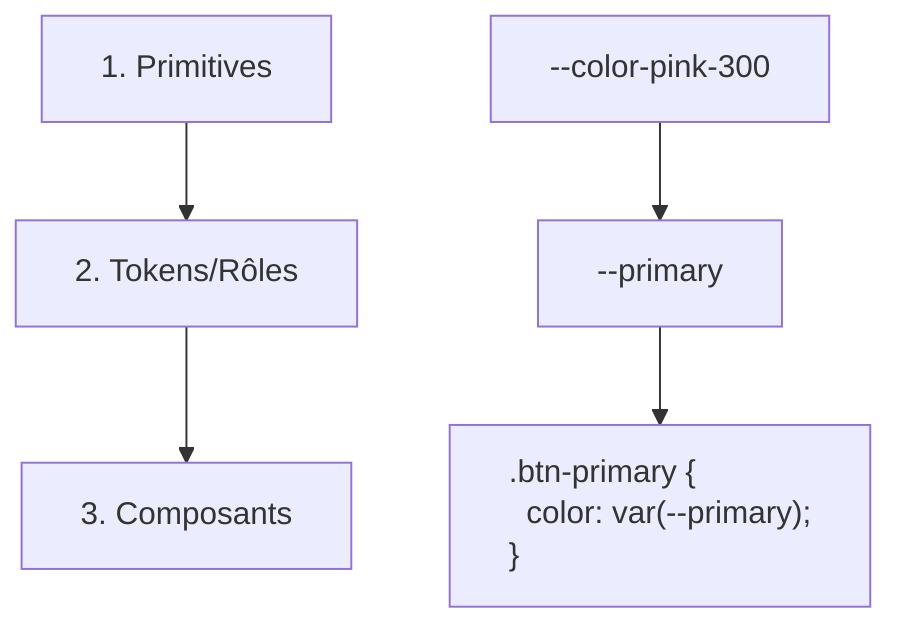

# Guidelines CSS

> 📋 **À propos de ce document**  
> Ce document rassemble les bonnes pratiques CSS appliquées par l'agence web [Alsacreations.fr](https://www.alsacreations.fr/). Ces guidelines sont le fruit de plusieurs années d'expérience avec diverses méthodologies (OOCSS, BEM, CubeCSS) et frameworks (Bootstrap, Tailwind, UnoCSS). Elles évoluent constamment pour s'adapter à chaque nouveau projet.

## Table des matières

1. [Vue d'ensemble](#vue-densemble)
2. [Configuration de projet](#configuration-de-projet)
3. [Architecture CSS](#architecture-css)
4. [Syntaxe et conventions](#syntaxe-et-conventions)
5. [Système de design](#système-de-design)
6. [Mise en page et positionnement](#mise-en-page-et-positionnement)
7. [Responsive Design](#responsive-design)
8. [Thématisation (light et dark mode)](#thématisation-light-et-dark-mode)
9. [Optimisation des animations](#optimisation-des-animations)
10. [Typographie](#typographie)

---

## Vue d'ensemble

### Philosophie d'intégration

Nous privilégions deux approches CSS selon le contexte du projet&#8239;:

1. **CSS Vanilla (natif)** - Notre approche par défaut

   - Utilisation de CSS moderne avec custom properties
   - Syntaxe imbriquée native (nesting)
   - Évite la prolifération de classes dans le HTML

2. **CSS Utilitaire** - Via Tailwind (ou UnoCSS)
   - Pour des prototypes rapides
   - Projets nécessitant une grande flexibilité
   - Équipes familiarisées avec l'approche utilitaire

> 💡 **Recommandation**&#8239;: Sauf contre-indication (client, projet historique), nous intégrons nos projets en CSS Vanilla avec Tailwind optionnel mais disponible pour les cas d'usage spécifiques.

---

## Configuration de projet

### Stack technologique

#### Tailwind CSS (v4+)

Intégré de façon optionnelle généralement pour bénéficier de classes utilitaires ponctuelles.

**Exceptions**&#8239;:

- Projets internes simples
- Projets historiques
- Projets WordPress FSE

> 📚 Voir [project-init.md](../starters/project-init.md) pour l'installation et la configuration détaillée de Tailwind.

#### Post-processeurs et pré-processeurs

Pour les fonctionnalités non natives (concaténation, mixins, custom media)&#8239;:

| Outil                      | Usage recommandé     | Avantages                                                               |
| -------------------------- | -------------------- | ----------------------------------------------------------------------- |
| **PostCSS**                | ✅ Recommandé        | Moderne, extensible, proche du CSS natif                                |
| **`postcss-custom-media`** | ✅ Recommandé        | Media Queries personnalisés. [Voir config](../starters/project-init.md) |
| **Sass (.scss)**           | ⚠️ Legacy uniquement | Mature, mais syntaxe propriétaire                                       |

#### Outils de qualité

| Outil                 | Rôle                                       | Configuration                              |
| --------------------- | ------------------------------------------ | ------------------------------------------ |
| **Stylelint**         | Validation syntaxique et bonnes pratiques  | [Voir config](../starters/project-init.md) |
| **Prettier**          | Formatage automatique                      | [Voir config](../starters/project-init.md) |
| **`stylelint-order`** | Organisation des propriétés (ordre SMACSS) | Automatique via config                     |

---

## Architecture CSS

### Structure des fichiers

```bash
css/
├── config/
│   ├── reset.css         # Reset
│   ├── fonts.css         # @font-face
│   ├── layouts.css       # Styles des Layouts (Bretzel)
│   ├── natives.css       # Styles des éléments natifs (KNACSS)
│   └── base.css          # Styles de base (body, typo, liens, etc.)
├── theme/
│   ├── theme.css         # Variables primitives
│   ├── theme-tokens.css  # Tokens sémantiques
├── components/
├── utilities/
└── app.css               # Point d'entrée principal
```

### Ordre d'importation

> 📚 Le fichier [app.css](../config/CSS/app.css) (ou la version Tailwind [app.css](../config/CSS/app-tailwind.css)) est le point d'entrée pour les styles. Il charge toutes les feuilles de styles dans l'ordre des layers CSS _(config, base, components, utilities)_.

```css
/* css/app.css */
/* L'ordre des layers définit la priorité des styles */
/* Chaque layer écrase le précédent si conflit */
@layer config, base, components, utilities;

/* Config (reset, polices, themes, layouts) */
@import "/css/config/reset.css" layer(config);
/* @import "/css/config/fonts.css" layer(config); */
@import "/css/theme/theme.css" layer(config);
@import "/css/theme/theme-tokens.css" layer(config);
@import "/css/config/layouts.css" layer(config);
@import "/css/config/natives.css" layer(config);

/* Base */
@import "/css/config/styles.css" layer(base);

/* Components */
/* Ici un @import dans le layer(components) */

/* Utilities */
/* Ici un @import dans le layer(utilities) */
```

---

## Syntaxe et conventions

### Règles de nommage

#### Sélecteurs

```css
/* ✅ BIEN : Sélecteurs de classe */
.card {
}
.card-title {
}
.card-content {
}

/* ❌ ÉVITER : Sélecteurs d'éléments ou d'ID */
article {
}
#card {
}
.card span {
}
```

#### Convention BEM adaptée

```css
/* Block */
.card {
}

/* Element */
.card-title {
}
.card-content {
}

/* Modifier */
.card--featured {
}
.card--disabled {
}

/* État */
.is-active {
}
.is-loading {
}
.has-error {
}
```

### Organisation des propriétés

Les propriétés sont automatiquement réordonnées selon l'ordre SMACSS via `stylelint-order`&#8239;:

```css
.element {
  /* 1. Positionnement */
  position: absolute;
  top: 0;
  right: 0;
  z-index: 10;

  /* 2. Modèle de boîte */
  display: flex;
  width: 100%;
  max-width: 50rem;
  padding: 1rem;
  margin: 0 auto;

  /* 3. Typographie */
  font-family: var(--font-primary);
  font-size: var(--text-m);
  line-height: 1.5;
  color: var(--color-on-surface);

  /* 4. Décoration */
  background: var(--color-surface);
  border: 1px solid var(--color-border-medium);
  border-radius: var(--radius-m);

  /* 5. Animations */
  transition: transform 0.2s ease;

  /* 6. Autres */
  cursor: pointer;
}
```

### Notation imbriquée (Nesting)

#### Cas d'usage recommandés

```css
/* ✅ BIEN : États et pseudo-éléments */
.button {
  /* Styles de base */

  &:hover,
  &:focus {
    /* États interactifs */
  }

  &::before {
    /* Pseudo-éléments */
  }

  &:disabled {
    /* États spéciaux */
  }

  @media (width >= 48rem) {
    /* Media queries */
  }

  @media (--md) {
    /* Si Custom Media queries installé */
  }
}
```

#### À éviter

```css
/* ❌ ÉVITER : Nesting profond augmentant la spécificité */
.wrapper {
  & .child {
    & .subchild {
      /* Spécificité trop élevée */
    }
  }
}
```

> 🎯 **Règle** : Limiter le nesting à un seul niveau pour maintenir une spécificité faible.

---

## Système de design

### Architecture à trois niveaux



### Variables primitives (`theme.css`)

Les primitives sont les valeurs de base issues de l'UI Kit, immuables et partagées avec les designers.

> 📚 Les variables primitives sont stockées dans le fichier [theme.css](../config/CSS/theme.css).

#### Conventions de nommage

| Type            | Préfixe           | Exemple                      | Usage                  |
| --------------- | ----------------- | ---------------------------- | ---------------------- |
| **Couleurs**    | `--color-*`       | `--color-pink-300: #f9a8d4;` | Palette de base        |
| **Espacements** | `--spacing-*`     | `--spacing-16: 1rem;`        | Marges, paddings       |
| **Gouttières**  | `--gap-*`         | `--gap-16: 1rem;`            | Espaces entre éléments |
| **Typographie** |                   |                              |                        |
| - Tailles       | `--text-*`        | `--text-16: 1rem;`           | Tailles de police      |
| - Familles      | `--font-*`        | `--font-poppins: 'Poppins';` | Familles de police     |
| - Graisses      | `--font-weight-*` | `--font-weight-bold: 700;`   | Épaisseurs             |
| - Hauteurs      | `--leading-*`     | `--leading-28: 1.75rem;`     | Interlignes            |
| **Arrondis**    | `--radius-*`      | `--radius-lg: 0.5rem;`       | Border-radius          |
| **Ombres**      | `--shadow-*`      | `--shadow-md: 0 4px 6px...;` | Box-shadows            |
| **Z-index**     | `--z-*`           | `--z-modal: 1000;`           | Niveaux d'empilement   |

### Tokens sémantiques (`theme-tokens.css`)

Les tokens assignent des rôles fonctionnels aux primitives, créant une couche d'abstraction sémantique.

> 📚 Les valeurs des tokens de design sont stockées dans le fichier [theme-tokens.css](../config/CSS/theme-tokens.css).

#### Tokens de couleur (inspirés de Material Design)

```css
:root {
  /* Couleurs principales */
  --primary: var(--color-pink-300);
  --on-primary: var(--color-white);

  /* Surfaces et contenus */
  --surface: var(--color-gray-50);
  --on-surface: var(--color-gray-900);
  --on-surface-secondary: var(--color-gray-600);

  /* Niveaux de profondeur */
  --layer-1: var(--color-gray-100);
  --layer-2: var(--color-gray-200);
  --layer-3: var(--color-gray-300);

  /* Interactions */
  --link: var(--color-blue-600);
  --link-hover: var(--color-blue-700);

  /* Bordures */
  --border-light: var(--color-gray-200);
  --border-medium: var(--color-gray-400);
  --border-dark: var(--color-gray-600);

  /* États */
  --error: var(--color-red-500);
  --success: var(--color-green-500);
  --warning: var(--color-orange-500);
  --info: var(--color-blue-500);

  /* Sélection */
  --selection: var(--color-primary-alpha-20);
}
```

#### Tokens d'espacement et de taille

```css
:root {
  /* Tailles de texte adaptatives */
  /* Source https://utopia.fyi/clamp/calculator/?a=360,1240 */
  --text-s: clamp(var(--text-14), 0.8239rem + 0.2273vw, var(--text-16));
  --text-m: clamp(var(--text-16), 0.9489rem + 0.2273vw, var(--text-18));
  --text-l: clamp(var(--text-18), 1.0739rem + 0.2273vw, var(--text-20));
  --text-xl: clamp(var(--text-20), 0.9943rem + 1.1364vw, var(--text-30));
  --text-2xl: clamp(var(--text-24), 1.1932rem + 1.3636vw, var(--text-36));
  --text-3xl: clamp(var(--text-30), 1.4148rem + 2.0455vw, var(--text-48));

  /* Espacements adaptatifs */
  --gap-s: clamp(var(--spacing-8), 0.2955rem + 0.9091vw, var(--spacing-16));
  --gap-m: clamp(var(--spacing-16), 0.5909rem + 1.8182vw, var(--spacing-32));
  --gap-l: clamp(var(--spacing-24), 0.8864rem + 2.7273vw, var(--spacing-48));
  --gap-xl: clamp(var(--spacing-32), 0.7727rem + 5.4545vw, var(--spacing-80));
  --spacing-s: clamp(var(--spacing-8), 0.2955rem + 0.9091vw, var(--spacing-16));
  --spacing-m: clamp(var(--spacing-16), 0.5909rem + 1.8182vw, var(--spacing-32));
  --spacing-l: clamp(var(--spacing-24), 0.8864rem + 2.2727vw, var(--spacing-48));
  --spacing-xl: clamp(var(--spacing-32), 0.7727rem + 5.4545vw, var(--spacing-80));
}
```

### Utilisation des variables

```css
/* ✅ BIEN : Utilisation des tokens */
.card {
  padding: var(--spacing-m);
  gap: var(--gap-m);
  background: var(--surface);
  color: var(--on-surface);
  border: 1px solid var(--border-light);
  border-radius: var(--radius-m);
}

/* ❌ ÉVITER : Valeurs en dur */
.card {
  padding: 1rem;
  background: #f5f5f5;
  color: #333;
}
```

---

## Mise en page et positionnement

> 🎯 **Règle** : Privilégier les styles utilitaires des Layouts "Bretzel" pour la plupart des dispositions "simples" et responsive. N'utiliser Grid Layout ou Flexbox que pour des affichages complexes ou spécifiques.

| Priorité        | Méthode     | Cas d'usage principaux |
| --------------- | ----------- | ---------------------- |
| Priorité 1      | Bretzel Layouts | Layout simple responsive        |
| Priorité 2      | Grid Layout | Layout spécifique        |
| Priorité 3      | Flexbox     | Layout spécifique          |
| Cas spécifiques | Position    | Overlays               |

### Bretzel Layouts

- ✅ Dispositions CSS utilitaires modernes réutilisables, légères et flexibles.
- ✅ Adaptés à la plupart des cas d’usage simples.
- ✅ Pilotés par un attribut HTML `data-layout` limitant les conflits avec des nommages de classes CSS.
- ✅ Inutile d'ajouter du CSS ni de connaître la syntaxe CSS Grid ou Flexbox.

#### Tableau de décision Layouts Bretzel

> 💡 Utiliser ce tableau comme aide rapide : si un pattern correspond à une ligne, employer `data-layout="…"`, avant d’écrire un nouveau `display: grid` ou `display: flex`.

| Pattern concret | Quand l’utiliser | Layout | Attributs spécifiques | Exceptions |
| ----------------------------- | ---------------------------------------- | --------------- | --------------------------------------------------------------- | ------------------------ |
| Empilement vertical de blocs (formulaire, liste, sections) | Empiler ≥2 éléments avec espacement régulier | <b>stack</b><br>`data-layout="stack"` | aucun | Un seul enfant ou besoin d’un alignement non couvert |
| Groupe d’actions / tags / boutons qui peut wrap | Rangée fluide d’items, retour à la ligne possible | <b>cluster</b><br>`data-layout="cluster"` | aucun | Distribution très spécifique par ligne |
| Grille fluide de cartes responsive | Cartes dont le nombre de colonnes varie selon largeur | <b>autogrid</b><br>`data-layout="autogrid"` | aucun | Besoin de zones ou placements manuels complexes |
| Passage 1 colonne → plusieurs (features) | Même ensemble qui s’étale après un seuil | <b>switcher</b><br>`data-layout="switcher"` | aucun | Ratios très hétérogènes impossibles à standardiser |
| Deux panneaux côte à côte (texte + image) | Toujours 2 colonnes sur viewport large | <b>duo</b><br>`data-layout="duo"` | `data-split="1-1,1-2,1-3,auto-1, …"`<br>`data-split="reverse"` | Ratio spécifique, multi-breakpoints |
| Barre avec un bloc extrême gauche et un bloc extrême droite | Séparer deux groupes principaux sur l’axe horizontal | <b>repel</b><br>`data-layout="repel"` | aucun | Plus de 2 groupes principaux à répartir |
| Liste horizontale scrollable (logos, témoignages) | Scroll horizontal + alignement/snap cohérents | <b>reel</b><br>`data-layout="reel"` | `data-scroll="start,end,center"`,<br>`data-scrollbar="hidden"` | Carrousel avancé (pagination, autoplay…) |
| Contenu centré largeur max (article, section) | Encapsuler du contenu avec largeur bornée | <b>boxed</b><br>`data-layout="boxed"` | `data-boxed="small"` | Cas isolé unique non réutilisé |
| Gabarit global page (sections full + sections centrées) | Page avec alternance pleine largeur / contenu contenu | <b>liquid</b><br>`data-layout="liquid"` | Enfants spéciaux `data-layout="splash"`, <br>`data-layout="splash-start"`, <br>`data-layout="splash-end"` | Mise en page expérimentale hors scope |

#### Heuristiques de détection

- `flex-direction: column` + `gap` ⇒ suggérer `stack`
- `flex-wrap: wrap` + `gap` ⇒ suggérer `cluster`
- `repeat(auto-fit|minmax` dans une grille ⇒ `autogrid`
- `justify-content: space-between` avec 2 enfants ⇒ `repel`
- `overflow-x:auto` + `scroll-snap-type` ⇒ `reel`

#### Modificateurs communs à tous les Layouts

- `data-gap="s|m|l|xl|none"`
- `data-justify="start|end|center|space"`
- `data-align="start|end|center|stretch"`

> 📚  **Documentation**&#8239;: [Layouts Bretzel](https://bretzel.alsacreations.com/), [Liquid](https://liquid.alsacreations.com/), [Feuille de style globale](https://github.com/alsacreations/bretzel/blob/main/public/layouts.css).

### Grid Layout

- ✅ Contrôle bidimensionnel précis
- ✅ Grid areas pour une représentation visuelle
- ✅ Ciblage du parent uniquement

Cas d'usage de Grid Layout&#8239;:

- Layout principal avec areas
- Grille responsive sur mesure
- Galeries d'images
- Layouts complexes avec superposition

### Flexbox

- ✅ Affichage horizontal par défaut
- ✅ Wrap automatique
- ✅ Flexibilité des enfants (grow, shrink)

Cas d'usage de Flexbox&#8239;:

- Disposition horizontale
- Alignement d'éléments
- Distribution d'espace

---

## Responsive Design

### Stratégie Mobile First

> 🎯 **Règle** : Nous intégrons toujours en Mobile First (via `width >=`) avec des valeurs en `rem`.

```css
/* Base mobile */
.component {
  display: grid;
  gap: var(--gap-m);

  @media (width >= 48rem) {
    grid-template-columns: 1fr 1fr;
  }
}
```

### Breakpoints standardisés

| Nom   | Valeur  | Pixels | Usage            |
| ----- | ------- | ------ | ---------------- |
| `md`  | `48rem` | 768px  | Mobiles          |
| `lg`  | `64rem` | 1024px | Tablettes        |
| `xl`  | `80rem` | 1280px | Desktop          |
| `xxl` | `96rem` | 1536px | Très grand écran |

---

## Thématisation (light et dark mode)

### Dark Mode avec `light-dark()`

La fonction `light-dark()` est parfaitement adaptée pour gérer dynamiquement les couleurs quel que soit le mode adopté (préférences système ou choix manuel utilisateur).

```css
:root {
  /* Activation des deux modes */
  color-scheme: light dark;

  /* Variables adaptatives */
  --surface: light-dark(#ffffff, #1a1a1a);
  --on-surface: light-dark(#000000, #ffffff);
  --primary: light-dark(var(--color-blue-600), var(--color-blue-400));
}
```

### Theme Switcher

```css
/* Forcer le mode via data attribute */
:root {
  color-scheme: light dark;

  &[data-theme="light"] {
    color-scheme: light;
  }

  &[data-theme="dark"] {
    color-scheme: dark;
  }
}
```

> 📚 Voir un exemple de Switcher accessible sur Codepen : <https://codepen.io/alsacreations/pen/ExBPExE>

### Gestion des SVG en Dark Mode

#### SVG inline

> 💡 Méthode recommandée dans la plupart des cas.

```css
.icon {
  /* Utilise la couleur du texte parent */
  fill: currentcolor;

  /* Ou couleur spécifique adaptative */
  stroke: light-dark(var(--color-black), var(--color-white));
}
```

#### SVG externe avec styles intégrés

> 💡 Méthode recommandée lorsque le fichier SVG est externe et qu'on a la possibilité de le modifier.

```svg
<svg viewBox="0 0 24 24">
  <style>
    @media (prefers-color-scheme: dark) {
      .adaptive-path {
        fill: white;
      }
    }

    [data-theme="dark"] .adaptive-path {
      fill: white;
    }
  </style>
  <path class="adaptive-path" d="..." fill="black"/>
</svg>
```

#### SVG externe avec masque CSS

> 💡 Méthode recommandée lorsque le fichier SVG est externe et qu'on ne peut pas le modifier.

```css
.icon {
  display: inline-block;
  width: 1.5rem;
  height: 1.5rem;
  background-color: currentColor;
  mask: var(--icon-url) no-repeat center;
  mask-size: contain;
}

.icon-cart {
  --icon-url: url("icons/cart.svg");
}
```

---

## Optimisation des animations

```css
/* ✅ Animer uniquement transform et opacity */
.smooth-animation {
  transition: transform 0.3s ease, opacity 0.3s ease;
  will-change: transform, opacity;
}

/* ❌ Éviter d'animer des propriétés coûteuses */
.laggy-animation {
  transition: width 0.3s, height 0.3s, padding 0.3s;
}
```

### Animation de SVG

```css
/* Configuration SVG */
svg {
  overflow: visible; /* Permet aux animations de dépasser */
}

svg * {
  transform-box: fill-box; /* Origine relative à l'élément */
  transform-origin: center;
}
```

---

## Typographie

### Recommandations générales

- On privilégie la police système `system-ui` pour les textes de contenus (raison&#8239;: performance + UX + Layout Shifts).
- On privilégie le format `.woff2`.
- On limite à 2 ou 3 fichiers de police au maximum (regular, bold, italic), sinon préférer une [Variable Font](https://v-fonts.com/) (voir la partie dédiée ci-dessous)
- On utilise la directive `<link rel="preload">` pour charger les polices de manière asynchrone.
- On applique `font-display: swap;` au sein de la règle `@font-face` pour éviter les effets de FOIT. Si la police est pré-chargée, `font-display: optional;` est alors recommandé.
- On héberge la police sur son propre serveur (voir l'outil "Google Webfont Helper").
- On utilise les valeurs chiffrées pour les graisses de police (`font-weight`).

### Structure `@font-face` optimisée

```css
@font-face {
  font-family: "Inter";
  src: url("inter-regular.woff2") format("woff2");
  font-weight: 400;
  font-style: normal;
  font-display: swap; /* Évite le FOIT */
}

@font-face {
  font-family: "Inter";
  src: url("inter-bold.woff2") format("woff2");
  font-weight: 700;
  font-style: normal;
  font-display: swap;
}
```

### Preload des polices critiques

```html
<link rel="preload" href="/fonts/inter-regular.woff2" as="font" type="font/woff2" crossorigin="anonymous" />
```

### Variable Fonts

Une variable font est systématiquement recommandée dès lors qu'un projet nécessite plus de 3 ou 4 variantes parmi celles-ci&#8239;: regular, italic, light, semi-bold, bold, bold italic, etc.

Comme pour les fontes classiques, le format `.woff2` ainsi que l'hébergement de la fonte sont préconisés (les fontes variables peuvent être trouvées sur [Google Fonts](https://fonts.google.com/?vfonly=true) en activant la case "show only variable fonts" puis téléchargées en `.ttf` via le bouton "Download family"). Un convertisseur tel que [Cloud converter](https://cloudconvert.com/ttf-to-woff2) pourra produire la version `.woff2`.

```css
@font-face {
  font-family: "Inter Variable";
  src: url("inter-variable.woff2") format("woff2") tech("variations"), url("inter-variable.woff2") format("woff2-variations");
  font-weight: 100 900;
  font-display: swap;
}

/* Utilisation avec variation */
.title {
  font-family: "Inter Variable";
  font-weight: 625; /* Valeur précise */
}
```
