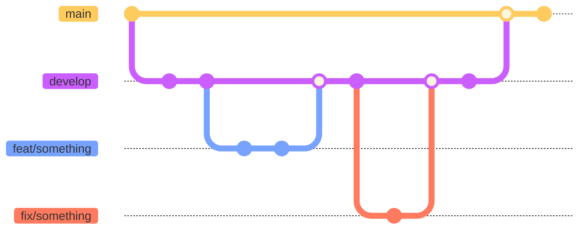

# Guidelines : Git

Ce document rassemble les bonnes pratiques appliquées par l'agence web [Alsacreations.fr](https://www.alsacreations.fr/) concernant **"Git"**. Ces indications sont destinées à évoluer dans le temps et à s'adapter à chaque nouveau projet.

## Conventional Commits

▶️ Nous respectons les *Conventional Commits* <https://www.conventionalcommits.org/fr/v1.0.0/>

- **build**: Changements relatifs au processus de *build* ou dépendances comme vite ou npm.
- **ci**: Changements des fichiers de configurations de la CI comme workflows GitHub.
- **docs**: Changements relatifs à la documentation du projet (wiki, readme, commentaires).
- **feat**: Changements qui ajoutent un nouvelle fonctionnalité.
  - Dans le cas d'un site, c'est une fonctionnalité pour l'utilisateur final.
  - Dans le cas d'un projet du type "framework css" comme Bretzel, une *feature* est l'ajout d'une nouvelle classe CSS par exemple.
- **fix**: Changements qui corrigent un bug visible pour l'utilisateur final.
  - Pour savoir si le commit est vraiment un fix ou non, se poser la question: "Mon commit vaut-il le coup d'être affiché dans un changelog ou non ?"
    - Si oui, c'est un `fix:`.
- **perf**: Changements qui améliorent la performance du projet.
- **refactor**: Changements qui ne sont ni un bug ni une *feature*.
  - Exemple: j'arrive à reproduire le même fonctionnement qu'avant mais en supprimant 50 lignes de code.
  - Exemple: je renomme une fonction mais le fonctionnement reste le même.
- **style**: Changements qui ne modifient pas le fonctionnement du code.
  - Exemple: formatage de fichiers avec eslint, prettier, ajout d'espaces, etc.
- **test**: Ajout ou modifications de tests unitaires, d'intégration et e2e.
- **chore**: Quand le reste ne convient pas.
  - Exemple: modification du fichier de configuration eslint, prettier, tâches de maintenance interne, mise à jour des dépendances.

## Git flow, branches

| branche | rôle |
| ------- | ---- |
| main    | code en production (= en ligne sur le serveur d'hébergement) |
| develop | développements en cours avant d’être fusionnés dans main |
| feat/*nomfeature* | développement d'une fonctionnalité, à partir de develop |
| fix/*nomfix* | correction de bug |

Schéma :



💡 Penser à reprendre les références (#issue ou #tâche) dans le nom de la branche / les messages de commit.

## Résoudre les conflits

Lors d’un `git pull` ou d’un `git merge`, des conflits peuvent survenir si les mêmes lignes d’un même fichier ont été modifiées différemment dans les branches fusionnées.

Pour résoudre ces conflits, Git marque les sections en conflit dans les fichiers concernés. Vous devez alors :

1. Ouvrir les fichiers en conflit et rechercher les sections marquées par Git.
2. Choisir quelle version des modifications conserver (celles de votre branche ou celles de la branche fusionnée).
3. Supprimer les marqueurs de conflit (`<<<<<<<`, `=======`, `>>>>>>>`) et enregistrer les fichiers.
4. Ajouter les fichiers résolus à l'index avec `git add <fichier>`.
5. Finaliser la fusion avec `git commit`.

```sh
# Exemple de résolution de conflit
git add <fichier_conflit>
git commit
```

Pour éviter les conflits, il est recommandé de faire des `git pull` fréquents et de communiquer avec votre équipe sur les modifications apportées aux fichiers partagés.

💡 Git dispose d'une fonctionnalité appelée "rerere" (_reuse recorded resolution_) qui peut aider à automatiser la résolution des conflits récurrents. Lorsque cette fonctionnalité est activée, Git enregistre les résolutions de conflits que vous effectuez et les réutilise automatiquement si les mêmes conflits se produisent à nouveau.

```sh
git config --global rerere.enabled true
```
