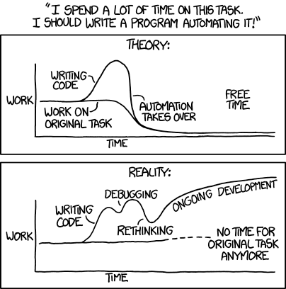

# PHP / MySQL

> Statut : stable · Niveau : avancé

**TL;DR** — Conventions PHP / MySQL d’Alsacréations : PSR-12, typage strict, PDO préparé, migrations versionnées, conventions de nommage et architecture.

Ce document rassemble les bonnes pratiques appliquées par l'agence [Alsacreations.fr](https://www.alsacreations.fr/) concernant **PHP / MySQL**. Il évolue dans le temps et s'adapte à chaque nouveau projet.

## Ressources

- 🔗 [PSR-12: Extended Coding Style](https://www.php-fig.org/psr/psr-12/)
- 🔗 [PHP The Right Way](https://phptherightway.com/)

---

## Généralités

- L’encodage des fichiers et des bases de données doit se faire en UTF-8 (sans BOM).
- Les indentations se font à l’aide d'espaces.
  Pour assurer une cohérence inter-projets, utiliser la convention [EditorConfig](https://editorconfig.org/).
- La numérotation des versions suit [Semantic Versioning](https://semver.org/)
- Activer le typage strict en tête de chaque fichier PHP: `declare(strict_types=1);`

## Garder à l’esprit

- DRY : Don't Repeat Yourself : Utiliser au maximum des fonctions (même très simples) pour stocker le code exécuté à différents endroits
- KISS : Keep it simple, stupid : Penser simple
- Modulaire : Quand on développe une feature : pouvoir la désactiver (= option)
- Commenter son code au maximum
- Vérifier s’il n’y a pas déjà un code existant qui fait déjà le travail
- Ne pas modifier le noyau des cms/extensions pour supporter les futures mises à jour
- Toujours penser à la sécurité !
- [Limitez votre PHP : optimisations pour une meilleure gestion des ressources](https://bearstech.com/societe/blog/limitez-votre-php/)



Source : <https://xkcd.com/1319/> (Automation)

## PHP

Les balises fermantes `?>` doivent être omises en fin de fichier pour éviter la production d’espaces indésirables entre différents scripts. Dans la mesure du possible, un commentaire peut être ajouté signifiant la fin du fichier, afin de déterminer si celui-ci n’a pas été tronqué.

**Incorrect :**

```php
<?php
echo "Hello!";
?>
```

**Correct :**

```php
<?php
echo "Hello!";

// Fin de monfichier.php
// Emplacement: ./chemin/vers/monfichier.php
```

### Variables, constantes et classes

- Respecter PSR-12 :
  - Classes et interfaces en PascalCase.
  - Méthodes, propriétés et variables en camelCase.
  - Constantes en UPPER_SNAKE_CASE.
  - Mots-clés/valeurs scalaires `true`, `false`, `null` en minuscules.
- Utiliser des espaces et des accolades sur nouvelles lignes selon PSR-12.
- Utiliser des namespaces et l’autoload PSR-4 (Composer).

```php
declare(strict_types=1);

namespace App\Service;

final class FileStorage
{
    private string $basePath;

    public function __construct(string $basePath = '/tmp')
    {
        $this->basePath = $basePath;
    }

    public function getFileProperties(string $filename): array
    {
        // ...
        return [];
    }
}
```

### Typage et signatures

- Taper systématiquement paramètres, propriétés et retours.
- Privilégier `readonly`, promotions de propriétés, unions, `?Type`, valeurs par défaut en fin de signature.
- Utiliser `iterable`, `array`, `string`, `int`, `float`, `bool`, `Closure`, `\DateTimeImmutable`, `\Stringable` quand pertinent.

```php
function kiwi(string $val1 = '', bool $val2 = false): string
{
    // ...
    return $val1;
}

function kaki(string $val1, bool $val2 = false): void
{
    // ...
}
```

### Commentaires

- Pour les brefs commentaires, le double slash est privilégié.
- Préférer du code auto-documenté; [DocBlocks](https://docs.phpdoc.org/guide/getting-started/what-is-a-docblock.html) pour API publiques, exceptions, invariants, ou quand le typage ne suffit pas.
- Éviter les @param/@return redondants avec les types natifs; conserver pour préciser l’intention ou les formats.

```php
// Une ligne de commentaire
// Une deuxième ligne

/**
 * Encode une chaîne au format XML.
 * @throws \RuntimeException si l'encodage échoue
 */
function xmlEncode(string $str): string
{
    // ...
}
```

### Indentation et instructions

- Une seule instruction par ligne. Préférer les [guard clauses](https://en.wikipedia.org/wiki/Guard_(computer_science)) et [early return](https://www.faceaucode.com/post/le-patron-de-conception-early-return).

### Chaînes de texte

- Préférer les apostrophes simples `'` ; utiliser les guillemets `"` pour l'interpolation controlée.
- Pour les blocs, utiliser [heredoc/nowdoc](https://www.php.net/manual/en/language.types.string.php). Éviter la concaténation dans les boucles.

```php
'Mon texte';
"SELECT * FROM table WHERE champ = 'valeur'";
"Bonjour $prenom";
```

### Contrôle de flux et raccourcis utiles

- Utiliser `===`/`!==`, `??`, `?:`, `?->`, `match`, fonctions fléchées.
- Préférer `match` aux `switch` quand approprié; `in_array($x, [...], true)` pour contrôles stricts.

### Erreurs, exceptions et journalisation

- Lever des exceptions, ne pas masquer les erreurs. `error_reporting(E_ALL)`.
- En production: `display_errors=Off`, logs structurés avec [Monolog](https://github.com/Seldaek/monolog).
- Utiliser `JSON_THROW_ON_ERROR` avec `json_encode/json_decode`.
- Centraliser la gestion des erreurs et des réponses HTTP.

### Sécurité

- Suivre l’OWASP (cheat sheets XSS, Injection, CSRF). Mettre en place CSP, CSRF tokens, SameSite cookies.
- Valider les entrées (type/format) puis échapper à la sortie selon le contexte (HTML, attribut, JS, URL).
- Authentification: `password_hash()`/`password_verify()` (Argon2id par défaut si disponible), salage et coût appropriés.
- Sessions: `cookie_secure`, `cookie_httponly`, `cookie_samesite=Lax/Strict`, régénérer l’ID après login.
- Base de données: toujours des requêtes préparées avec PDO (ou mysqli préparé). Éviter `mysql_*` obsolète.
- Uploads: vérifier MIME via Fileinfo (`finfo_open`), taille, extension whitelist, nommage aléatoire, stocker hors webroot.
- Éviter `eval`, `system`, `exec`. Si nécessaire, whitelists strictes et escapes appropriés.
- Secrets et configuration via variables d’environnement; ne jamais les committer.

```php
$pdo = new PDO($dsn, $user, $pass, [
    PDO::ATTR_ERRMODE => PDO::ERRMODE_EXCEPTION,
    PDO::ATTR_DEFAULT_FETCH_MODE => PDO::FETCH_ASSOC,
]);
$stmt = $pdo->prepare('SELECT * FROM users WHERE email = :email');
$stmt->execute(['email' => $email]);
```

### Données

- Expressions régulières: tester sur <https://regex101.com/>.
- JSON: `json_encode($data, JSON_THROW_ON_ERROR | JSON_UNESCAPED_UNICODE)`.
- Dates: stocker UTC, manipuler avec `DateTimeImmutable` et `DateTimeZone`.

### Performance

- Préférer les algorithmes simples (KISS), mesurer avant d’optimiser.
- Déporter les tâches longues en jobs asynchrones.
- Activer OPcache en production, voire Redis.
- [Limitez votre PHP : optimisations pour une meilleure gestion des ressources](https://bearstech.com/societe/blog/limitez-votre-php/)

### Syntaxe et raccourcis syntaxiques

- [Shorthand comparisons in PHP](https://stitcher.io/blog/shorthand-comparisons-in-php)
- Utiliser `match`, `??`, `?->`, arguments nommés, trailing commas.

## Composer

Utilisation de <https://getcomposer.org/> pour la gestion des dépendances PHP.

- Fichier de configuration : `composer.json` (commit aussi `composer.lock`)
- Initialiser de manière interactive le projet `composer init`
- Installer un paquet et le sauvegarde dans le fichier de configuration `composer require [nom du paquet]`
- Désinstalle la dépendance `composer remove [nom du paquet]`
- Met à jour les dépendances `composer update`
- Autoload PSR-4 dans `composer.json` (`"autoload": {"psr-4": {"App\\\": "src/"}}`) puis `composer dump-autoload`
- Sécurité: `composer audit`, tenir à jour, utiliser contraintes de versions (caret `^`), `config.platform.php` pour fixer la version cible
- Scripts utiles: `composer scripts`, hooks CI (lint, tests, stan, cs-fixer, phpstan)

## Visual Studio Code

🔖 Lire <https://code.visualstudio.com/docs/languages/php>

- Installer PHP sur la machine pour renseigner le chemin dans `php.validate.executablePath`. Sur macOS, utiliser [brew](https://brew.sh/).
- Extension [PHP Intelephense](https://marketplace.visualstudio.com/items?itemName=bmewburn.vscode-intelephense-client)
- Intégrer PHPCS ou PHP-CS-Fixer, Xdebug pour le debug pas-à-pas, et PHPUnit.
- Exemple de réglages:
  - `"php.validate.executablePath": "/usr/local/bin/php"`
  - `"editor.formatOnSave": true`
  - `"php-cs-fixer.useCache": true`

## Tests, qualité

- Analyse statique: [PHPStan](https://phpstan.org/) (niveau 6+), voire Psalm si besoin.
- Linting/format: PHP_CodeSniffer ou PHP-CS-Fixer avec PSR-12.
- Mises à niveau: [Rector](https://github.com/rectorphp/rector).
- Intégration continue (GitHub Actions/GitLab CI): lint, stan, tests, couverture, audit.
- Tests unitaires et d’intégration avec PHPUnit.

## MySQL

### Nommage

Les noms des tables doivent être explicites. Éviter les abréviations. Préfixer les colonnes avec le nom de la table n’est pas obligatoire; préférer des noms clairs (et alias SQL) et s’appuyer sur des clés étrangères. Exemple: `users(id, email, status, created_at)`.

### Types de champs

- Charset/collation: `utf8mb4` et `utf8mb4_0900_ai_ci` (ou équivalent) pour couvrir tous les emojis et caractères.
- Moteur: InnoDB (permet les transactions, foreign keys...).
- Éviter `ENUM` (maintenance difficile).
- Utiliser `JSON` pour données semi-structurées (avec parcimonie).
- Monétaire: `DECIMAL(precision, scale)` (pas de `FLOAT`/`DOUBLE`).
- Dates: stocker en UTC, `DATETIME` pour large plage; `TIMESTAMP` si besoin d’auto-update/zone limitée.

|Usage|Type à privilégier|
|--- |--- |
|Booléen|BOOLEAN/TINYINT(1)|
|Clé primaire|INT/BIGINT AUTO_INCREMENT (selon volumétrie)|
|Valeur numérique entière|TINYINT à BIGINT selon la taille prévue|
|Valeur décimale|DECIMAL(p,s)|
|Chaîne courte|VARCHAR(x) (CHAR pour longueurs fixes)|
|Choix limités|Table de référence + FK ou CHECK|
|Date/heure|DATETIME (UTC)|
|Timestamp Unix|INT UNSIGNED|
|Texte long|TEXT/LONGTEXT|
|Données semi-structurées|JSON|

### Contraintes, transactions et intégrité

- Utiliser des clés étrangères, `UNIQUE`, `CHECK`, `NOT NULL` pour l’intégrité.
- Encapsuler les écritures liées dans des transactions; choisir un niveau d’isolation adapté.

```sql
START TRANSACTION;
-- opérations
COMMIT;
```

### Index et performance

Afin d’améliorer la performance :

- Des index doivent être placés sur les champs servant dans les requêtes SELECT (au moins celles-là).
- Préférer des index composites dans l’ordre des prédicats (sélectivité).
- Couvrir les requêtes fréquentes (covering index), éviter `SELECT *`.
- Examiner la performance et l'usage des index avec [EXPLAIN](https://dev.mysql.com/doc/refman/8.4/en/execution-plan-information.html) et le [slow query log](https://dev.mysql.com/doc/refman/8.4/en/slow-query-log.html).
- Éviter les fonctions sur colonnes indexées dans les `WHERE` ; préférer des colonnes dérivées ou colonnes générées.
- Pagination: éviter `OFFSET` élevés; préférer keyset pagination (`WHERE id > ? ORDER BY id LIMIT ?`).
- Dans le cas de jointures, les champs mis en relation (d'une table à l’autre) doivent être de même type (par exemple `INT` avec `INT` et non `INT` avec `MEDIUMINT`).
- Faire attention au type de table utilisé (MyISAM vs InnoDB).

### Requêtes SQL

- Mots-clés en MAJUSCULES, noms en snake_case cohérent.
- Toujours utiliser des requêtes préparées côté application (PDO/mysqli).

```php
$query = $this->db->prepare("
SELECT u.id, u.email, u.status
FROM users u
WHERE u.status = :status
ORDER BY u.id
LIMIT :limit OFFSET :offset
");
$query->bindValue('status', $status, PDO::PARAM_STR);
$query->bindValue('limit', $limit, PDO::PARAM_INT);
$query->bindValue('offset', $offset, PDO::PARAM_INT);
$query->execute();
```

### Migrations et déploiement

- Versionner le schéma avec des migrations (Doctrine Migrations, Laravel Migrations).

---

## Voir aussi

- [WordPress](wordpress/README.md) — Stack PHP/MySQL spécifique.
- [Sécurité HTTP](http-security.md) — En-têtes, CSP, sécurisation côté serveur.
- [Performances](performances.md) — Optimisations back-end.
- [RGPD](rgpd.md) — Stockage et traitement des données personnelles.
