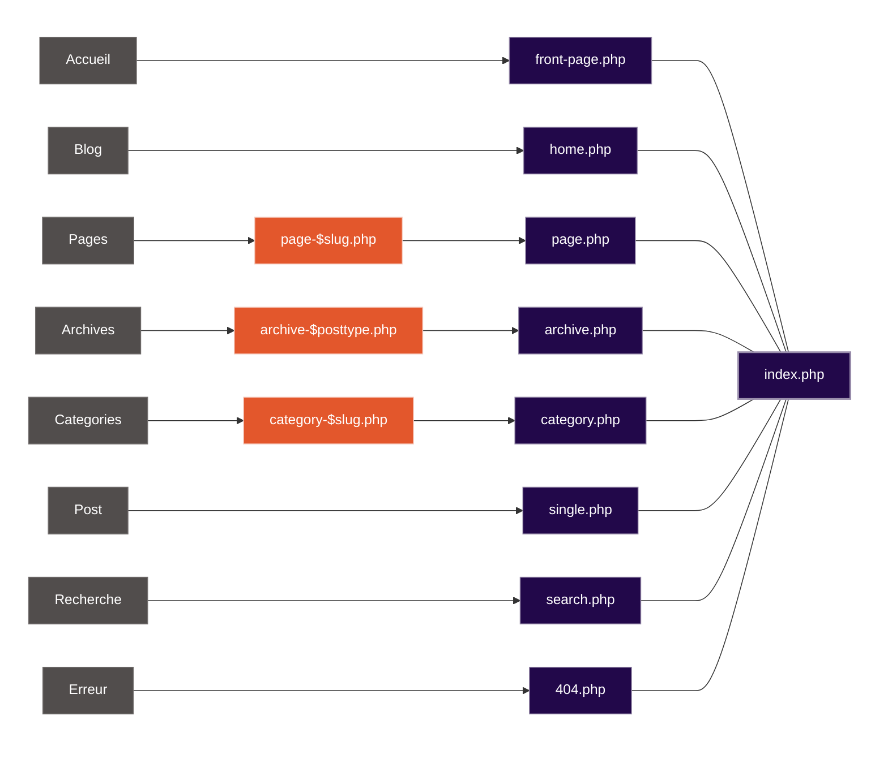

# WordPress : vue d'ensemble

WordPress est un CMS (Content Management System) basé sur PHP et MySQL. Il repose sur une architecture événementielle (Hooks : Actions et Filtres) qui permet de modifier le comportement du noyau sans toucher au code source.

## Routing et Template Hierarchy

Le routing de WordPress ne se définit pas dans un fichier de routes centralisé (comme `routes.php` dans Laravel ou `router.js` dans Vue). Il est déterminé par la **Hiérarchie des Templates** : WordPress analyse l'URL demandée et cherche le fichier PHP le plus spécifique dans le thème actif pour l'afficher.

Exemple de priorité (du plus spécifique au plus générique) pour une page :

1. `page-$slug.php` (ex: `page-contact.php`) - le slug provenant de l'édition de la page elle-même (voir sidebar)
2. `page-$id.php`
3. `page.php`
4. `singular.php`
5. `index.php` (fallback ultime)

Pour les types de contenus personnalisés (CPT) :

1. `single-$posttype.php` (ex: `single-movie.php`)
2. `single.php`
3. `singular.php`
4. `index.php`

Ressources :

- 🔖 [Post Template Files](https://developer.wordpress.org/themes/classic-themes/templates/post-template-files/)
- 🔖 [Voir la hiérarchie complète](https://developer.wordpress.org/themes/basics/template-hierarchy/)

### Création d'URL avec page enfant

Les URLs sont hiérarchiques par défaut pour le type de contenu `page`.

- Si vous créez une page "Entreprise" (slug: `entreprise`).
- Et une page "Histoire" (slug: `histoire`) dont la **Parente** est "Entreprise".
- L'URL sera automatiquement : `example.org/entreprise/histoire`.

## Réglages de base essentiels

### Page d'accueil et Front Page

Pour définir la page d'accueil, aller dans **Réglages > Lecture**.

- **La page d'accueil affiche** : Choisir "Une page statique".
- **Page d'accueil** : Sélectionner la page créée (ex: "Accueil").
- **Page des articles** : Sélectionner la page pour le blog (ex: "Actualités").

Au niveau du thème :

- `front-page.php` est **toujours** prioritaire pour la racine du site, peu importe le réglage ci-dessus.
- `home.php` est utilisé pour la liste des articles de blog (la "Page des articles").

### Permaliens

Aller dans **Réglages > Permaliens**.

- Pour le SEO, choisir **Titre de la publication** (`/%postname%/`).
- Cela évite les IDs dans les URLs (`?p=123`) et génère des URLs propres (`/mon-article`).
- Après chaque déclaration de nouveau CPT via le code, il faut souvent visiter cette page pour "flusher" (rafraîchir) les règles de réécriture (`rewrite rules`).

### Gestion des dates et localisation

- **Réglages > Général** : Définir le fuseau horaire (ex: "Paris") et le format de date.
- En code, utiliser les fonctions WP (`wp_date()`, `get_the_date()`) plutôt que les fonctions PHP natives (`date()`) pour respecter le fuseau horaire défini dans l'admin.

## Architecture de données

### CPT (Custom Post Types)

Par défaut, WordPress propose des Posts = Articles (chronologiques) et des Pages (hiérarchiques).

Les **CPT** permettent de créer de nouvelles structures de données métier (ex: "Produits", "Événements", "Projets") et de les gérer via l'admin WordPress. Ils s'enregistrent via `register_post_type()`, on peut les créer via du code PHP (plugin ou thème) ou via des extensions (ex: CPT UI) ou même via [wp cli](https://developer.wordpress.org/cli/commands/scaffold/cpt/).

### ACF (Advanced Custom Fields)

WordPress stocke les métadonnées dans la table `wp_postmeta`. Ces métadonnées permettent d'ajouter des informations supplémentaires aux Posts, Pages, et CPT (par exemple: Prix, Date, Lieu, Image, Fichier, etc.).

L'extension **ACF** est le standard de l'industrie pour gérer ces métadonnées via une interface graphique agréable. Il permet d'ajouter des champs typés (Image, Texte, Relation, Répéteur) aux Posts, Pages, et CPT sans avoir à coder l'interface soi-même.

### Blocs Gutenberg vs Blocs ACF

Depuis l'éditeur Gutenberg ([Block Editor](https://wordpress.org/documentation/article/wordpress-block-editor/)) visible dans l'admin, le contenu est géré par blocs.

👉 [Liste complète des blocs natifs](https://wordpress.org/documentation/article/blocks-list/)

1. Bloc Gutenberg (Natif/React) : C'est la méthode "native" pour créer un bloc interactif dans l'éditeur. Plus complexe à mettre en place. C'est aussi la méthode recommandée par WordPress pour les extensions publiques.
   - Le rendu se fait via du JavaScript (React) dans l'éditeur et via PHP dans le front (ex: `render_callback`).
   - Les données sont gérées via les attributs du bloc en JS.
   - Nécessite un environnement de build JS (ex: webpack, babel).
2. [Bloc ACF (PHP)](https://www.advancedcustomfields.com/resources/blocks/) : Permet de déclarer un bloc Gutenberg en PHP via [acf_register_block_type](https://www.advancedcustomfields.com/resources/blocks/).
   - Le rendu se fait via un fichier template PHP classique (ex: `blocks/testimonial.php`).
   - Les champs sont gérés via l'interface ACF.
   - C'est souvent la méthode préférée en agence pour développer rapidement des blocs sur-mesure sans coder en React.
