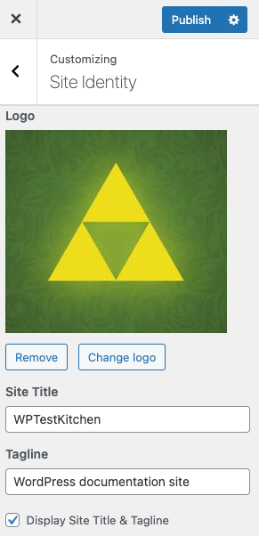
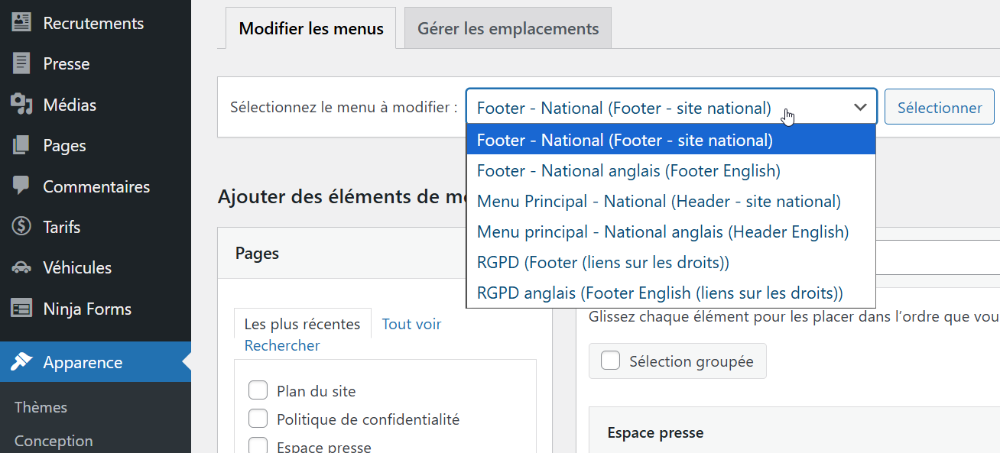
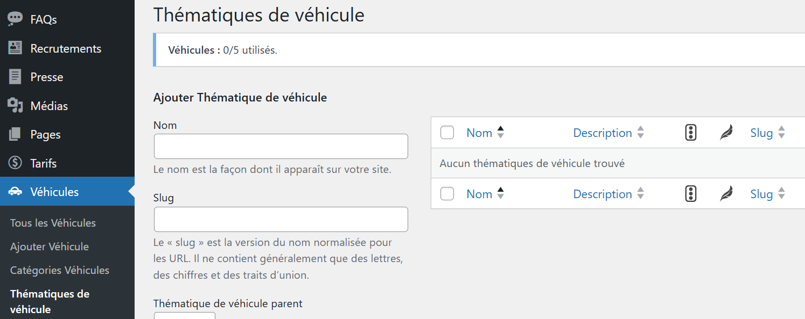
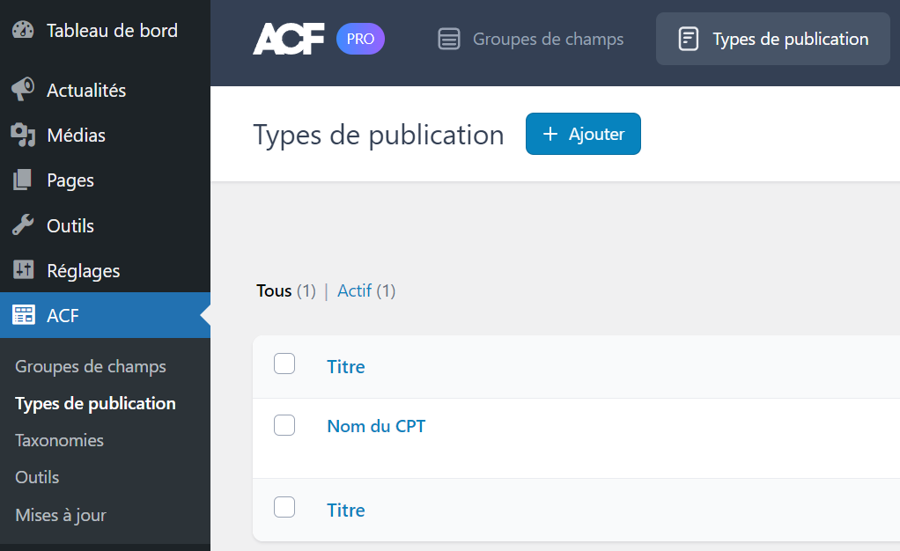
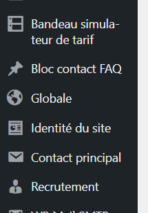
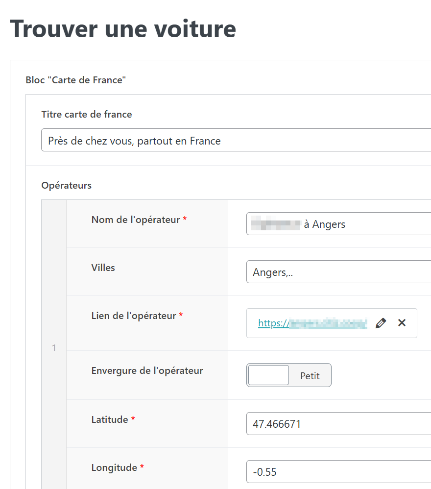
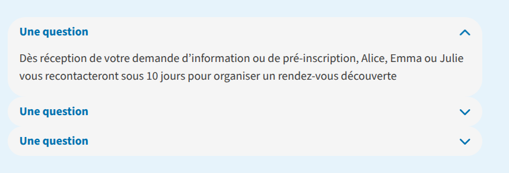
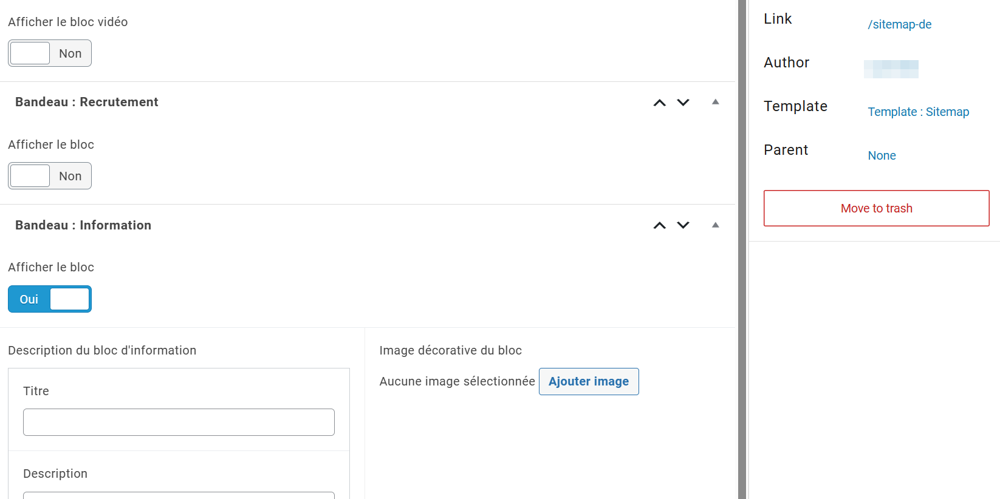
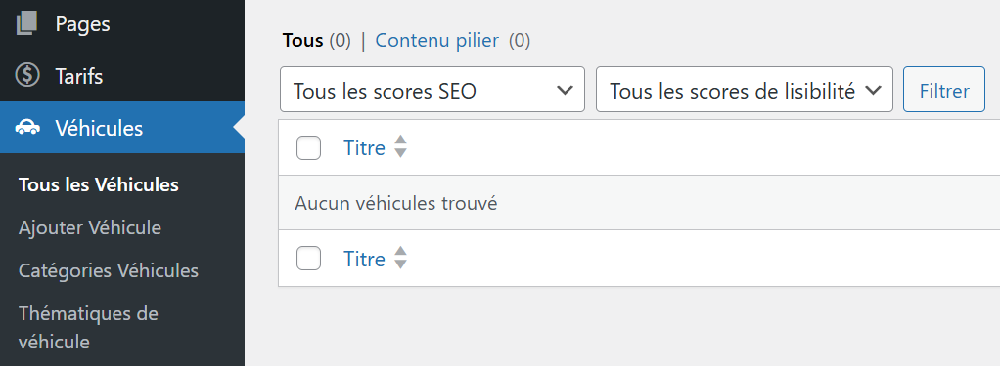

# WordPress : Thème

## Thème

👉 On dévelope au maximum à l'aide de techniques natives WordPress (Posts, boucles, CPT, etc), voir <https://codex.wordpress.org/Theme_Development>.

- On privilégie de démarrer avec un thème _starter_ épuré tel que <https://underscores.me/>.
- On supprime les autres thèmes livrés par défaut.
- On évite d'utiliser un thème tiers, car cela implique qu'on ne pourra pas tout mettre en place dans ces guidelines et qu'on ne maîtrise pas son contenu (code, extensions, évolutions). Si toutefois cela arrive, utiliser le principe de [thème enfant](https://developer.wordpress.org/themes/advanced-topics/child-themes/) pour ne pas modifier le thème parent, qui pourrait être mis à jour par la suite.

- 🔖 Documentation officielle <https://developer.wordpress.org/themes/> et documentation des fonctions <https://codex.wordpress.org/Function_Reference>
- 🔖 [Développer un thème WordPress sur mesure](https://capitainewp.io/formations/developper-theme-wordpress/)
- 🔖 [Concepts fondamentaux à comprendre dans le développement d’un thème WordPress](https://kinsta.com/fr/blog/concepts-fondamentaux-developpement-theme-wordpress/)

### FSE / Full Site Editing et blocs

- 🔖 [Travailler avec des propriétés et des paires clé-valeur dans theme.json](https://kinsta.com/fr/blog/travailler-proprietes-paires-cle-valeur-theme-json/)
- 🔖 [Comment construire un plugin Gutenberg pour ajouter des fonctionnalités à l’éditeur de blocs](https://kinsta.com/fr/blog/plugin-gutenberg/)
- 🔖 [Comment étendre les blocs de base de WordPress avec l’API Blocks](https://kinsta.com/fr/blog/etendre-blocs-coeur-wp/)

Blocs natifs de WordPress (ex: Titre, Paragraphe, Image, Colonnes…) <https://fr.wordpress.org/support/article/blocks/>

### Intégration du thème

#### Outils de vérification (linters)

La liste des [linters globaux recommandés](https://github.com/alsacreations/kiwipedia/blob/main/starters/project-init.md#3-linter-formatters-et-correcteurs)

Les extensions spécifiques WordPress / PHP recommandées sont :  

- [PHP Intelephense](https://marketplace.visualstudio.com/items?itemName=bmewburn.vscode-intelephense-client)
- [Visual Studio Code supporte PHP](https://code.visualstudio.com/docs/languages/php) (Linting, Debug…) : le configurer en indiquant le chemin.

#### Automatisation

Avec [Vite](https://github.com/vitejs/vite) (présent dans WordPlate) on compile CSS et JavaScript depuis le dossier `resources`, avec HMR (_Hot Module Reloading_) durant la tâche de développement. Pour ajouter le support de Sass : `(p)npm install sass --save-dev`.

#### Nommage HTML, CSS, JavaScript et PHP

➡️ Guidelines [HTML](../html.md), [CSS](../css.md) et [JavaScript](../javascript.md).

Pour PHP suivre les [PHP Coding Standards](https://developer.wordpress.org/coding-standards/wordpress-coding-standards/php/) de WordPress.  
Utiliser les [conditional tags](https://developer.wordpress.org/themes/basics/conditional-tags/) pour ajouter des conditions/contextes (`is_category`, `is_single`, `has_tag`...).

Quelques exemples :

- Pour les fichiers : **kebab-case** : `get-user-type.php` (descriptif et explicite, pas d'abréviation)
- Pour les fonctions : **snake_case** avec préfixe du thème pour éviter les conflits : `kiwistore_get_user_type()`

  ```php
  if ( ! function_exists( 'kiwistore_get_user_type' )) {
      function kiwistore_get_user_type() {
          // Code
      }
  }
  ```

- Pour les `add_action()` et `add_filter()` (avec préfixe du thème, descriptif, explicite et après la fonction liée)

  ```php
  function kiwistore_init_custom_features() {
      // Votre code d'initialisation
  }
  add_action('init', 'kiwistore_init_custom_features');
  ```

- Pour les classes : **PascalCase** avec préfixe : `Kiwistore_Product_Utils`

  ```php
  // On utilise des fonctions de vérification
  if (class_exists('Kiwistore_Product_Utils')) {
      // Code
  }
  ```

- ⚠️ Ne pas utiliser les classes CSS générées par WordPress qui sont spécifiques à une installation précise et ne sont pas réutilisables : classes spécifiques des _wrappers_ des menus du type `.menu-nom-de-mon-menu` et la majorité des classes générées par `body_class()` ou `post_class()`.
- Découper le thème de manière cohérente (boucles à part, etc.) pour pouvoir utiliser `get_template_part()` correctement.
- Tout ce qui ne fait pas partie intégrante du thème et/ou optionnel doit être réalisé sous forme d'extension (si possible et si néccessaire).

### Hiérarchie de fichiers et documentation

👉 Utiliser l'auto-chargement des fichiers PHP du thème par WordPress (selon slug de la catégorie, du Custom Post Type, etc) en suivant la [hiérarchie de templates](https://developer.wordpress.org/themes/basics/template-hierarchy/) ([explications](https://wpshout.com/wordpress-template-hierarchy/)).

- 🔖 [Vie d'une requête](https://roots.io/routing-wp-requests/)
- 🔖 [Cheatsheet template map](https://cdn.tutsplus.com/wp/uploads/legacy/090_WPCheatSheets/WP_CheatSheet_TemplateMap.pdf)
- 🔖 [Cheatsheet loop visual model](https://cdn.tutsplus.com/wp/uploads/legacy/090_WPCheatSheets/WP_CheatSheet_LoopVisualModel.pdf)
- 🔖 [A Detailed Guide To A Custom WordPress Page Templates](https://www.smashingmagazine.com/2015/06/wordpress-custom-page-templates/)

### Structure de fichiers à prévoir dans le thème

La [structure standard](https://developer.wordpress.org/themes/basics/organizing-theme-files/) est :

```text
├── assets (dir)/
│   ├── css (dir)
│   ├── images (dir)
│   └── js (dir)
├── includes (dir)
├── utils (dir)
├── template-parts (dir)/
│   ├── footer (dir)
│   ├── header (dir)
│   ├── navigation (dir)
│   ├── page (dir)
│   └── post (dir)
├── 404.php
├── archive.php
├── comments.php
├── footer.php
├── front-page.php
├── functions.php
├── header.php
├── index.php
├── page.php
├── README.txt
├── rtl.css
├── screenshot.png
├── search.php
├── searchform.php
├── sidebar.php
├── single.php
└── style.css
```

On utilise des fonctions telles que [get_header](https://developer.wordpress.org/reference/functions/get_header/), [get_footer](https://developer.wordpress.org/reference/functions/get_footer/) pour construire les pages, et [get_template_directory_uri](https://developer.wordpress.org/reference/functions/get_template_directory_uri/) pour générer les chemins d'accès.

On charge les ressources dans le thème avec [wp_enqueue_style()](https://developer.wordpress.org/reference/functions/wp_enqueue_style/) et [wp_enqueue_script()](https://developer.wordpress.org/reference/functions/wp_enqueue_script/), et en modulant avec [strategy](https://make.wordpress.org/core/2023/07/14/registering-scripts-with-async-and-defer-attributes-in-wordpress-6-3/) pour defer/async.

### Ajout des fonctionnalités essentielles dans des mu-plugins

Toutes les fonctions de base, sur lesquelles un non-administrateur ne doit pas avoir la main doivent passer par des extensions indispensables, ou _mu-plugins_ (mu = _must use_). Elles ne peuvent être désactivées par l'interface web. C'est le cas notamment du renommage de fichiers dès l'upload dans la bibliothèque de médias, mais également du retrait des indices lors des erreurs de connexion au back-office (admin).

```php
function no_wordpress_errors() {
    return __( 'Something is wrong !', 'text-domain' );
}
add_filter( 'login_errors', 'no_wordpress_errors' );
```

🔖 Quelques MU Plugins bien utiles : <https://gitlab.com/ArmandPhilippot/mu-plugins>

### functions.php

⚠️ Le fichier `functions.php` fonctionne différemment des autres fichiers “template”, lors de la création d'un thème enfant par exemple, il n'est pas simplement écrasé, mais chargé avant le thème parent. Les deux fichiers déclarant des fonctions cohabitent, et il serait dommage de ne pas pouvoir écraser une fonctionnalité, ou de tomber sur une erreur PHP car une fonction est déclarée deux fois. Il faut donc prendre l'habitude de déclarer **toutes** les fonctions ainsi :

```php
if ( ! function_exists( 'nomdutheme_nom_de_la_fonction' )) {
    function nomdutheme_nom_de_la_fonction() {
        // Code
    }
}
add_filter('filter_name', 'nomdutheme_nom_de_la_fonction');
```

👉 Le fichier `functions.php` du thème ne mélange pas tout mais inclut d'autres scripts PHP dédiés pour organiser le code (ex : actions.php, filters.php, menu.php, theme-setup.php, etc). Exemple :

```php
/**
 * Menus/Sidebar/Theme options definitions
 */
require_once __DIR__ . 'includes/theme-setup.php';

/**
 * Filters used to alter front-end rendering
 */
require_once __DIR__ . 'includes/menu-filters.php';

/**
 * Actions & filters
 */
require_once __DIR__ . 'includes/actions.php';
require_once __DIR__ . 'includes/filters.php';
```

### Personnalisation du thème avec Customizer API

👉 Le [Customizer de WordPress](https://developer.wordpress.org/themes/customize-api/) permet d’ajouter des options de personnalisation directement accessibles depuis le back-office, avec un aperçu en temps réel des modifications. En utilisant l’API du Customizer, on peut créer des sections, paramètres et contrôles personnalisés pour gérer des aspects visuels (couleurs, polices, logos) ou fonctionnels (affichage de certains éléments, options de mise en page) du thème. Cela offre une expérience utilisateur intuitive pour les administrateurs, tout en garantissant que les modifications sont appliquées de manière cohérente et sécurisée dans le thème via les fonctions `get_theme_mod()`.

⚠️ On privilégie tout de même ACF Options par défaut car on maîtrise mieux les permissions, l'organisation, les valeurs saisies, mais le Customizer reste utile pour de petits réglages rapides et une intégration native.



#### Ajouter une option au Customizer

```php
// Dans functions.php ou un fichier include
function theme_customize_register($wp_customize) {
    // Ajouter une section
    $wp_customize->add_section('theme_colors_section', array(
        'title'       => __('Couleurs du thème', 'textdomain'),
        'priority'    => 30,
        'description' => 'Personnalisez les couleurs principales du thème.'
    ));
    
    // Ajouter un paramètre pour la couleur primaire
    $wp_customize->add_setting('primary_color', array(
        'default'           => '#1d4ed8',
        'sanitize_callback' => 'sanitize_hex_color',
        'transport'         => 'refresh', // ou 'postMessage' pour live preview
    ));
    
    // Ajouter un contrôle de couleur
    $wp_customize->add_control(new WP_Customize_Color_Control($wp_customize, 'primary_color_control', array(
        'label'    => __('Couleur primaire', 'textdomain'),
        'section'  => 'theme_colors_section',
        'settings' => 'primary_color',
    )));
}
add_action('customize_register', 'theme_customize_register');
```

Lecture de l'option dans le thème :

```php
// Récupérer la couleur primaire
$primary_color = get_theme_mod('primary_color', '#1d4ed8');
echo '<div style="background-color:' . esc_attr($primary_color) . ';">Mon en-tête</div>';
```

Il existe : WP_Customize_Color_Control, WP_Customize_Image_Control, WP_Customize_Upload_Control, WP_Customize_Media_Control, WP_Customize_Cropped_Image_Control, WP_Customize_Background_Image_Control, WP_Customize_Header_Image_Control, WP_Customize_Nav_Menu_Control, WP_Customize_Site_Icon_Control, WP_Customize_Theme_Control.

### Modèle de page

Un modèle de page (page template) est un fichier PHP spécifique comprenant une déclaration `Template Name:` qui permet de définir une mise en page ou une structure particulière pour certaines pages. Il peut être choisi lors de la création ou de la modification d'une page dans le back-office WordPress.

👉 En créant des modèles de page personnalisés, on peut offrir des designs uniques et des fonctionnalités spécifiques à certaines pages du site, tout en conservant la flexibilité d'utiliser l'éditeur Gutenberg pour le contenu principal.

#### Création d'un modèle de page personnalisé

C'est le champ `Template Name:` qui permet à WordPress de reconnaître le fichier comme un modèle de page et de le proposer dans la liste déroulante des modèles lors de l'édition d'une page.

```php
<?php
/**
 * Template Name: Page Contact
 * Description: Un modèle de page personnalisé pour la page de contact.
 */
get_header(); ?>
<div class="contact-page">
    <h1><?php the_title(); ?></h1>
    
    <div class="contact-form">
        <?php
        // Afficher un formulaire de contact (ex: via shortcode)
        echo do_shortcode('[contact-form-7 id="123" title="Formulaire de contact"]');
        ?>
    </div>
    
    <div class="contact-info">
        <h2>Nos coordonnées</h2>
        <p>Téléphone : <?php the_field('telephone', 'option'); ?></p>
        <p>Email : <?php the_field('email', 'option'); ?></p>
        <p>Adresse : <?php the_field('adresse', 'option'); ?></p>
    </div>
</div>
<?php get_footer(); ?>
```

### Traductions

Toutes les chaînes de caractères d'un thème doivent pouvoir être traduites : il faut les entourer par les bonnes fonctions couplées à un text-domain cohérent en fonction du contexte (thème, thème enfant, extension, ...) : [__](https://developer.wordpress.org/reference/functions/__/), [_e](https://developer.wordpress.org/reference/functions/_e/), [_n](https://developer.wordpress.org/reference/functions/_n/), [_x](https://developer.wordpress.org/reference/functions/_x/), [_ex](https://developer.wordpress.org/reference/functions/_ex/), [_nx](https://developer.wordpress.org/reference/functions/_nx/) ainsi que les variantes avec _esc_html_ et _esc_attr_.

Objectif: rendre disponibles les chaînes traduites (.mo) depuis le dossier /languages de votre thème.

Pré-requis dans le fichier `style.css` du thème (en-tête):

```text
Text Domain: nom-du-projet
Domain Path: /languages
```

Structure attendue:

```text
nom-du-theme/
  languages/
    nom-du-projet.pot
    nom-du-projet-fr_FR.po
    nom-du-projet-fr_FR.mo
    nom-du-projet-en_GB.po
    nom-du-projet-en_GB.mo
```

Hook d’initialisation (dans functions.php ou un fichier inclus) :

```php
add_action('after_setup_theme', function () {
    load_theme_textdomain(
        'nom-du-projet',
        get_template_directory() . '/languages'
    );
});
```

Thème enfant: charger en plus le text-domain parent si nécessaire :

```php
add_action('after_setup_theme', function () {
    load_child_theme_textdomain(
        'nom-du-projet',
        get_stylesheet_directory() . '/languages'
    );
});
```

On utilise ensuite les commandes [WP cli i18n](https://developer.wordpress.org/cli/commands/i18n/) pour les opérations de traduction sur les fichiers .mo, .po par exemple `wp i18n make-pot . languages/nom-du-projet.pot --domain=nom-du-projet`

- 🔖 [Préparer un thème WordPress pour l'internationalisation](https://www.alsacreations.com/article/lire/1837-wordpress-theme-internationalisation.html)
- 🔖 [Traduire vos extensions WordPress](https://www.alsacreations.com/tuto/lire/1840-traduire-extension-wordpress.html)
- 🔖 [Traductions multilingues avec Timber](https://www.alsacreations.com/tuto/lire/1868-Traductions-multilingues-avec-Timber.html)

### Formulaires

- Suivre les bonnes pratiques : [Best Practices](https://developer.wordpress.org/plugins/plugin-basics/best-practices/)
- Valider les données avec les méthodes natives : [Validating Data](https://developer.wordpress.org/apis/security/data-validation/)
- Un formulaire = un _nonce_ : [Nonces](https://developer.wordpress.org/apis/security/nonces/)

## Développement des contenus éditables

### Menus de navigation

On se repose sur un [Bloc Navigation](https://fr.wordpress.org/support/article/navigation-block/) ou la fonctionnalité classique native de [menu éditable (dans Apparence > Menus)](https://wordpress.org/documentation/article/appearance-menus-screen/) en réservant un emplacement.

🔖 [Comment gérer et optimiser les menus de WordPress](https://wpmarmite.com/menu-wordpress/)

👉 Le menu de navigation dans WordPress est géré via l’interface d’administration, permettant aux utilisateurs de créer, organiser et personnaliser les menus de leur site. En utilisant les fonctions natives comme `wp_nav_menu()`, on peut afficher ces menus dans le thème avec une grande flexibilité, en adaptant leur structure HTML, leurs classes CSS et leur comportement (ex : menus déroulants). Cela garantit une gestion intuitive des liens de navigation tout en offrant une expérience utilisateur cohérente et accessible.

#### Enregistrement d'un emplacement de menu

```php
// Dans inc/theme-setup.php
function nomduprojet_setup() {
    add_theme_support('menus');
    register_nav_menus(array(
        'header-menu' => __('Menu principal', 'nomduprojet'),
        'footer-menu' => __('Menu de pied de page', 'nomduprojet'),
    ));
}
add_action('after_setup_theme', 'nomduprojet_setup');
```



#### Affichage du menu dans le thème

```php
// Dans header.php ou footer.php
<?php
wp_nav_menu(array(
    'theme_location' => 'header-menu',
    'container' => 'nav',
    'container_class' => 'header-nav',
    'menu_class' => 'footer-nav-menu',
));
?>
```

### Requêtes et boucles

Le [Loop](https://codex.wordpress.org/The_Loop) est la boucle native de WordPress pour générer des affichages de posts et utiliser des [template tags](https://codex.wordpress.org/Template_Tags) tels que `the_title`, `the_content`, `the_author`, etc. On peut créer ses propres requêtes avec [WP_Query](https://developer.wordpress.org/reference/classes/wp_query/). 🔖 Voir <https://www.smashingmagazine.com/2013/01/using-wp_query-wordpress/> et <https://www.rarst.net/wordpress/wordpress-query-functions/>.

### Hooks

Les [hooks](https://developer.wordpress.org/plugins/hooks/) permettent de brancher du code à des moments précis du cycle de génération des pages, et recouvrent :

- Les _actions_ ([add_action](https://developer.wordpress.org/reference/functions/add_action/)) qui ajoutent ou modifient des données ; voir [référence des actions](https://codex.wordpress.org/Plugin_API/Action_Reference).
- Les _filtres_ ([add_filter](https://developer.wordpress.org/reference/functions/add_filter/)) qui changent les données durant l'exécution de WordPress ; voir [référence des filtres](https://codex.wordpress.org/Plugin_API/Filter_Reference).

### Shortcodes

Un [shortcode](https://codex.wordpress.org/fr:Shortcode) est approprié pour insérer rapidement une portion de contenu simple dans tout éditeur, mais non éditable en détails directement, avec passage de quelques paramètres (ex: emplacement de formulaire de contact, carte géographique...).

🔖 <https://capitainewp.io/formations/developper-theme-wordpress/shortcode/> et <https://kinsta.com/fr/blog/shortcodes-wordpress/>

```php
function mon_shortcode_exemple($atts)
{
    $atts = shortcode_atts(
        array(
            'titre' => 'Titre par défaut',
            'classe' => 'ma-classe',
        ),
        $atts,
        'mon_shortcode'
    );

    return '<div class="' . esc_attr($atts['classe']) . '"><h2>' . esc_html($atts['titre']) . '</h2></div>';
}
add_shortcode('mon_shortcode', 'mon_shortcode_exemple');
# Usage : [mon_shortcode titre="Mon super titre" classe="autre-classe"]
```

### Taxonomies

Les [taxonomies](https://kinsta.com/fr/base-de-connaissances/qu-est-ce-qu-une-taxonomie/) gèrent nativement les catégories et tags mais on peut en déclarer avec [register_taxonomy](https://developer.wordpress.org/reference/functions/register_taxonomy/) et les associer à un ou plusieurs CPT.

👉 Les taxonomies personnalisées permettent de classer et d'organiser les contenus de manière plus fine. Par exemple, pour un site de recettes, on peut créer des taxonomies pour le type de cuisine (italienne, asiatique, etc.) ou pour les allergènes (gluten, lactose, etc.).

Une taxonomie personnalisée dans WordPress est très souple, elle peut être :

- **Hiérarchique** → fonctionne comme les catégories natives : tu peux créer une arborescence, et un contenu peut appartenir à une ou plusieurs “catégories” de cette taxonomie.
- **Non hiérarchique** → fonctionne comme les tags natifs : pas de hiérarchie, juste une liste de mots-clés assignables librement à un contenu (ex: tags/étiquettes).



#### Déclaration d'une taxonomie

```php
// Taxonomie "Type de cuisine" pour les recettes
function create_cuisine_taxonomy() {
    $labels = array(
        'name'              => _x('Types de cuisine', 'taxonomy general name', 'textdomain'),
        'singular_name'     => _x('Type de cuisine', 'taxonomy singular name', 'textdomain'),
        'search_items'      => __('Rechercher des types', 'textdomain'),
        'all_items'         => __('Tous les types', 'textdomain'),
        'parent_item'       => __('Type parent', 'textdomain'),
        'parent_item_colon' => __('Type parent:', 'textdomain'),
        'edit_item'         => __('Modifier le type', 'textdomain'),
        'update_item'       => __('Mettre à jour le type', 'textdomain'),
        'add_new_item'      => __('Ajouter un nouveau type', 'textdomain'),
        'new_item_name'     => __('Nom du nouveau type', 'textdomain'),
        'menu_name'         => __('Types de cuisine', 'textdomain'),
    );

    $args = array(
        'hierarchical'      => true, // true = comme les catégories, false = comme les tags
        'labels'            => $labels,
        'show_ui'           => true,
        'show_admin_column' => true,
        'query_var'         => true,
        'rewrite'           => array('slug' => 'type-cuisine'),
        'show_in_rest'      => true,
    );

    register_taxonomy('type_cuisine', array('recette'), $args);
}
add_action('init', 'create_cuisine_taxonomy');

// Taxonomie non-hiérarchique "Allergènes"
function create_allergenes_taxonomy() {
    $labels = array(
        'name'                       => _x('Allergènes', 'taxonomy general name', 'textdomain'),
        'singular_name'              => _x('Allergène', 'taxonomy singular name', 'textdomain'),
        'search_items'               => __('Rechercher des allergènes', 'textdomain'),
        'popular_items'              => __('Allergènes populaires', 'textdomain'),
        'all_items'                  => __('Tous les allergènes', 'textdomain'),
        'edit_item'                  => __('Modifier l\'allergène', 'textdomain'),
        'update_item'                => __('Mettre à jour l\'allergène', 'textdomain'),
        'add_new_item'               => __('Ajouter un nouvel allergène', 'textdomain'),
        'new_item_name'              => __('Nom du nouvel allergène', 'textdomain'),
        'separate_items_with_commas' => __('Séparer les allergènes avec des virgules', 'textdomain'),
        'add_or_remove_items'        => __('Ajouter ou retirer des allergènes', 'textdomain'),
        'choose_from_most_used'      => __('Choisir parmi les plus utilisés', 'textdomain'),
        'menu_name'                  => __('Allergènes', 'textdomain'),
    );

    register_taxonomy('allergene', 'recette', array(
        'hierarchical'          => false,
        'labels'                => $labels,
        'show_ui'               => true,
        'show_admin_column'     => true,
        'update_count_callback' => '_update_post_term_count',
        'query_var'             => true,
        'rewrite'               => array('slug' => 'allergene'),
        'show_in_rest'          => true,
    ));
}
add_action('init', 'create_allergenes_taxonomy');
```

#### Affichage des taxonomies

```php
// Afficher les termes d'une taxonomie
<?php
$types = get_the_terms(get_the_ID(), 'type_cuisine');
if ($types && !is_wp_error($types)) : ?>
    <div class="types-cuisine">
        <strong>Type de cuisine:</strong>
        <?php foreach ($types as $type) : ?>
            <a href="<?php echo get_term_link($type); ?>">
                <?php echo $type->name; ?>
            </a>
        <?php endforeach; ?>
    </div>
<?php endif; ?>

// Lister tous les termes d'une taxonomie
<?php
$terms = get_terms(array(
    'taxonomy'   => 'type_cuisine',
    'hide_empty' => false,
    'orderby'    => 'name',
    'order'      => 'ASC',
));

if (!empty($terms) && !is_wp_error($terms)) : ?>
    <ul class="taxonomy-list">
    <?php foreach ($terms as $term) : ?>
        <li>
            <a href="<?php echo get_term_link($term); ?>">
                <?php echo $term->name; ?> 
                (<?php echo $term->count; ?>)
            </a>
        </li>
    <?php endforeach; ?>
    </ul>
<?php endif; ?>
```

### CPT (Custom Post Types)

On utilise des CPT pour toute entité de données allant au-delà des Pages et Posts.

👉 ACF permet de créer des CPT et taxonomies depuis l'interface d'administration, puis d'exporter le code PHP correspondant (ou import/export en JSON) via son onglet _Outils_ ce qui facilite les opérations.



- Déclarer un Custom Post Type avec [register_post_type](https://developer.wordpress.org/reference/functions/register_post_type/)
- [WordPress CPT Best Practices](https://salferrarello.com/cpt-best-practices/)
- Générateur de CPT en plugin <https://wpturbo.dev/generators/post-type/> ou autre générateur <https://generatewp.com/post-type/> (à noter avec Gutenberg: il faut obligatoirement renseigner le champ "parent_item_colon" pour voir apparaître le sélecteur de pages parentes pour un CPT hiérarchique).

🔖 Voir [Tutoriel : Créer des Custom Post Types avec WordPress](https://wpchannel.com/wordpress/tutoriels-wordpress/creer-custom-post-types-wordpress/) et [Types de publications personnalisés WordPress : Le guide tout-en-un pour les créer et les utiliser (Kinsta)](https://kinsta.com/fr/blog/types-publications-personnalises-wordpress/).

Si le projet nécessite d'utiliser **Gutenberg**, penser à ajouter `"show_in_rest" => true` et `"supports" => ['editor']` dans la déclaration des CPT.

### ACF (Advanced Custom Fields)

On utilise ACF pour

- ajouter des champs personnalisés à des Pages, Articles, CPT ou d'autres [conditions spécifiques](https://www.advancedcustomfields.com/resources/custom-location-rules/).
- ajouter des options globales au thème / au site avec [Options Page](https://www.advancedcustomfields.com/resources/options-page/).

Pour filtrer des requêtes à l'aide de ces valeurs, on utilisera une [Meta Query](https://rudrastyh.com/wordpress/meta_query.html) dans [WP_Query](https://developer.wordpress.org/reference/classes/wp_query/).

👉 Le dossier `acf-json/` doit être présent à la racine du thème et autorisé en écriture permettant de versionner et synchroniser automatiquement les ajouts/modifications ACF par des fichiers JSON. On peut se servir de l'onglet _Sync_ ou utiliser la _Bulk action_ "Activer" après avoir coché toutes les cases pour forcer la génération de ces fichiers JSON. Voir <https://www.advancedcustomfields.com/resources/local-json/>.

🔖 Voir [Des champs administrables avec ACF par Capitaine WP](https://capitainewp.io/formations/acf/), [Tutoriel ACF : Advanced Custom Fields – Le guide complet](https://newslang.ch/blog/tutoriel-acf-advanced-custom-fields-le-guide-complet/), [Best Practices when Designing Custom Fields](https://www.advancedcustomfields.com/blog/best-practices-designing-custom-fields/) et [Tutoriel sur Advanced Custom Fields : Votre guide ultime](https://kinsta.com/fr/blog/advanced-custom-fields/)

### Pages d'options avec ACF

👉 Les pages d’options créées avec ACF permettent d’ajouter des interfaces d’administration personnalisées dans le back-office WordPress, accessibles via le menu latéral. Elles servent à centraliser des réglages globaux du site (logo, coordonnées, réseaux sociaux, couleurs, scripts, etc.) qui ne dépendent pas d’un contenu spécifique, mais qui doivent pouvoir être édités facilement par les administrateurs. Grâce à ACF, on peut définir des groupes de champs adaptés à chaque besoin, organiser ces options en sous-pages, et les exploiter dans le thème via la fonction `get_field('nom_du_champ', 'option')`. Cela garantit une gestion souple, sécurisée et évolutive des paramètres du site, tout en offrant une expérience utilisateur claire côté administration.



#### Création de la page d'options

```php
// Dans functions.php ou un fichier include
add_action('acf/init', function() {
    if( function_exists('acf_add_options_page') ) {
        
        // Page d'options principale
        acf_add_options_page(array(
            'page_title'    => 'Options du thème',
            'menu_title'    => 'Options du site',
            'menu_slug'     => 'theme-general-settings',
            'capability'    => 'edit_posts',
            'redirect'      => false,
            'icon_url'      => 'dashicons-admin-settings',
            'position'      => 2
        ));
        
        // Sous-page d'options
        acf_add_options_sub_page(array(
            'page_title'    => 'Réseaux sociaux',
            'menu_title'    => 'Réseaux sociaux',
            'parent_slug'   => 'theme-general-settings',
        ));
        
        // Page d'options pour les infos de contact
        acf_add_options_sub_page(array(
            'page_title'    => 'Informations de contact',
            'menu_title'    => 'Contact',
            'parent_slug'   => 'theme-general-settings',
        ));
    }
});
```

#### Récupération des options dans le thème

```php
// Récupérer une option simple
<?php $logo = get_field('logo_site', 'option'); ?>
<?php if( $logo ): ?>
    " alt="<?php echo esc_attr($logo['alt']); ?>">
<?php endif; ?>

// Récupérer un groupe de champs répéteur
<?php if( have_rows('reseaux_sociaux', 'option') ): ?>
    <ul class="social-links">
    <?php while( have_rows('reseaux_sociaux', 'option') ) : the_row(); ?>
        <li>
            <a href="<?php the_sub_field('url'); ?>" target="_blank">
                <?php the_sub_field('nom_reseau'); ?>
            </a>
        </li>
    <?php endwhile; ?>
    </ul>
<?php endif; ?>

// Récupérer avec valeur par défaut
<?php 
$tel = get_field('telephone', 'option');
$tel = $tel ? $tel : '01 23 45 67 89';
echo $tel;
?>
```

### Bloc statique non éditable

👉 Un bloc statique non éditable est un type de bloc Gutenberg qui affiche du contenu fixe que les utilisateurs ne peuvent pas modifier directement dans l'éditeur. Ce type de bloc est utile pour afficher des informations standardisées, des éléments de design ou des fonctionnalités spécifiques qui doivent rester cohérentes à travers le site, tout en empêchant les modifications accidentelles par les éditeurs.

### Blocs ACF

👉 Les blocs ACF permettent de créer des blocs personnalisés pour l’éditeur Gutenberg en utilisant l’interface d’Advanced Custom Fields. Cela offre la possibilité d’ajouter des contenus structurés et réutilisables (ex : témoignages, galeries, call-to-action) sans avoir à écrire du JavaScript pour Gutenberg. Chaque bloc peut être configuré avec ses propres champs ACF, un template de rendu PHP, et des options d’affichage, tout en restant accessible à l’édition côté back-office.





#### Déclaration d'un bloc ACF

```php
// Dans functions.php ou un fichier include
function register_acf_blocks() {
    // Vérifier que la fonction existe
    if( function_exists('acf_register_block_type') ) {
        
        // Bloc Témoignage
        acf_register_block_type(array(
            'name'              => 'testimonial',
            'title'             => __('Témoignage'),
            'description'       => __('Un bloc pour afficher un témoignage client.'),
            'render_template'   => 'template-parts/blocks/testimonial/testimonial.php',
            'render_callback'   => 'my_acf_block_render_callback',
            'category'          => 'formatting',
            'icon'              => 'admin-comments',
            'keywords'          => array('testimonial', 'quote', 'témoignage'),
            'mode'              => 'preview',
            'supports'          => array(
                'align' => true,
                'mode' => false,
                'jsx' => true
            ),
            'example'           => array(
                'attributes' => array(
                    'mode' => 'preview',
                    'data' => array(
                        'testimonial'   => "Un excellent service !",
                        'author'        => "Jean Dupont",
                    )
                )
            )
        ));
        
        // Bloc Call to Action
        acf_register_block_type(array(
            'name'              => 'cta',
            'title'             => __('Call to Action'),
            'description'       => __('Un bloc d\'appel à l\'action personnalisable.'),
            'render_template'   => 'template-parts/blocks/cta/cta.php',
            'category'          => 'layout',
            'icon'              => 'megaphone',
            'keywords'          => array('cta', 'button', 'call to action'),
            'align'             => 'full',
            'mode'              => 'edit',
            'supports'          => array(
                'align' => array('wide', 'full'),
                'jsx' => true
            ),
        ));
        
        // Bloc Galerie personnalisée
        acf_register_block_type(array(
            'name'              => 'custom-gallery',
            'title'             => __('Galerie personnalisée'),
            'description'       => __('Une galerie d\'images avec options avancées.'),
            'render_callback'   => 'render_custom_gallery_block',
            'category'          => 'media',
            'icon'              => 'images-alt2',
            'keywords'          => array('gallery', 'images', 'photos'),
            'enqueue_assets'    => function() {
                wp_enqueue_style('custom-gallery', get_template_directory_uri() . '/assets/css/blocks/gallery.css');
                wp_enqueue_script('custom-gallery', get_template_directory_uri() . '/assets/js/blocks/gallery.js', array('jquery'), '', true);
            },
        ));
    }
}
add_action('acf/init', 'register_acf_blocks');
```

#### Template de rendu pour bloc ACF

```php
// template-parts/blocks/testimonial/testimonial.php
<?php
/**
 * Testimonial Block Template.
 *
 * @param   array $block The block settings and attributes.
 * @param   string $content The block inner HTML (empty).
 * @param   bool $is_preview True during AJAX preview.
 * @param   (int|string) $post_id The post ID this block is saved to.
 */

// Créer un ID unique
$id = 'testimonial-' . $block['id'];
if( !empty($block['anchor']) ) {
    $id = $block['anchor'];
}

// Créer les classes CSS
$className = 'testimonial-block';
if( !empty($block['className']) ) {
    $className .= ' ' . $block['className'];
}
if( !empty($block['align']) ) {
    $className .= ' align' . $block['align'];
}

// Récupérer les valeurs des champs
$text = get_field('testimonial') ?: 'Votre témoignage ici...';
$author = get_field('author') ?: 'Nom de l\'auteur';
$role = get_field('role') ?: 'Rôle';
$image = get_field('image');
?>

<div id="<?php echo esc_attr($id); ?>" class="<?php echo esc_attr($className); ?>">
    <blockquote class="testimonial-blockquote">
        <p class="testimonial-text"><?php echo esc_html($text); ?></p>
        <footer class="testimonial-footer">
            <?php if( $image ) : ?>
                " alt="<?php echo esc_attr($image['alt']); ?>" class="testimonial-image">
            <?php endif; ?>
            <div class="testimonial-author">
                <cite class="testimonial-author-name"><?php echo esc_html($author); ?></cite>
                <?php if( $role ) : ?>
                    <span class="testimonial-author-role"><?php echo esc_html($role); ?></span>
                <?php endif; ?>
            </div>
        </footer>
    </blockquote>
</div>
```

#### Fonction de rendu avec callback

```php
// Fonction de rendu pour le bloc galerie
function render_custom_gallery_block($block, $content = '', $is_preview = false, $post_id = 0) {
    // Récupérer les images
    $images = get_field('gallery_images');
    $columns = get_field('columns') ?: 3;
    $lightbox = get_field('enable_lightbox');
    
    if( $images ) : ?>
        <div class="custom-gallery columns-<?php echo $columns; ?>" data-lightbox="<?php echo $lightbox ? 'true' : 'false'; ?>">
            <?php foreach( $images as $image ) : ?>
                <div class="gallery-item">
                    <a href="<?php echo esc_url($image['url']); ?>" class="gallery-link">
                        " alt="<?php echo esc_attr($image['alt']); ?>">
                        <?php if( $image['caption'] ) : ?>
                            <span class="gallery-caption"><?php echo esc_html($image['caption']); ?></span>
                        <?php endif; ?>
                    </a>
                </div>
            <?php endforeach; ?>
        </div>
    <?php else : ?>
        <p>Veuillez ajouter des images à la galerie.</p>
    <?php endif;
}
```

### Blocs ACF avec CPT

👉 Les blocs ACF peuvent afficher des contenus issus de [Custom Post Types (CPT)](#custom-post-types-cpt). Cela permet de réutiliser ces contenus structurés dans différents contextes, comme des listes de témoignages, des portfolios, ou des articles récents, tout en bénéficiant de la flexibilité des blocs.

TODO: exemple, screenshot

### Champs personnalisés ACF

Les champs personnalisés ACF (Advanced Custom Fields) permettent d'ajouter des métadonnées personnalisées aux Pages, Posts, CPT. Cela permet de structurer et d'organiser les données de manière plus efficace avec des champs de différents types (texte, lien, date, image, galerie, etc.), affichés dans l'éditeur Gutenberg ou dans le front-end.



TODO: via PHP ou via interface ACF (avec le dossier acf-json) ?

### Custom Post Types (CPT)

👉 Les Custom Post Types (CPT) permettent de créer des types de contenus personnalisés dans WordPress, au-delà des articles et pages classiques. Ils sont utilisés pour structurer des contenus spécifiques (ex : recettes, événements, témoignages, portfolios) avec leurs propres champs personnalisés (nativement via _postmeta_ ou avec ACF), taxonomies, modèles d’affichage et options d’administration. Les CPT facilitent la gestion, la recherche et la présentation de contenus variés, tout en offrant une expérience d’édition adaptée aux besoins du projet.



#### Déclaration d'un CPT "Recettes de cuisine"

```php
// Dans un fichier inc/cpt/cpt-recettes.php
function cpt_recettes_init() {
    $labels = array(
        'name'                  => _x('Recettes', 'Post type general name', 'textdomain'),
        'singular_name'         => _x('Recette', 'Post type singular name', 'textdomain'),
        'menu_name'             => _x('Recettes', 'Admin Menu text', 'textdomain'),
        'name_admin_bar'        => _x('Recette', 'Add New on Toolbar', 'textdomain'),
        'add_new'               => __('Ajouter', 'textdomain'),
        'add_new_item'          => __('Ajouter une nouvelle recette', 'textdomain'),
        'new_item'              => __('Nouvelle recette', 'textdomain'),
        'edit_item'             => __('Modifier la recette', 'textdomain'),
        'view_item'             => __('Voir la recette', 'textdomain'),
        'all_items'             => __('Toutes les recettes', 'textdomain'),
        'search_items'          => __('Rechercher des recettes', 'textdomain'),
        'not_found'             => __('Aucune recette trouvée.', 'textdomain'),
        'not_found_in_trash'    => __('Aucune recette dans la corbeille.', 'textdomain'),
        'featured_image'        => _x('Image de la recette', 'Overrides the "Featured Image" phrase', 'textdomain'),
        'set_featured_image'    => _x('Définir l\'image', 'Overrides the "Set featured image" phrase', 'textdomain'),
    );

    $args = array(
        'labels'             => $labels,
        'public'             => true,
        'publicly_queryable' => true,
        'show_ui'            => true,
        'show_in_menu'       => true,
        'query_var'          => true,
        'rewrite'            => array('slug' => 'recettes'),
        'capability_type'    => 'post',
        'has_archive'        => true,
        'hierarchical'       => false,
        'menu_position'      => 5,
        'menu_icon'          => 'dashicons-food',
        'supports'           => array('title', 'editor', 'thumbnail', 'excerpt', 'custom-fields'),
        'show_in_rest'       => true, // Support Gutenberg
    );

    register_post_type('recette', $args);
}
add_action('init', 'cpt_recettes_init');
```

#### Boucle et affichage des CPT

```php
// Archive des recettes (archive-recette.php)
<?php get_header(); ?>

<div class="recettes-archive">
    <h1>Toutes nos recettes</h1>
    
    <?php
    // Query personnalisée
    $args = array(
        'post_type'      => 'recette',
        'posts_per_page' => 12,
        'orderby'        => 'date',
        'order'          => 'DESC',
        'meta_key'       => 'difficulte',
        'meta_value'     => 'facile', // Filtrer par difficulté
    );
    
    $recettes_query = new WP_Query($args);
    
    if ($recettes_query->have_posts()) : ?>
        <div class="recettes-grid">
            <?php while ($recettes_query->have_posts()) : $recettes_query->the_post(); ?>
                <article class="recette-card">
                    <?php if (has_post_thumbnail()) : ?>
                        <div class="recette-thumbnail">
                            <?php the_post_thumbnail('medium'); ?>
                        </div>
                    <?php endif; ?>
                    
                    <h2><a href="<?php the_permalink(); ?>"><?php the_title(); ?></a></h2>
                    
                    <?php // Affichage des champs ACF ?>
                    <?php if( get_field('temps_preparation') ): ?>
                        <p class="temps">Temps : <?php the_field('temps_preparation'); ?> min</p>
                    <?php endif; ?>
                    
                    <?php if( get_field('difficulte') ): ?>
                        <p class="difficulte">Difficulté : <?php the_field('difficulte'); ?></p>
                    <?php endif; ?>
                    
                    <div class="excerpt">
                        <?php the_excerpt(); ?>
                    </div>
                    
                    <a href="<?php the_permalink(); ?>" class="btn-voir-plus">Voir la recette</a>
                </article>
            <?php endwhile; ?>
        </div>
        
        <?php // Pagination
        echo paginate_links(array(
            'total' => $recettes_query->max_num_pages
        ));
        ?>
        
    <?php else : ?>
        <p>Aucune recette trouvée.</p>
    <?php endif;
    
    wp_reset_postdata();
    ?>
</div>

<?php get_footer(); ?>

// Single recette (single-recette.php)
<?php get_header(); ?>

<?php while (have_posts()) : the_post(); ?>
    <article class="recette-single">
        <h1><?php the_title(); ?></h1>
        
        <?php if (has_post_thumbnail()) : ?>
            <?php the_post_thumbnail('large'); ?>
        <?php endif; ?>
        
        <div class="recette-meta">
            <?php if( get_field('temps_preparation') ): ?>
                <div class="meta-item">
                    <strong>Temps de préparation:</strong> 
                    <?php the_field('temps_preparation'); ?> minutes
                </div>
            <?php endif; ?>
            
            <?php if( get_field('nombre_personnes') ): ?>
                <div class="meta-item">
                    <strong>Pour:</strong> 
                    <?php the_field('nombre_personnes'); ?> personnes
                </div>
            <?php endif; ?>
        </div>
        
        <?php // Liste d'ingrédients (répéteur ACF) ?>
        <?php if( have_rows('ingredients') ): ?>
            <div class="ingredients">
                <h2>Ingrédients</h2>
                <ul>
                <?php while( have_rows('ingredients') ) : the_row(); ?>
                    <li>
                        <?php the_sub_field('quantite'); ?> 
                        <?php the_sub_field('ingredient'); ?>
                    </li>
                <?php endwhile; ?>
                </ul>
            </div>
        <?php endif; ?>
        
        <div class="recette-content">
            <h2>Préparation</h2>
            <?php the_content(); ?>
        </div>
    </article>
<?php endwhile; ?>

<?php get_footer(); ?>
```

### Blocs personnalisés avec block.json

👉 Les blocs personnalisés avec `block.json` permettent de définir des blocs Gutenberg de manière simplifiée et standardisée. Ce fichier JSON contient toutes les métadonnées nécessaires pour enregistrer un bloc, y compris son nom, sa description, ses attributs, et les scripts/styles à charger. Cela facilite la création et la gestion des blocs, tout en assurant une meilleure compatibilité avec les outils de développement et les mises à jour futures de WordPress.

- block.json = centralise métadonnées + supports.
- Variations = presets réutilisables d’un bloc existant.
- Styles = habillages alternatifs sans dupliquer le bloc.
- Locking = contrôle structure (templateLock / lock attribute).
- theme.json = gouvernance des styles et limites éditoriales.

#### block.json

- Manifeste d’un bloc (standardise déclaration PHP/JS).  
- Clé possibles: name, title, category, icon, attributes, supports, style, editorScript, render.  
- Avantages: auto‑découverte (metadata), simplifie register_block_type().

```json
{
  "apiVersion": 2,
  "name": "acme/cta",
  "title": "CTA",
  "category": "widgets",
  "icon": "megaphone",
  "description": "Bloc d'appel à l'action",
  "attributes": {
    "text": { "type": "string", "default": "En savoir plus" },
    "url": { "type": "string" }
  },
  "supports": {
    "spacing": { "margin": true, "padding": true },
    "color": { "text": true, "background": true },
    "typography": { "fontSize": true, "lineHeight": true }
  },
  "style": "acme-cta-style",
  "editorScript": "acme-cta-editor",
  "script": "acme-cta-frontend",
  "render": "file:./render.php"
}
```

#### Variations de bloc (Block Variations)  

Préconfigurations d’un bloc existant (ex: core/columns avec colonnes pré-remplies) via JS.

```js
wp.blocks.registerBlockVariation('core/columns', {
  name: 'hero-two-col',
  title: 'Hero 2 colonnes',
  attributes: { verticalAlignment: 'center' },
  innerBlocks: [
    ['core/column', { width: '60%' }, [['core/heading', { level: 2, placeholder: 'Titre hero' }]]],
    ['core/column', { width: '40%' }, [['core/image']]]
  ],
  icon: 'star-filled',
  scope: ['inserter']
});
```

#### Styles de bloc (Block Styles / register_block_style)  

Offre des variantes de présentation sélectionnables dans la sidebar.

```php
add_action('init', function () {
    register_block_style('core/image', [
        'name'  => 'shadow-frame',
        'label' => 'Ombre + cadre',
        'inline_style' => '.wp-block-image.is-style-shadow-frame img{box-shadow:0 8px 24px rgba(0,0,0,.15);padding:8px;border:1px solid #ddd;}'
    ]);
});
```

#### Locking (verrouillage)

Empêche déplacement/suppression d’un bloc (ex: dans des templates ou patterns).

Dans un pattern ou block.json (apiVersion 2):

```json
{
  "name": "acme/cta-wrapper",
  "title": "Section CTA verrouillée",
  "innerBlocks": [
    ["acme/cta", { "text": "Contactez-nous" }]
  ],
  "templateLock": "all"
}
```

Attribut lock direct dans le contenu (serialisation JSON commentée) :

```html
<!-- wp:group {"lock":{"move":true,"remove":true}} -->
<div class="wp-block-group">...</div>
<!-- /wp:group -->
```

#### Supports (via block.json + theme.json)

Permet d’activer typographie, couleurs, espacements, alignments. Facilite cohérence + Global Styles.

#### Intégration theme.json

Définit palettes, presets (spacing, typography) et limite ce que l’éditeur expose.

```json
{
  "version": 2,
  "settings": {
    "color": {
      "palette": [
        { "name": "Primaire", "slug": "primary", "color": "#1d4ed8" },
        { "name": "Accent", "slug": "accent", "color": "#f59e0b" }
      ],
      "custom": false
    },
    "spacing": { "units": ["px","rem","%"], "padding": true }
  },
  "styles": {
    "blocks": {
      "acme/cta": {
        "spacing": { "padding": { "top":"1.5rem","bottom":"1.5rem","left":"1rem","right":"1rem" } }
      }
    }
  }
}
```

🔖 [Comprendre le fichier theme.json](https://vincentdubroeucq.com/comprendre-le-fichier-theme-json/)

### Blocs sur-mesure, Gutenberg, theme.json

Utiliser les [blocs ACF](https://www.advancedcustomfields.com/resources/blocks/) pour ne rendre modifiables que des champs spécifiques (champ texte, image, colorpicker, etc.) et avoir les fonctionnalités d'ACF (champ [relationnel](https://www.advancedcustomfields.com/resources/relationship/), [taxonomies](https://www.advancedcustomfields.com/resources/taxonomy/), etc.). Un bloc ACF est mis en place ainsi :

- Préparation du bloc via l'interface d'administration : définition des champs éditables.
- Préparation du template PHP de rendu.
- Association avec [acf_register_block_type](https://www.advancedcustomfields.com/resources/acf_register_block_type/).
- Usage dans l'éditeur Gutenberg : le bloc devrait apparaître dans le menu ➕

Dans le cas où on utilise un thème acheté et que les fichiers PHP ne sont pas utilisables, on se tournera vers une [extension](https://fr.wordpress.org/plugins/blockmeister/) afin de générer des ["patterns" Gutenberg](https://developer.wordpress.org/block-editor/reference-guides/block-api/block-patterns/) sur-mesure.

🔖 Adapter la palette de couleurs <https://speckyboy.com/custom-color-palette-wordpress-gutenberg-editor/>.

### Compositions de blocs (Block Patterns)

🔖 Voir [Les compositions de blocs](https://fr.wordpress.org/support/article/block-pattern/) et [Block patterns](https://developer.wordpress.org/block-editor/reference-guides/block-api/block-patterns/)

👉 Les patterns (modèles de blocs) sont des compositions prédéfinies de blocs Gutenberg qui permettent de créer rapidement des mises en page complexes et cohérentes. Ils facilitent l'insertion de sections entières (ex : héros, grilles, témoignages) avec une structure et un style déjà configurés, offrant ainsi une expérience utilisateur améliorée pour les éditeurs. Les patterns peuvent être enregistrés via PHP ou JSON, et sont accessibles directement depuis l'éditeur de blocs.

Caractéristiques :

- Classés par catégories : pour mieux organiser les patterns (par ex. “mise en page”, “call-to-action”).
- Modifiables après insertion : une fois insérés dans la page, les blocs sont indépendants, donc l’utilisateur peut adapter le contenu.
- Utilisables via l’éditeur Gutenberg : accessibles dans l’onglet “Patterns” de l’inserteur de blocs.
- Réutilisables et rapides à déployer.
- Aucun code JavaScript nécessaire.
- Bon compromis entre flexibilité (l’éditeur peut modifier après insertion) et consistance (tu imposes une structure de départ).
- Idéal pour créer des briques éditoriales standardisées dans un projet.

### Enregistrement d’un pattern via PHP

```php
add_action('init', function() {
    register_block_pattern('acme/cta', [
        'title' => __('Call to Action', 'acme'),
        'content' => '<!-- wp:group {"align":"full","className":"cta"} -->
<div class="wp-block-group alignfull cta">...</div>
<!-- /wp:group -->',
    ]);
});
```

### Enregistrement d’un pattern via JSON

```json
{
  "name": "acme/hero-section",
  "title": "Section Héros",
  "description": "Une section héros avec titre, texte et bouton.",
  "content": "<!-- wp:group {\"align\":\"full\",\"className\":\"hero-section\"} --><div class=\"wp-block-group alignfull hero-section\">...</div><!-- /wp:group -->",
  "categories": ["layout", "featured"]
}
```

### Injection de scripts JavaScript

Ici il ne s'agit pas du code JavaScript global du thème (ex: dans les ressources), mais de l'injection de scripts spécifiques à certaines pages, types de contenus, ou fonctionnalités particulières.

👉 On veut pouvoir injecter des scripts dans le thème pour ajouter des fonctionnalités dynamiques, améliorer l’interactivité ou intégrer des librairies tierces. L’injection de scripts doit se faire proprement via les hooks WordPress (`wp_enqueue_script`) afin d’assurer la compatibilité, la performance et la sécurité du site. On peut cibler des pages spécifiques, des types de contenus ou transmettre des variables PHP à JavaScript pour des interactions avancées (AJAX, données dynamiques, etc.).

💡 Pour passer des variables de PHP à JavaScript, on utilise `wp_localize_script()` (voir ci-dessous).

#### Scripts JavaScript personnalisés

```php
// Enqueue scripts de manière globale
function theme_enqueue_scripts() {
    // jQuery (si nécessaire)
    wp_enqueue_script('jquery');
    
    // Script global du thème
    wp_enqueue_script(
        'nomduprojet-main', // handle
        get_template_directory_uri() . '/assets/js/main.js',
        array('jquery'),
        filemtime(get_template_directory() . '/assets/js/main.js'),
        true // Dans le footer
    );
    
    // Passer des variables PHP à JavaScript
    // ⚠️ Le premier paramètre doit correspondre au handle du script précédent
    wp_localize_script('nomduprojet-main', 'theme_ajax', array(
        'ajax_url' => admin_url('admin-ajax.php'),
        'nonce'    => wp_create_nonce('theme-nonce'),
        'site_url' => home_url(),
    ));
    // Ces variables seront disponibles dans main.js via theme_ajax.ajax_url, theme_ajax.nonce, etc.
    
    // Script conditionnel pour la page d'accueil
    if (is_front_page()) {
        wp_enqueue_script(
            'homepage-slider',
            get_template_directory_uri() . '/assets/js/slider.js',
            array('jquery'),
            '1.0.0',
            true
        );
    }
    
    // Script pour un CPT spécifique
    if (is_singular('recette')) {
        wp_enqueue_script(
            'recette-interactions',
            get_template_directory_uri() . '/assets/js/recette.js',
            array('jquery'),
            '1.0.0',
            true
        );
        
        // Passer l'ID du post au script
        wp_localize_script('recette-interactions', 'recette_data', array(
            'post_id' => get_the_ID(),
            'is_favorite' => get_user_meta(get_current_user_id(), 'favorite_recette_' . get_the_ID(), true),
        ));
    }
    
    // Script pour une page template spécifique
    if (is_page_template('template-contact.php')) {
        wp_enqueue_script(
            'contact-form',
            get_template_directory_uri() . '/assets/js/contact.js',
            array(),
            '1.0.0',
            true
        );
    }
    
    // Script pour l'archive d'un CPT
    if (is_post_type_archive('recette')) {
        wp_enqueue_script(
            'recettes-filter',
            get_template_directory_uri() . '/assets/js/filter.js',
            array('jquery'),
            '1.0.0',
            true
        );
    }
}
add_action('wp_enqueue_scripts', 'theme_enqueue_scripts');
```

### Développement spécifique

Parfois, un projet WordPress nécessite des développements spécifiques pour répondre à des besoins particuliers qui ne sont pas couverts par les fonctionnalités natives ou les plugins existants. Cela peut inclure la création de fonctionnalités personnalisées, l'intégration avec des services externes (API), ou la modification du comportement par défaut de WordPress.

👉 On réalise des développements sur mesure en les regroupant dans ou plusieurs plugins ou mu-plugins, utilisant les hooks (actions et filtres) de WordPress, en suivant les bonnes pratiques de développement pour assurer la maintenabilité, la performance et la sécurité.
